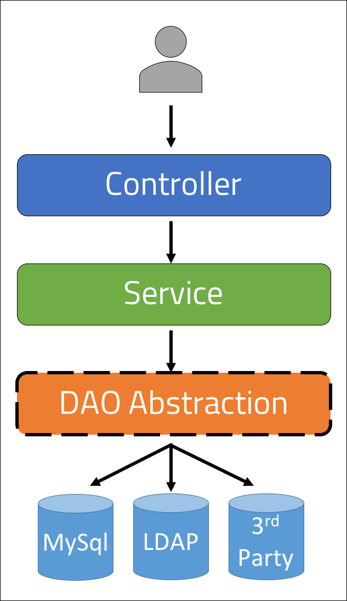

<br>
<strong>Key Takeaways</strong><br>
&#8226; Understand when to use the DAO pattern and the benefits it brings to software design.<br>
&#8226; Explore the use of Spring data JPA as the repository layer.<br>
&#8226; Implement the DAO pattern to support different repository layer implementations.<br>

<br>
<h4>The Data Access Object (DAO) pattern</h4>
<p>
The DAO pattern is used within software development to separate the service layer from the repository layer of an application. The service layer of an application will apply business logic to a user request that is received from a controller and will send the request to the repository layer where it is persisted into a data store. To learn more about the multiple layers of an application, visit a previous blog <a href="https://aneesh.co.uk/spring-architecture-layers">here</a>.
<p>

<p>
The DAO pattern uses dependency inversion to loosely couple the service layer from the repository layer. The DAO abstraction enables the service layer to remain agnostic to the implementation of the data store, whether that be a relational database, lightweight directory access protocol, business to business data store or any other type of persistance. The DAO supports the use of the open-closed principle where the service layer can remain unchanged while the underlying data store is dynamic.
</p>

<h4>A top-down view of the DAO pattern</h4>
<p>
The DAO pattern is divided between the service layer which intercepts a request from the controller, and the repository layer which is used within the service layer to persist the change within the data store.


The DAO pattern introduces an abstracted relationship between the service layer and the repository layer such that the service layer becomes agnostic to the implementations of the data store as implemented by the DAO implementations:



</p>

<br>
<h4>Using the DAO design pattern</h4>
<p>
The DAO pattern in this blog is being used to demonstrate an Estate agent application that will use the repository layer to store properties that are for sale.
The application will include a controller API to save, update or delete properties that are stored within the data store.
The DAO implementation is used to encapsulate the data store for the service to use, and to access.
</p>

<br>
<h4>DAO Participants</h4>
<p>
The DAO defines 6 key participants involved with the creation and execution of a request with the persisted data store:<br>
&#8226; Business user: The request from the user to obtain or modify data.<br>
&#8226; Service: the business logic service to process the request.<br>
&#8226; Entity object: instances of the data as an Object representation.<br>
&#8226; DAOInterface: interface with repository methods to interact with the data store.<br>
&#8226; DAOImpl: individual implementations of DAOInterface to interact with different data storage options.<br>
&#8226; Data store: the storage of the data in its persisted form.<br>


</p>

<br>
<h4>Implementing the DAO</h4>
<p>
The DAO is implemented as an interface for the CRUD operations to be performed upon the datastore. The implementations of the interface enable the growth of the application to support further data stores as the DAO interface is passed as a service to the service layer to use.
</p>
<p>
The DAO interface exists below with descriptive operations to be performed upon the database:

```java{numberLines:true}
public interface PropertyDao {

	public List<Property> getProperties();

	public void saveProperty(Property property);

	public Property getProperty(int id);

	public void deleteProperty(int id);
	
}

```

the DAO Implementation will use the Hibernate SessionFactory to create transactions to the data store:

```java{numberLines:true}
@Repository
public class PropertyDaoImpl implements PropertyDao {

	@Autowired
	SessionFactory sessionFactory;
	
	@Override
	public List<Property> getProperties() {
		Session session = sessionFactory.getCurrentSession();
		Query<Property> query = session.createQuery("from property order by id", Property.class);
		
		List<Property> result = query.getResultList();
		return result;
	}

	@Override
	public void saveProperty(Property property) {
		Session session = sessionFactory.getCurrentSession();
		session.saveOrUpdate(property);
	}

	@Override
	public Property getProperty(int id) {
		Session session = sessionFactory.getCurrentSession();

		Property property = session.get(Property.class, id);
		return property;
	}

	@Override
	public void deleteProperty(int id) {
		Session session = sessionFactory.getCurrentSession();

		Query<Property> query = session.createQuery("delete from Property where id=:id", Property.class);
		query.executeUpdate();
	}

}
```
</p>
<br>
<h4>Implementing the service layer</h4>
<p>
The service layer will be used to obtain requests from the controller to be passed down to the repository layer.

```java{numberLines:true}
@Service
public class PropertyService {

	@Autowired
	private PropertyDao repositoryService;
	
    @Transactional
	public void save(Property property) {
		repositoryService.saveProperty(property);		
	}

    @Transactional
	public List<Property> getAllProperties() {
		return repositoryService.getProperties();
	}
	
    @Transactional
	public Property getProperty(int id) {

		Property property = repositoryService.getProperty(id);
		
		return property;
	}	
}
```
</p>
<p>
While it may appear to be an additional and unnecessary layer to access the PropertyDaoImpl, the service layer would typically provide additional functionality to the transaction such as logging, authorisation and security. 
The <code>PropertyDaoImpl</code> is passed in as a service to the layer to provide access to the data store. Each method is marked as <code>@Transactional</code> to assign transactional semantics to the method call. The semantics define the scope for a single database transaction using the <code>Session</code> instance created to synchronize changes that are persisted to the data store.
</p>

<br>
<h4>Using Spring data JPA as a repository layer</h4>
<p>
In the current application, the service layer creates transactional requests to the repository layer where a session with the data store is used. The DAO pattern is used to define the CRUD methods which are required to the data store.
</p>
<p>
The use of the Hibernate Session objects in the repository layer requires verbose configuration to create the bean for the Session. The Spring Data JPA abstraction offers an out-of-the-box interface to support the CRUD operations made to a data store thus simplifying the implementation of the repository layer.
</p>
<p>
The Spring Data JPA package can be obtained within the dependencies:

```
<dependency>
    <groupId>org.springframework.boot</groupId>
    <artifactId>spring-boot-starter-data-jpa</artifactId>
</dependency>
```
</p>

<p>
The Spring data JPA repository layer is implemented as an extension of the interface which can then be passed into the service layer as a service:

```java{numberLines:true}
public interface JpaRepositoryImpl extends JpaRepository<Property, Integer>{
	
}
```
The <code>JpaRepositoryImpl</code> extends the <code>JpaRepository</code> interface and introduces two generic values for the interface. The <code>Property</code> generic is used to identify the entity each record of the datastore will coincide with. The <code>Integer</code> identifies the type the primary key is for the table.
</p>
<p>
The interface is autowired into an application and provides the following methods amongst many others to support interaction with the data store:<br>
&#8226; <code>findAll()</code> to return a list of all records as Property instances from the data store.<br>
&#8226; <code>findById(int id)</code> to return a single record as a Property instance, identified by the primary key.<br>
&#8226; <code>save(Property)</code> to update or save a record to the data store.<br>
</p>

<p>
By implementing Spring data JPA into the application, the DAO is pre-defined to cover all the actions required to the data store. As a result, the extension of behaviour from the interface can be defined where the methods are hidden by the JPA abstraction. We can create a new extension of the interface with a different Entity Object as the Generic to define a new data store for the repository layer.<br>
The Spring data package encapsulates all method calls to the interface with @Transaction behind the scenes. The service layer will no longer require the @Transactional annotation as it is in-built. 
</p>
<p>
The updated Service layer will use the Spring data JPA interface:

```java{numberLines:true}
@Service
public class PropertyService {

	@Autowired
	private JpaRepositoryImpl repositoryService;
	
	
	public void save(Property property) {
		
		repositoryService.save(property);	
	}
	
	public List<Property> getAllProperties() {

		return repositoryService.findAll();
	}
	
	public Property getProperty(int id) {

		Property property = repositoryService.findById(id).get();
		return property;
	}
}
```
</p>
<br>
<h4>Realising the benefits of DAO</h4>
<p>
The DAO pattern generalises the transactions that a Service layer can make to the repository layer thus opening the Repository layer to implementations of the transactions. We can use Spring Hibernate to provide a granular approach to defining data stores, sessions and transactions to handle the different implementations of the Repository layer.
</p>
<p>
As the extension of the repository layer is enabled by the DAO, we can use alternative strategies for the repository layer including the Spring data JPA repository implementation. Provided the DAO supports all the defined methods, the DAO can represent various Repository implementations across data storage medium, transaction definitions and sessions to benefit the application implementation and developer experience.
</p>
<br>
<h4>Conclusion</h4>
<p>
The data access object pattern is used to separate the service layer from the repository layer. As a result, multiple implementations of the repository layer can be used to represent different data stores and abstractions of the repository layer.<br>
The Hibernate and Spring data Spring packages support different designs of the repository layer to provide varying abstractions of the Session and Transactions made to the data store. Furthermore, the DAO pattern enables the support of multiple data stores and repository layer.
</p>
<p>
This blog has used the DAO pattern to implement two different strategies for the repository layer that can be easily used within the same abstraction to represent interactions with different data stores and transaction semantics for the same service layer in an open-closed design.
You can find the source code from this blog on GitHub <a href="https://github.com/4neesh/DeveloperBlogDemos/tree/master/DAO">here</a>.
</p>

<br>
<small style="float: right;" >Picture: Kyoto, Japan by <a target="_blank" href="https://unsplash.com/@boontohhgraphy">Sorasak</small></a><br>