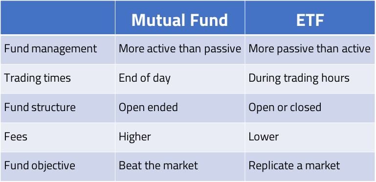

 
<strong>Key Takeaways</strong> 
&#8226; Explore the benefits mutual funds and exchange traded funds provide investors. 
&#8226; Understand the differences between a mutual fund and exchange traded fund. 
&#8226; Review the creation redemption mechanism for exchange traded funds. 

 
<h4>Diversified funds for investors</h4>

Mutual funds and exchange traded funds (ETFs) are pooled investment vehicles that collect capital from multiple investors, both retail and institutional, to invest in a variety of securities to satisfy the fund's objectives. 
The investment funds offer the investor the opportunity to diversify their investment across securities through a single fund rather than manually selecting securities themselves to invest in. The benefit to the investor is their reduced exposure to the volatility of a single security and to spread their exposure across entire industries, regions, and global markets.

The activity of investing within mutual funds and ETFs fall under the asset management division. Visit my blog <a href="https://aneesh.co.uk/understanding-investment-bank-services">here</a> to learn about the different divisions and functions of investment banks. The institution that creates the mutual fund or ETF is known as the <i>investment company</i>. The two types of funds can be further segmented and designed to meet investor objectives for short and long term as well as for risk and return potential. This blog will explore the properties of each fund and the consideration an investor may take when choosing to invest in either.

Below are general definitions of keywords used within this blog: 
<i><strong>Investment company</strong></i>: A corporation responsible for pooling capital from investors into securities. 
<i><strong>Net asset value</strong></i>: the average value of all assets held within a fund, used to value the fund. 
<i><strong>Expense ratio</strong></i>: an annual fee paid by the investor to the investment company as a percentage of the investment they make. 

 
<h4>The different types of fund structures</h4>

Fund structures define how capital moves into and out of the fund and when shares of the fund are created.

<strong>Open ended funds</strong> do not set a limit on the amount of capital that it contains, and therefore the number of shares that can be purchased for the fund. If more capital flows into the open ended fund from investors, more capital is invested in the securities and the number of shares for the open ended fund grows at the same price. 
If the investors choose to sell their shares, the investment company will act as a market maker to buy-back the shares of the open ended fund. The freedom for the portfolio manager to buy and sell securities within the fund mean the investment mix can change.

<strong>Closed ended funds</strong> will issue shares to the fund only once through an initial public offering. Once bought, shares from the fund are then traded through the stock exchange and are not bought back by the investment company itself. The price of the shares may be different to the NAV as a premium or discount reflecting the market's expectation for the NAV of the fund to grow or shrink with time.

<strong>Unit investment trusts</strong> (UIT) are a less commonly traded fund structures that place a timeline upon the life of the fund. The investment company will buy securities with a defined expiration date for when the assets are sold and the shares of the UIT are returned to the investors. 
Shares are purchased at the NAV of the securities within the fund. Similar to closed ended funds, UITs will issue a set number of shares (units) that can be bought. The portfolio of investments for the UIT are established at inception and sold at termination. The investment company of the UIT may also act as a market maker to avoid the depletion of the UIT assets.

 
<h4>Introduction to mutual funds</h4>

A mutual fund has it's shares traded at the end of each trading day and is often actively managed. Mutual funds are more often open-ended to support the growth of assets within the fund.

The price of the mutual fund is derived from the average value of the investments that it holds. 
The 'Net Asset Value' is used to define the price of each share from the mutual fund calculated as the market value of all assets divided by the total number of fund shares. 
For example if mutual fund 'M1' contains: 
5 shares of A at £3 
10 shares of B at £5 
2 shares of C at £11 
If there are 10 shares of M1 for sale, the NAV = {(5 x 3) + (10 x 5) + (2 x 11)} / 10 
= 87 / 10 = £8.70 per share. 
If the share price of A rises to £4, the new NAV of the fund will be £9.20.

As an 'actively managed fund', the strategy behind the mutual fund is typically very different to that of the ETF (as we will later review). Actively managed funds describe a fund strategy from the portfolio manager as to try and outperform the market. Outperforming the market requires the portfolio manager to selectively buy undervalued stocks and to sell overvalued stocks to profit from the bid-offer spread on the security. The portfolio manager will be supported by a team of research and credit analysts who offer advice in which securities to act upon. The objective of the actively managed fund is to therefore offer higher returns than the average market growth. While actively managed funds sound great, the investor will have to pay a higher expense ratio provided the additional expertise required to manage the fund, and can also expect a higher level of risk for the fund returns.

 
<h4>Introduction to Exchange Traded Funds</h4>

Exchange traded funds differ from mutual funds as they are traded on the exchange <u>during the day</u> at a price that closely reflect it's NAV. The function that enables ETFs to be traded during the day, known as the creation-redemption mechanism, is later reviewed in this blog.

ETFs tend to be passively managed, meaning the fund will invest in a basket of securities from a particular group without trying to select the 'winner' amongst it. Some passive funds, known as index funds, try to replicate the performance of an index. The performance for the fund is defined against how well they track the index and how low their expense ratio is.

While mutual funds tend to be open-ended, ETFs are often open and closed ended. Index funds will aim to track an index such as the S&P 500 or the FTSE 100 to obtain a broad market exposure for the investor. The  exposure diversifies the fund and reduces the risk of price volatility to the investor. As the securities within each ETF change throughout the day, the NAV of the fund will change, and the investors within the market will be able to trade against the market price of the fund.

 
<h4>The creation redemption mechanism</h4>

One key difference between the ETF and mutual fund is the ability to trade the ETF like a stock during the day. How is the ETF priced? And where does the market liquidity originate from? 
The creation-redemption mechanism (CRM) that enables the ETF to be traded like a stock is supported by a third entity in the relationship between the market and the investment company, the authorised participant (AP).
An AP can be any large institution with enough buying power to purchase and hold securities to facilitate the liquidity of the ETF. 

<strong>Creation</strong>

When the market requires shares in the ETF that are otherwise not available, the AP will send an order to the investment company requesting new shares of the ETF. The capital from the investor flows to the AP where new securities are bought that reflect the ETF. The AP will swap the securities for new shares of the ETF with the investment company and return the new ETF shares to the investor. The package of ETF shares and securities are known as a <i>creation unit</i>.

<strong>Redemption</strong>

When the market sells large amounts of the ETF shares, the AP will provide capital to the investor and exchange it for shares in the ETF. The AP will exchange the ETF shares with the investment company and will in-turn receive the underlying securities that the shares represented. The securities can then be sold in the market by the AP. 

The creation and redemption mechanism of the ETF enable the shares of the ETF to be traded on the exchange during the day where the AP provides sufficient liquidity to the market for buying and selling shares and underlying securities of the ETF. 

 
<h4>Conclusion</h4>

Pooled funds offer investors the opportunity to diversify their investments and to reduce their exposure to the volatility of a single security. The mutual fund and exchange traded fund are two popular investment funds that endorse different investment strategies to create varied risk exposure and returns for the investor.

By understanding the differences between fund structures, active and passive management and associate costs, it can become easier to differentiate funds by their objectives and suitability to the investors goals.

 
<small style="float: right;" >Picture: Marina Bay Sands, Singapore by <a target="_blank" href="https://unsplash.com/@zyteng1997">Kelvin Zyteng</small></a> 