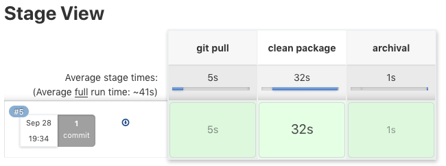
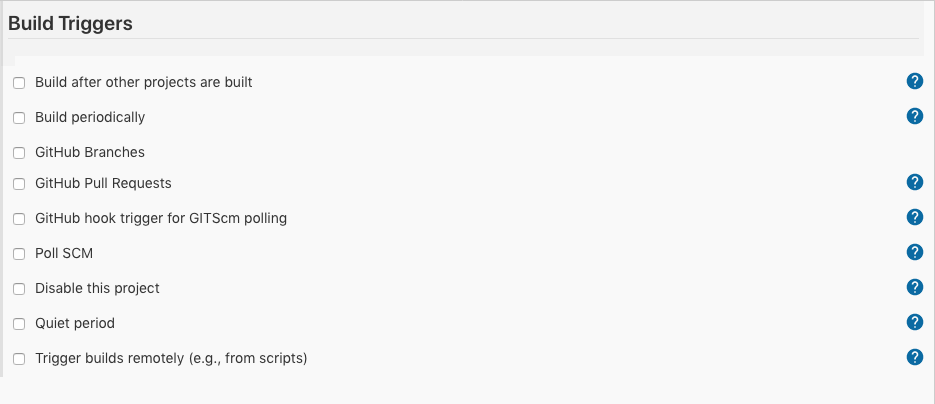
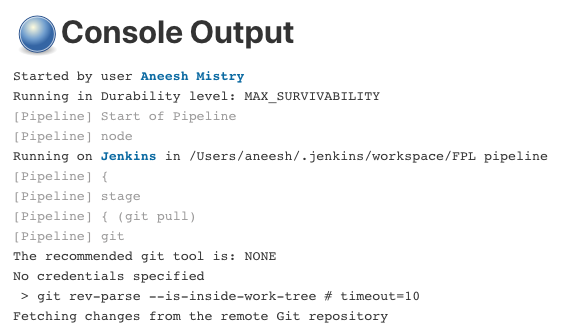
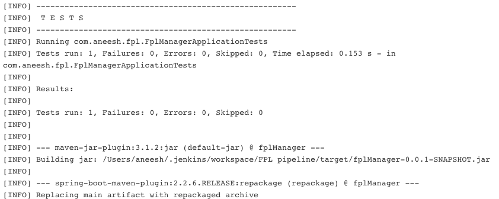

<br>
<strong>Key Takeaways</strong><br>
&#8226; Understand the challenges of integrating code between multiple developers.<br>
&#8226; Review the phases of an application build and the responsibility of each phase.<br>
&#8226; Understand the benefits of creating a continuous integration pipeline for code builds.<br>

<br>
<h4>What is continuous integration?</h4>
<p>
Continuous integration is a development practice that automates the combined actions of compiling, building, testing and packaging source code into software. As software is frequently updated, the cost of integrating code into the latest build can be timely to the developer. Furthermore, the coordination between teams of multiple developers and the presence of merge conflicts can make the integration of code even more burdensome.
</p>
<p>
Merge conflicts arise when multiple developers attempt to integrate code changes that are applied to the same file(s). Multiple developers may have a different idea for the implementation of a module and therefore a merge conflict must be manually reviewed before the code is updated to the single version. Merge conflicts become increasingly likely as larger integrations are performed at a single time.</p>
<p>
Continuous integration enables code builds to be performed autonomously and quickly. The process for compiling, testing, building and packaging code is performed through an automated pipeline. As a result, continuous integration encourages the practice of small, daily integrations amongst developers to lower the likelihood and impact of merge conflicts. 
</p>

<br>
<h4>Build tools</h4>
<p>
Build tools automate the individual processes of creating executable builds from the source code. There are individual phases that are used within build tools to separately compile, build, test, package and deploy source code. Some of the popular build tools used are Ant, Maven and Gradle.
</p>

<br>
<h4>The lifecycle of a build</h4>
<p>
The build contains three different in-built life-cycles that define how a build is constructed: default, clean, and site.<br>
&#8226; default: handles project deployment.<br>
&#8226; clean: cleans the project by removing the files generated from the previous build.<br>
&#8226; site: creates the project's site documentation and reports.<br>
</p>
<p>
The build lifecycle consists of multiple phases that enable the developer to have control over how the code is compiled:<br>
&#8226; validate: validate the project includes all the necessary information.<br>
&#8226; compile: compile the source code of the project.<br>
&#8226; test: test the compiled source code with the unit testing framework.<br>
&#8226; package: package the tested code into a distributable format (such as a war or jar file).<br>
&#8226; verify: perform checks upon quality through integration tests.<br>
&#8226; install: install the package into the local repository.<br>
&#8226; deploy: copy the final package into the the remote repository to be shared.
</p>
<p>
Each lifecycle phase can be run individually, however the former stages will always be run prior to the phase defined. For example, running the install phase will inadvertently run the validate, compile, test, package and verify phases before install.<br>
The continuous integration phases are only relevant up to the package; these are explained further depth for a java project:
</p>

<p>
<strong>Validate</strong> will not perform any actions unless a 'goal' is specified for this phase within the POM.xml file. A simple validation check could reflect the version naming conventions, artifact ids, descriptions and purpose of each class is defined with JavaDocs etc.  
</p>
<p>
<strong>Compile</strong> will take the source code of the .java files and compile them into bytecode (.class) files for the JVM to later execute at runtime. The JIT Java compiler will then convert the bytecode into machine code to be executed.
</p>
<p>
<strong>Test</strong> will compile the unit test code into bytecode and run each of the unit tests for the project. If a test were to fail, the lifecycle will end.
</p>
<p>
<strong>Package</strong> will take the compiled code from the .class files and package them into a executable format such as a .jar file. The pacakge phase is to be defined within the POM.xml file. For example:

```
 <plugin>
    <artifactId>maven-assembly-plugin</artifactId>
    <configuration>
        <descriptorRefs>
            <descriptorRef>jar</descriptorRef>
        </descriptorRefs>
        <archive>
            <manifestFile>src/main/java/META-INF/MANIFEST.MF</manifestFile>
        </archive>
    </configuration>
    <executions>
        <execution>
            <phase>package</phase>
            <goals>
                <goal>single</goal>
            </goals>
        </execution>
    </executions>
</plugin>

```
</p>

<br>
<h4>Continuous integration tools</h4>
<p>
CI tools can be used to streamline the process of compiling, building, testing and packaging software within teams. The tools provide an automated pipeline that can execute each of the phases 
while provided appropriate feedback, metrics and outcomes of each build as configured. <strong>Jenkins</strong> is a popular open source automation server that offers the capacity of continuous integration 
for software systems as well as other convenient plugins that can optimise the pipeline for feedback and diagnostics. 
</p>
<p>
A continuous integration pipeline is used to stitch the various phases of code integration into a production line to be delivered into environments. The goal behind the pipelines is to support the constant flow of software updates from all members of the team, to reduce the time it takes to integrate the code, and thus to encourage the frequent updates of code.
</p>
<p>
The CI platform is used as a centralised repository of build reports, status' and historical build updates for a project. Whereas before a CI platform was used, the console output and report from a build phase remained local to the developers machine, the console output is now available for review by all members of the team.
</p>
<br>
<h4>Jenkins support for CI</h4>
<p>
With the use of the scripting language <i>groovy</i> and an abundance of plugins, Jenkins provides the opportunity to customise the output of each build to provide insight and functionality to the pipeline.
</p>
<p>
Jenkins can offer support into the build times for each phase to diagnose bottlenecks and to understand the implication of pipeline updates to the project. Jenkins supports the use of concurrent builds and can therefore be leveraged to resolve bottlenecks from independent stages.<br>
The graphic below provides a clear visualisation of the individual stages that can be defined within the groovy script.



</p>
<p>
Project build can be triggered within Jenkins in a variety of ways:



Jenkins can be integrated with Git repositories to initiate builds from commits. You can also set-up periodic builds to run in a more structured manner. As a centralised build tool between teams, the triggers for the builds can be used to share control of the pipeline across all teams to build as frequently, or infrequently, as desired.
</p>
<p>
Jenkins also supports exception handling within the pipeline. The console provides detailed log messages on each build:





Exceptions can be acted upon with email alerts for build successes and failures to alert the relevant teams and individuals for an end-to-end exception handling process to the software. 
</p>
<br>
<h4>Conclusion</h4>
<p>
Continuous integration is a valuable framework used within DevOps with the objective of reducing the friction behind code updates across teams and streamlining the process for 
building a new artefact to be taken through delivery. Continuous integration can be defined by a single pipeline that performs each action upon the.
</p>
<p>
Continuous integration tools can be used to build pipelines that automate the process for integration code updates into builds in a centralised environment.<br>
Jenkins is one such tool that can be used to build interactive reports to obtain an insight to the step-by-step process for builds. Jenkins also provides useful plugins to trigger builds, visualise performance reports and send email notifications upon events. 
</p>

<br>
<small style="float: right;" >Picture: Taba, Egypt by <a target="_blank" href="https://unsplash.com/@rawanyasser">Rawan Yasser</small></a><br>

