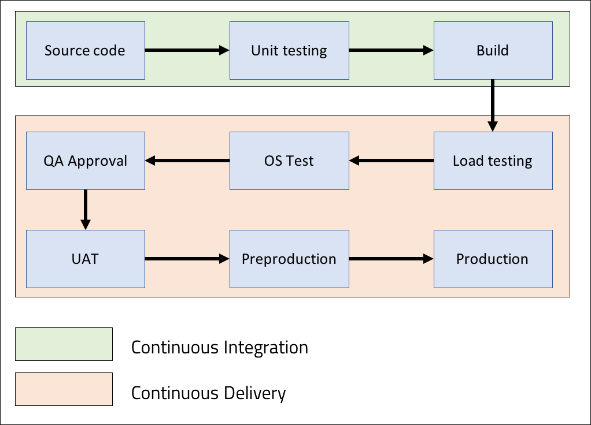

 
<strong>Key Takeaways</strong> 
&#8226; Understand the importance of functional testing before software deployment. 
&#8226; Identify the challenges that arise with functional testing. 
&#8226; Review the benefits of using continuous delivery and the Jenkins pipeline. 

 
<h4>What is continuous delivery?</h4>

Continuous delivery (CD) extends from continuous integration by ensuring the latest software artifact is always in a deployment-ready build to be sent into production. You can read about continuous integration from my previous blog <a href="https://aneesh.co.uk/how-continuous-integration-helps-developers" target="_blank">here</a>.

But what does 'deployment-ready' mean? While CI aims to manage the movement of source code branches into new application builds, CD aims to manage the movement of the build through functional testing phases in a safe, sustainable and predictable manner. 

The phases of functional testing can include rigorous testing and deployments across environments to ensure the software has been stressed in every feasible way before moving it into production. The diagram below visualises possible continuous delivery processes in a pipeline:

CD encourages frequent delivery of software updates in the same manner that CI encourages the frequent integration of source code. Smaller, but more frequent deployments are less risky to creating a regression in production. CD eliminates the repetitive tasks that may arise for functional testing to return tighter feedback loops for the test team while enabling a faster time to market.
 
The approach of 'continuous deployment' may often be mistaken with continuous delivery; continuous delivery differs as it requires a single manual approval stage prior to production deployment whereas continuous deployment is fully automated end-to-end.

 
<h4>What are functional requirements?</h4>

The functional requirements of a system can be described as the behaviours for inputs and outputs the system is expected to produce. The functional requirements can encapsulate all areas of the system from data processing, data manipulation and algorithms. Functional requirements are captured within use cases and enforced against non-functional requirements such as security and performance metrics.

While unit testing appeals to the developers perspective of the problem, functional testing takes the users perspective. The CD pipeline is responsible for carrying out multiple streams of testing to ensure the latest build adheres to the functional requirements. Functional testing can be divided into further testing domains such as UI testing, load testing, integration testing and API testing. 

<strong>Integration testing</strong> involves testing a combination of software modules in unison. While unit testing involves the testing of individual components on their own, integration testing identifies dependent modules within the application and tests scenarios that occur between them. The main objective from integration testing is to test the interfaces between the modules. The value behind integration testing is to ensure each module can interact with each other as expected and to identify inconsistencies between module implementation.

<strong>API testing</strong> can fall under the integration testing umbrella where external APIs are tested to perform as expected for functionality and reliability. As modules may communicate with external systems, the API testing will cover the external layer of the system of communication. 

<strong>Load testing</strong> involves stress testing the system capabilities to handle increased levels of traffic and requests than expected. The typical expected usage of the software may be modelled and simulated as well as upper and lower levels of requests. The load testing can provide metrics for the quality of service provided by a system and identify potential bottlenecks or vulnerabilities of the system for certain traffic or use patterns.

<strong>Operating System testing</strong> will test that the software is able to perform in the operating systems it is designed for as expected.

 
<h4>Release management with continuous delivery</h4>

The release management for continuous delivery defines multiple stages of functional testing. The system will be tested within dedicated servers to replicate the production environment to some degree. The separation of a test environment from the production environment enables system changes to be phased into the production environment with confidence that due diligence has been carried out upon each system change.

<strong>User acceptance testing</strong> (UAT) is a process of verifying the software works for the user. UAT is used to assess if the system can support the day-to-day intended use of the system. The system requirements may be defined within a scope and tested upon both systematically and unsystematically to verify the outcome of the test.

 
<h4>The challenges of continuous delivery</h4>

Continuous delivery can constitute a lengthy process where multiple timely tests are completed across multiple test servers. The functional testing process remains largely unchanged despite the size of the system update. As a result, the time consumption for continuous delivery is mostly fixed to the software delivery pipeline.

The complexity of functional testing further extends to the type of tests that are run across environments to verify the software update. Unlike unit tests, integration tests and other functional tests incorporate multiple modules together to cover use cases and behaviours of the system. The tests, as stand alone functions, therefore require greater levels of resources and inspection to verify. 

The configuration of the environments and the system to perform checks upon must remain consistent and reliable, however functional testing may alter the server environment and create inconsistencies. While dedicated environments are used for specific testing, it becomes a challenge to 'clean' the environments for testing as and when is appropriate. The responsibility for ensuring tests are performed within a controlled environment introduces further challenges to continuous delivery.

 
<h4>Jenkins as a continuous delivery solution</h4>

Jenkins supports CD pipelines to automate the functional testing of builds along with useful tools to resolve the specific challenges related to CD.
Amongst the plugins that come with Jenkins, support for multi-threaded testing and stashing archives make Jenkins a popular tool for CD.

<strong>Automated delivery pipeline</strong> 
Similar to the CI pipeline, the Jenkins CD pipeline is an extension of automated procedures to run on the new software update. The CD activities can be lined-up and executed in succession where exceptions are reported back to the appropriate teams. 

<strong>Concurrent delivery</strong> 
The master-agent model of the Jenkins pipeline supports parallel processing. As functional testing may take place across multiple servers, the CD pipeline utilise parallel processing to divide tests across the servers at the same time. As a result, the CD pipeline can be streamlined for time efficiency. 

<strong>Consistent configuration</strong> 
Jenkins supports the use of stash to save a set of files to be later used in the workspace. Stashed files are present for the duration of the pipeline before being 
discarded at the end. The stash can support small file saves to a temporary directory to be later unstashed and used to create a consistent environment for testing. 
Some uses of stash can be for dependencies and configuration files. 

 
<h4>Conclusion</h4>

The continuous delivery pipeline extends from continuous integration to verify the system upgrade meets functional requirements before being deployed into the 
production environment. Software testing is performed across different test environments that are designed to support functional testing and to replicate the production environment.

The importance of continuous delivery is to support a reliable, predictable and safe deployment of software into production. The multitude of testing to be performed across environments for verification can create challenges of time consumption and intervention of testing before deploying system updates. Jenkins supports the continuous delivery pipeline by automating the functional testing of the system updates across the appropriate test environments. Jenkins also supports continuous delivery with parallel processing.

Continuous delivery and continuous deployment play a major role in the modern software delivery cycle where code is rigorously integrated, built, tested and deployed to the production environment. The automation of continuous delivery enhances the feedback loop from functional testing to support frequent, incremental and efficient upgrades to software system. 

 
<small style="float: right;" >Picture: Yosemite, California by <a target="_blank" href="https://unsplash.com/@annaaelizabeth">Anna Elizabeth</small></a> 