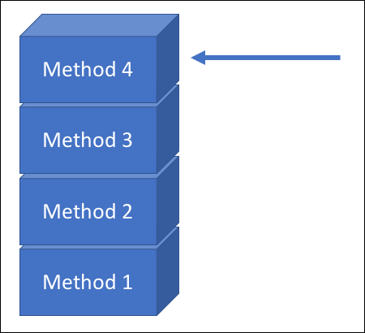
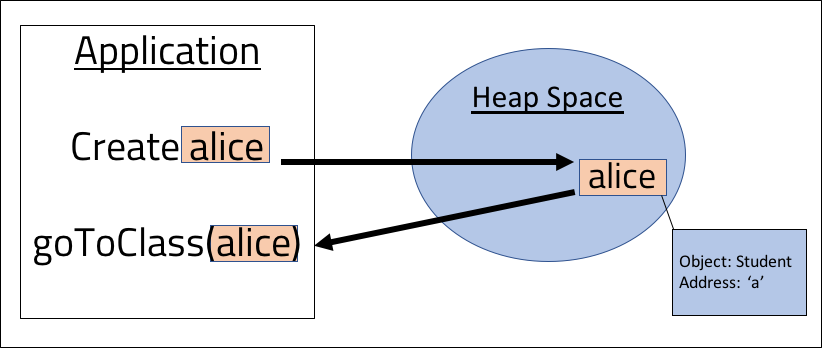
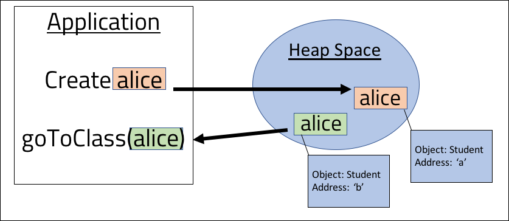
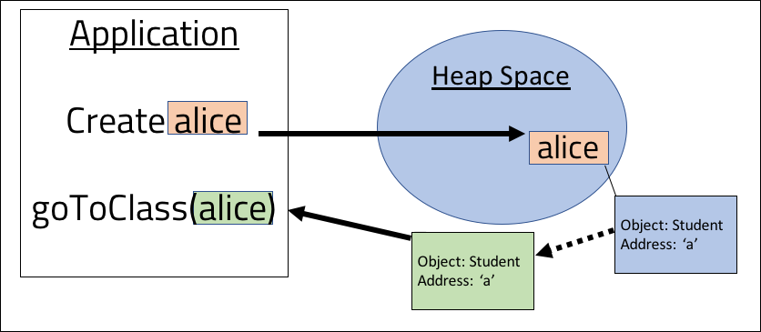
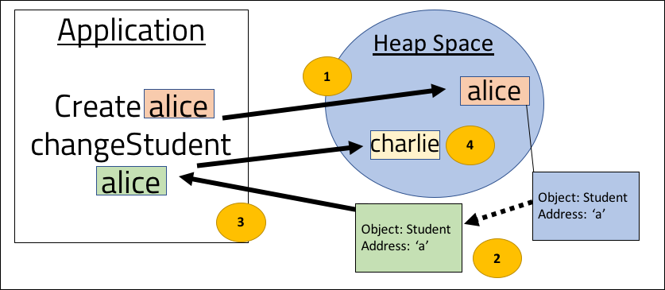

<br>
<strong>Key Takeaways</strong><br>
&#8226; Understand the differences between the heap space and stack memory.<br>
&#8226; Visualise the runtime activity of the stack memory.<br>
&#8226; Understand how the heap and stack communicate with each other.<br>

<br>
<h4>How does the JVM store our Objects?</h4>
<p>
The JVM divides memory between two locations known as the heap space and stack memory for managing the application runtime and Objects. The two locations differ by their design and properties that effect their function and efficiency of memory use. 
</p>
<p>
In this blog, I am going to review the responsibilities between the heap and stack to the JVM. By understanding the differences between the heap and stack, we may be better positioned to improve our application runtime performance through design. 
</p>

<br>
<h4>The heap space</h4>
<p>
The heap space is created when the JVM starts as a dynamic space for allocating storage of Java Objects. The heap is obtained by the JVM from the operating system as a fixed space for the lifetime of the application. The heap is described as <i>dynamic</i> as it allocates memory during runtime of the application. 
</p>
<p>
When Objects are assigned to the heap, they are globally accessible by all threads of the application, however they are not necessarily thread-safe. Objects can be designed to be thread safe as discussed in my blog <a href="https://aneesh.co.uk/creating-multi-threaded-visibility">here</a>.
</p>
The heap space is divided into two 'generations' for storage: old and new. The generational divide is used to determine how Objects are stored, retained and removed from the heap space at runtime. The heap space uses a garbage collector to mark and sweep Objects when the young generation reaches capacity. You can read more about the garbage collector in my blog <a target="_blank" href="https://aneesh.co.uk/how-the-jvm-manages-memory">here</a>.
</p>
<p>
The impact of the garbage collector upon the JVM performance can be significant. Object management from the heap is therefore a valuable area to inspect and resolve for runtime performance enhancement.<br>
When the heap is full, java will throw a <code>java.lang.OutOfMemoryError</code> exception.
</p>

<br>
<h4>The stack memory</h4>
<p>
The stack memory contains space for the execution of application threads. The stack is used for temporary memory where variables are stored when methods are invoked. When a method is called, its memory is allocated on top of the stack in a first-in-last-out (FILO) order. Once the method has completed, its memory allocation is cleared from the stack. The diagram below represents 4 different method calls made, where the most recent method call sits at the top of the stack and is currently pointed to by the JVM.



</p>
<p>
The stack uses static memory allocation where the compiler is able to allocate memory to the application before it has been executed. Once the stack has bounded the memory to locations, it is able to execute the threads efficiently with direct addressing. 
</p>
<p>
The stack will store local variables to the methods and the reference addresses of the Objects within the method. The references will point to the Object location within the heap. When the method is completed, the stack will remove the method from the memory along with the local variables that are referenced by the method. 
</p>
<p>
A key performance advantage of the stack over the heap is the direct addressing of memory. The stack is able to efficiently assign and remove memory unlike the heap.
When there is insufficient memory on the stack, the JVM throws a <code>java.lang.StackOverflowError</code> exception.
</p>

<br>
<h4>Using the heap and stack together</h4>
<p>
The below code sample provides a means to explain how the heap space and stack memory coordinate together:

```java{numberLines:true}
public class Sport{
    String name;
    int players;

    public Sport(String name, int players){
        this.name = name;
        this.players = players;
    }
}

```
```java{numberLines:true}
public class SportBuilder{
    public static Sport Build(String name, int players){
        return new Sport(name, players);
    }
}

```

```java{numberLines:true}
public class Main{

    public static void main(String[] args){

        int players = 2;
        String sport = "tennis";
        Sport tennis = null;
        tennis = SportBuilder.build(sport, players);

    }
    
}

```
<p>
The code above defines 3 classes, a Sport entity class, a SportBuilder class with a static method to build a Sport Object and a Main class with the main method. 
</p>
<p>
The main method from the Main class will instantiate the creation of the stack memory with a single thread. 
On line 3 in the Main class, the main method is defined and added into the stack memory. <br>
On line 5, the primitive int <code>players</code> is added into the main method of the stack memory. <br>
On lines 6 and 7, Objects of Type String and Sport are created in the heap space; their address is referenced by the main method block in the stack.<br>
On line 8, when the SportBuilder method is called, a new block is added to the stack on top of the main method block. The new block will contain a reference to the Main class instance that is calling it, the local int <code>players</code> and the reference to the String "tennis". <br>
In line 3 from the SportBuilder class, a further method is added to the stack as the Sport constructor is called. The third block will contain the primitive int value along with references to the String "tennis". The third block will also contain a reference to the calling Object instance of SportBuilder.
<br>
When the Sport Object is created, the third block is swept from the stack, followed by the second block from the SportBuilder class, and finally the Sport Object is populated with the String and primitive value in the heap space. 
</p>

<br>
<h4>Referencing Objects from the heap into the stack</h4>
<p>
The code sample above has demonstrated how the heap and stack work together to store and reference Objects through the lifecycle of a JVM thread. The process for referencing Objects from the stack to the heap can impact the efficiency of the JVM and operations that can be performed upon the Objects. This section will review how the two memory areas communicate.
</p>
<p>
The <i>pass by reference</i> approach involves passing the address of the Object from the heap space into the stack. 
In the below example, an instance of <code>Student</code> is created ('alice') and it is stored in memory location 'a' in the heap space. 
On line 5, the Student is referenced by a method called <code>goToClass()</code> from the stack. The <code>goToClass</code> method will receive the location 'a' of Alice and will 
set the 'attendance' boolean of the Object to true on line 9.

```java{numberLines:true}
public static void main(String[] args){
    
    Student alice = new Student("Alice");

    goToClass(alice);
}

private static void goToClass(Student student){
    student.setAttendance(true);
}

```



</p>
<p>
The <i>pass by value</i> process involves passing a copy of the Object itself from the heap space into the stack.
Using the same example as above, the pass by value movement of the Object would involve creating a new copy of the Object and then passing it into the stack.



In the diagram above, an identical copy of <code>alice</code> is made within the heap space and is then passed into the <code>goToClass</code> method.
</p>

<br>
<h4>How Java passes Objects between the heap space and stack</h4>
<p>
The JVM uses a combination of pass-by-reference and pass-by-value for managing Objects. Technically, Java uses pass-by-value as the a copy of the Object is passed to the method call, however Java does not make a copy of the Object, it will pass a copy of the Object address from the heap space.
</p>




<p>
We are able to test how Java passes Objects with the below code snippet. The code will attempt to switch the Person Objects:

```java{numberLines:true}
class Person{

private String name;

    public Person(String name){
        this.name = name;
    }

    public String getName(){
        return this.name;
    }
}


```
```java{numberLines:true}
class Main{

    public static void main(String[] args){
        Person alice = new Person("Alice");
        Person bob = new Person("Bob");
        swap(alice, bob);

        System.out.println(alice.getName());
    }

    public static void swap(Object a, Object b){
        Object c = a;
        a = b;
        b = c;
    }
}
```
</p>
<p>
The output from the above code will show:

```
Alice
```

The <code>swap()</code> method will not work as expected as we are not actually altering the location of alice and bob, but are altering the location of a copy of the reference:

```java{numberLines:true}
public static void swap(Object a, Object b){   //(copy of)alice = location a, (copy of)bob = location b
        Object c = a;   //c = location a
        a = b;          //a = location b
        b = c;          //b = location a
        
        //final result: (copy of)alice = location b, (copy of)bob = location a
    }
```
</p>
<p>
If the actual reference of the Person was passed into the <code>swap()</code> method, then alice would point to location B and have the name "Bob" and vice versa. However as a <u>copy</u> of the reference was passed, the actual Person objects of Alice and Bob remain unchanged.
</p>
<p>
The use of the <code>new</code> keyword within Java will allocate a new memory location of an Object. When the Object is then passed around the application, it will be the reference location that is copied and sent across. In the below code snippet, the creation of a new Student Object will result in a new Object being referenced with its own address. Assume the Student Alice has been passed in.

```java{numberLines:true}

public void changeStudent(Student student){ //student = (copy of) Alice: location a
    student.setName("Alex");                //student = location a
    student = new Student("Charlie");       //student = location c
}

```
Alice's name is first changed to "Alex". As the reference location is passed into the method, the name will be changed on the Alice instance. 
Once the student is referenced to a 'new' Object, the memory location of the Object has been changed and all further method calls to 
the Object 'student' within the method will apply to the the Student instance of Charlie. 
If you were to query the name of Alice after this method has run, the output would remain as "Alice". The reference of 
Charlie will be lost after the method as it is no longer referenced within the method. 



</p>

<br>
<h4>Conclusion</h4>
<p>
The heap space and stack memory are two separate areas within the RAM used by the JVM before and during runtime. The two areas work together by using a pass-by-value process where the address of the Objects within the heap space are copied and passed to the stack memory. The pass-by-value process enables the JVM to access and modify Objects without having to return them back to the calling method.
</p>
<p>
The stack memory is designed with a pointer to quickly navigate methods and remove them once completed. The heap space uses a garbage collector to mark and sweep Objects that are no longer referenced within the application. 
</p>
<p>
Our understanding of the heap and stack can enable us to better understand runtime errors that may arise and how the application can make use of the stack direct addressing and recursive nature to optimise runtime performance. 
</p>