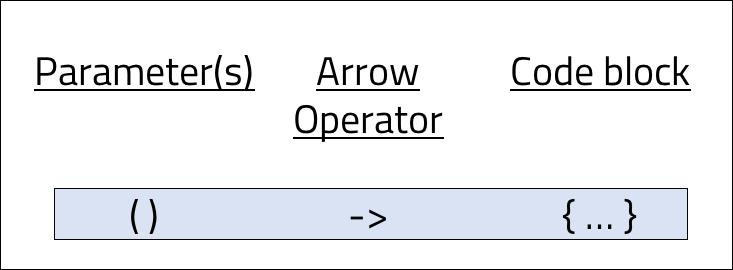

<br>
<strong>Key Takeaways</strong><br>
&#8226; Understand how functional interfaces are designed and created.<br>
&#8226; Use anonymous classes to implement functional interfaces.<br>
&#8226; Understand how to create a lambda function for expressive implementations of functional interfaces.<br>
 
<br>
<h4>Lambda and functional programming</h4>
<p>
Lambda functions were introduced in Java 8 as a step for Java towards functional programming.
Functional programming enables a developer to pass functions around the application without assigning it to a specific  class. Lambda enables Java to use functional programming as functional interface implementations that are dynamically created and executed at runtime.
</p>

<br>
<h4>What are functional interfaces?</h4>
<p>
A functional interface is defined as an interface with just a single abstract method. A functional interface can also contain many other methods that are either Static or Default, provided there is just a single abstract method. If the interface contains more than one abstract method, it cannot be considered when creating lambda functions.
</p>
<p>
Prior to Java 8 (and the introduction of lambda functions), functional interfaces would be used through a class implementation where the abstract method is overridden:

```java{numberLines:true}
//functional interface
public interface CoffeeMachine{
    void makeCoffee();
}

```

```java{numberLines:true}
public class EspressoMachine implements CoffeeMachine{

    @Override
    public void makeCoffee(){
        System.out.println("Making an espresso");
    }
}
```
```java{numberLines:true}

EspressoMachine machine = new EspressoMachine();
machine.makeCoffee();

```
```
Making an espresso
```
</p>
<p>
The creation of the <code>EspressoMachine</code> with a single method, and further instantiation of the <code>machine</code> enables an implementation of the CoffeeMachine to be used. Considering what we have achieved, in an implementation of a single method, you may consider the creation and instantiation of the class as being heavy to write. An anonymous class may provide a more straight-forward approach.
</p>

<br>
<h4>Using anonymous classes</h4>
<p>
Anonymous classes allow us to reduce the boilerplate code of implementing the interface into a class. As the name suggests, an anonymous class does not have a name as it is implemented in the method body of its declaration:

```java{numberLines:true}

CoffeeMachine espressoMachine = new CoffeeMachine(){

    @Override
    public void makeCoffee(){
        System.out.println("Making an espresso");
    }

};
```
</p>
<p>
The anonymous class enables local variables to the class to be defined and for further methods to be used for the <code>espressoMachine</code>:

```java{numberLines:true}

 CoffeeMachine espresso = new CoffeeMachine() {
    int numberOfCoffees = 1;

    @Override
    public void makeCoffee() {
        this.numberOfCoffees = randomNumberCoffees();
        System.out.println("making " + numberOfCoffees + " coffee(s)");
    }

    int randomNumberCoffees(){
        return (int)(numberOfCoffees * Math.random()*100);
    }
};
```

</p>
<p>
Within the body of the anonymous class, the keyword <code>this</code> would refer to the implementation espressoMachine as the anonymous class represents an inner class at compile time. 
</p>

<br>
<h4>Functional interfaces as a lambda function</h4>
<p>
The <code>CoffeeMachine</code> can be implemented as a lambda function as an alternative to an anonymous class. The lambda function ultimately reduces the amount of code to write, however is limited in the complexity of the implementation that can be achieved. Let's look at what a lambda function might look like for the EspressoMachine implementation:

```java{numberLines:True}
CoffeeMachine espressoMachine = () -> {System.out.println("Making an espresso");};
```
Is that it? Yes!
</p>
<p>
The syntax of the lambda function may seem strange and the logic behind it may appear unclear. I will now break down the lambda function and explore how it can be adapted to cater for other types of functional interfaces. 
</p>
<p>
The lambda function is broken down into three areas: parameters, arrow operator, and code block.



The code block can wither exist within curly brackets or it can exist without provided it is a single line. 
</p>
<p>
The parameter is used to take in the arguments as defined by the abstract method. The number of parameters can be any number as long as it reflects the abstract method. The arrow separator is used to instruct a lambda function. The final expression is used as the method body. The implementation of the Lambda function for the CoffeeMachine can exist as below:

```java{numberLines:true}
CoffeeMachine espresso = () -> System.out.println("Making an espresso");
```
</p>
<p>
The lambda function could be replaced to accommodate any number of arguments if the abstract method were to require them:
<br>
1 argument (int numberOfCoffee)

```java{numberLines:true}
CoffeeMachine espresso = (a) -> System.out.println("Making " + a + " espresso(s)");
```

2 arguments (int numberOfCoffee, String customer)
```java{numberLines:true}
CoffeeMachine espresso = (a, b) -> System.out.println("Making " + a + " espresso(s) for " + b);
```
</p>
<p>
If the lambda expression returns an Object or value, the curly braces must be used with the return statement or none together. 

```java{numberLines:true}
public interface CoffeeMachine{

    String typeOfCoffee();
}
```
```java{numberLines:true}
CoffeeMachine latte = () -> {return "Latte";};
CoffeeMachine cappuccino = () -> "Cappuccino";
```
In the above example, the <code>latte</code> uses both the curly braces and the return keyword. The <code>cappuccino</code> however uses neither. 
</p>
<p>
The relative ease of creating lambda functions is enabled by the JVM as it infers the method call that is represented. There are three key properties to the lambda function that enable it to be inferred without compile error by the JVM:<br>
1. The expected representation of the lambda function must replace a functional interface. Therefore the implemented interface must have only a single abstract method.<br>
2. The abstract methods number of parameters must match the number of parameters and cast as represented by the lambda function.<br>
3. The return type of the abstract method must be equal to the return from the code block of the lambda function.
</p>
<p>
For the functional interface below, each of the three subsequent lambda functions will fail to compile as they breach of the three rules above:

```java{numberLines:true}
public interface Vehicle{
    void getTypeOfVehicle();
}
```

The below lambda will not compile as an implementation of Driver is expected which is not a functional interface (unlike Vehicle).
```java{numberLines:true}

public String getDriverName(Driver driver){
    return driver.getName();
}

```
```java{numberLines:true}
System.out.println(getDriverName(() -> {return "Vehicle is truck";};))
```

The below lambda will not compile as an argument is passed in when there should be 0 arguments.
```java{numberLines:true}
(10) -> {System.out.println("Vehicle is a truck");};
```

The below lambda will not compile as the code block returns a String when the return should be void.
```java{numberLines:true}
() -> {return "Vehicle is a truck";};
```
</p>
<br>
<h4>Anonymous classes vs Lambda functions</h4>
<p>
While Lambda expressions reduce the amount code to write, they may not always be the best solution to implement. The considerations to make for an anonymous class extend to performance, readability and purpose/complexity of the function invoked.
</p>
<p>
The anonymous class is a class of itself and generates a new '.class' method from compilation that adds to the size of the jar executable file. A lambda function however uses the <i>invokedynamic</i> bytecode instruction to bind the method dynamically to the encapsulating class. Therefore lambda expressions can improve time and performance of the application. 
</p>
<p>
An anonymous class can be used for other implementations of interfaces and not just a functional interface. They are not bounded to the single abstract method, however the anonymous class will become larger as each method is overridden. 
</p>
<p>
The anonymous class tends to be more verbose than the lambda expression. A redundant class body must be defined within the anonymous class and therefore must only be used when a class implementation is valuable. Unlike a lambda function, an anonymous class enables class-local variables to be defined as well as further functions for processing.
The anonymous class supports far greater complexity and functionality within the class.
</p>
<p>
As the differences between lambda and anonymous classes are vast, there are clear and distinct purposes to use one over the other.
</p>
<br>
<h4>Summary</h4>
<p>
Functional interfaces are interfaces with a single abstract method. Prior to Java 8, a functional interface would require verbose implementation within a class and instantiation to access its behaviour.</p>
<p>
Anonymous classes offer a compiled implementation of interfaces within the calling method. The anonymous class is compiled at runtime and enables further complexity of behaviour to be implemented.
</p>
<p>
Lambda functions introduce functional interface implementations that support behaviours of the application at runtime. The lambda function enables developers to reduce boilerplate code for implementations of functional interfaces using a unique three-part instruction.<br>
Lambda functions can be flexible to support multiple parameters and return types and can be passed around the application and used as arguments to create dynamic and independent behaviours.
</p>

<br>
<small style="float: right;" >Picture: Paris, France by <a target="_blank" href="https://unsplash.com/@allewollenalex">Alexander Kagen</small></a><br>