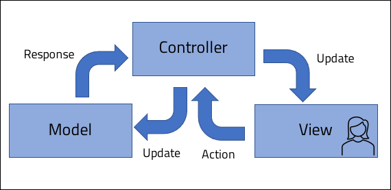

<br>
<strong>Key Takeaways</strong><br>
&#8226; Understand the popularity of the Spring framework to developers.<br>
&#8226; Review the core IOC containers provided with Spring.<br>
&#8226; Understand how Spring Boot Autoconfiguration enables convention over configuration.<br>

<p>
<i>
In the first year of my career, my manager would often tell me that writing a VBA script would allow me to make a coffee while the computer did my work.
Fascinated, I started to write more VBA scripts, measuring the productivity of the script as to how many coffees (few minutes) it would save me. This blog will look 
at how Spring Boot can send your coffee intake through the roof...
</i>
</p>
<br>
<h4>The Spring framework</h4>
<p>
<a href="https://spring.io/" target="_blank">Spring</a> is an open source application framework used with Java. 
Spring offers comprehensive support to the developer for building applications with in-built support for testing, data access, web frameworks and messaging support. 
The popularity of Spring, which is over 18 years old, has been realised as a from its light-weight design and features that include inversion of control (IOC).
</p>

<br>
<h4>Key features of the Spring framework</h4>
<p>
Spring provides an IOC container which serves as the most valuable feature to the developer.
The IOC container is complementary to the final principle of SOLID: <strong>'dependency inversion'</strong>. Dependency inversion creates loosely coupled classes within the application design. Loose coupling will provide benefits across unit testing and support for application growth and behaviours. 
You can read about dependency inversion in more detail from my previous <a href="https://aneesh.co.uk/dependency-inversion-principle" target="_blank">blog</a>.
</p>
<p>
In addition to the IOC container, the Spring framework also provides out-of-the-box support for further features:
</p>
<strong>Aspect-orientated programming</strong>, also known as AOP, enables cross-cutting concerns to be injected for method calls within the application. 
With AOP, the process of calling methods can be broken down into sections (such as before the call and after the call) where logic can be injected in a modular fashion. You can read more on AOP in my blog <a href="https://aneesh.co.uk/implementing-aop-in-a-spring-application" target="_blank">here</a>.
</p>
<p>
<strong>Security</strong> is supported by Spring for authentication, authorisation and other aspects. Spring security offers popular security mechanisms that can be efficiently implemented and customised into enterprise applications such as authorisation protocols of Kerberos, OAuth and SAML. 
</p>
<p>
<strong>Transaction management</strong> by Spring ensures database transactions are made in a timely manner using the ACID components. When an application makes a transaction to a database, the ACID components of atomicity, consistency, isolation and durability are important to meet to ensure transactions are orderly, complete and correct. The Spring framework provides an abstract layer underpinning both local transactions (in a centralised system) and global transactions (in a distributed system).
Spring provides an object relational mapping of data where support for integration with Hibernate, Java persistence API and data access object implementations can be configured for the IOC container.
</p>
<p>
<strong>Model-view-controller framework</strong>, also known as MVC, is an industry-standard design pattern used for developing front-end interfaces that support scalable applications. 
MVC defines three components of the application that allow data to be passed through the application for processing: 
The view, which represents the interface that the user interacts with.<br>
The controller, which accepts an input from the user and converts the request to the model.<br>
The model, the central component which manages the request from the controller and manages the business logic to return a response for the user.



</p>

<br>
<h4>Spring Beans and IOC</h4>
<p>
Spring achieves IOC by defining a 'container' to store the Objects that are later created and injected to the application. The Objects stored within the container are known as 'beans'.
The IOC container can exist with different properties and features, these are largely divided into the <strong>BeanFactory</strong> and <strong>ApplicationContext</strong>.
</p>
<h4>Spring Beans</h4>
<p>
A Spring Bean contains a set of instructions for creating an Object; by default, the Object is created as a singleton. The bean is later injected as and when it is required. 
Spring Bean definitions are made dependent to the IOC container that is used. Definitions can be made using XML or annotations. For XML files, beans are defined within a configuration file, and are injected by defining an 'autowire' property to the class configuration or by accessing the bean through its name from the container in the source code. Alternatively, beans can be defined within a class marked with '@Configuration' and injected by using the '@Autowired' annotation. We will later visit how to define the IOC container for the application. 
An example of the two styles for definitions are below:

XML definition and autowire:

```
<beans>
    <bean id="car" class="com.f1.Car"/>

    <bean id="race" class="com.f1.Race" autowire="byName">
        <property colour="yellow">
    </bean>
</beans>
```

Annotation-based:

```java{numberLines:true}
public class Car{
    String colour;
}
```
```java{numberLines:true}
@Configuration
public class ConfigClass{

    @Bean
    public Car getCar(){
        return new Car();
    }
}
```
```java{numberLines:true}
@Component
public class Race{

    @Autowired
    Car carToRace;

}
```
</p>
<p>
When using the Spring Framework, the IOC container is determined by the developer. The ApplicationContext is significantly more popular as recommended by the <a href="https://docs.spring.io/spring-framework/docs/2.5.x/reference/beans.html#context-introduction-ctx-vs-beanfactory">documentation</a>: <i>'use an ApplicationContext unless you have a really good reason for not doing so.'</i> The motivation for using the BeanFactory over the ApplicationContext is limited to only when memory usage is a valuable metric to the application as the BeanFactory can help reduce the memory-load of default ApplicationContext features.
</p>
<h4>BeanFactory container</h4>
<p>
The BeanFactory is an interface that is most commonly used through the <code>XmlBeanFactory</code> implementation. The BeanFactory is instantiated within the application using the following dependency:

```
    <dependency>
	    <groupId>org.springframework</groupId>
	    <artifactId>spring-beans</artifactId>
	    <version>5.2.8.RELEASE</version>
	</dependency>
```

The BeanFactory instance will take in a Resource instance to locate the configuration file for the beans:

```java{numberLines:true}
    Resource resource = new ClassPathResource("beans.xml");
    BeanFactory beanFactory = new XmlBeanFactory(resource);
```

As previously seen, the configuration file will use XML to define beans:

```java{numberLines:true}
public class Person{
    
    public Person(String name, int age){
        this.name = name;
        this.age = age;
    }

    String name;
    int age;
}
```
beans.xml file:
```
<bean id="cricketer" class="com.Person">
    <constructor-arg name="name" value="Ben Stokes"/>
    <constructor-arg name="age" value="29"/>
</bean>
```
The <code>cricketer</code> bean will create a Person of name "Ben Stokes" and of age 29.
The beanFactory can be used to obtain the bean:

```java{numberLines:true}
    Person person = (Person)beanFactory.getBean("cricketer");
```
</p>

<h4>ApplicationContext container</h4>
<p>
The ApplicationContext is a an advanced Spring container available from Spring 3.0 that offers specific framework-orientated enterprise functionality as well as all BeanFactory features.
While the BeanFactory supports only xml-configuration of beans, the ApplicationContext differs as it additionally supports annotation-based configuration that can be used within the application code.
The ApplicationContext extends from the BeanFactory to provide further functionality of bean integration with application-layer features such as:
* ApplicationEvent support for creating and listening to events during runtime
* MessageSource access to support environment-specific configuration and internationalisation
* BeanPostProcessor for the creation and use of new beans before formal bean creation
</p>
<p>
The ApplicationContext container can be implemented similarly to the XmlBeanFactory with the implementation 'ClassPathXmlApplicationContext':

```java
ApplicationContext context = new ClassPathXmlApplicationContext();
```
The annotation-driven configuration can be defined 'AnnotationConfigApplicationContext':

```java
ApplicationContext context = new AnnotationConfigApplicationContext();
```

The annotation-based container will perform a component scan to the configuration classes to store the beans that can be later obtained. 
</p>

<br>
<h4>Challenges with the Spring framework</h4>
<p>
While Spring provided developers with some great features to transform their application design and complexity, it introduced some unwanted challenges to the developer.
The complexities of Object management and dependency injection was since replaced with verbose xml configuration, most of which was boilerplate code.
As applications grew and the relationships between beans became more complicated, the burden of configuring the application became more and more apparent. 
</p>
<p>
One example that captures the laborious configuration required with Spring would be the MVC functionality.
Spring MVC requires a few configurations to be made before it can work as expected in the application. 
This involves the dependency in the pom.xml file and configurations for the DispatcherServlet and InternalResourceViewResolver.
</p>
<p>
The spring-mvc and java servlet dependencies are first referenced within the pom.xml file:

```
<dependency>
    <groupId>org.springframework</groupId>
    <artifactId>spring-webmvc</artifactId>
    <version>${spring.version}</version>
</dependency>

<dependency>
    <groupId>javax.servlet</groupId>
    <artifactId>javax.servlet-api</artifactId>
    <version>3.1.0</version>
    <scope>provided</scope>
</dependency>

<dependency>
    <groupId>javax.servlet</groupId>
    <artifactId>jstl</artifactId>
    <version>1.2</version>
</dependency>
```
</p>
<p>
The DispatcherServlet is bootstrapped to the application and is responsible for loading the IOC container. 
In the WEB-INF/web.xml file, the developer will need to configure the DispatcherServlet:

```
<servlet>
    <servlet-name>servlet</servlet-name>
    <servlet-class>org.springframework.web.servlet.DispatcherServlet</servlet-class>
    <init-param>
       <param-name>contextConfigLocation</param-name>
       <param-value>/WEB-INF/spring/appServlet/servlet-context.xml</param-value>
    </init-param>
    <load-on-startup>1</load-on-startup>
</servlet>

<servlet-mapping>
    <servlet-name>appServlet</servlet-name>
    <url-pattern>/</url-pattern>
</servlet-mapping>
```
</p>
<p>
Component scanning will be configured into the app-config.xml file to direct Spring to the packages to be scanned:

```
<beans xmlns="http://www.springframework.org/schema/beans"
       xmlns:xsi="http://www.w3.org/2001/XMLSchema-instance"
       xmlns:context="http://www.springframework.org/schema/context"
       xsi:schemaLocation="http://www.springframework.org/schema/beans
                           http://www.springframework.org/schema/beans/spring-beans.xsd
                           http://www.springframework.org/schema/context
                           http://www.springframework.org/schema/context/spring-context.xsd ">

    <context:component-scan base-package="com.spring.application" />

</beans>
```
</p>
<p>
Lastly, the InternalResourceViewResolver bean is registered which will return the view name as specified by the location of the file:

```
<beans xmlns="http://www.springframework.org/schema/beans"
       xmlns:xsi="http://www.w3.org/2001/XMLSchema-instance"
       xmlns:context="http://www.springframework.org/schema/context"
       xmlns:mvc="http://www.springframework.org/schema/mvc"
       xsi:schemaLocation="http://www.springframework.org/schema/beans
                           http://www.springframework.org/schema/beans/spring-beans.xsd
                           http://www.springframework.org/schema/mvc
                           http://www.springframework.org/schema/mvc/spring-mvc.xsd
                           http://www.springframework.org/schema/context
                           http://www.springframework.org/schema/context/spring-context.xsd ">

    <mvc:annotation-driven />
    <context:component-scan base-package="com.spring.application" />

    <bean class="org.springframework.web.servlet.view.InternalResourceViewResolver">
        <property name="viewClass" value="org.springframework.web.servlet.view.JstlView"/>
        <property name="prefix" value="/WEB-INF/view/" />
        <property name="suffix" value=".jsp" />
    </bean>

</beans>
```
</p>
<p>
Thankfully, that would be the <i>only</i> configuration required as default for using MVC with the Spring framework. But surely this can be made easier?
In April 2014, the advent of Spring Boot came as a solution to resolve the heavy configuration required with the Spring framework...
</p>

<br>
<h4>Introduction to Spring Boot</h4>
<p>
Spring Boot was introduced with a precendent to <i>convention over configuration</i>: the objective of reducing the number of decisions a developer needs to make when creating an application. But what does this mean?<br>
The design paradigm of convention over configuration will <i>only</i> require the developer to specify <u>unconventional</u> configurations for the application. A <i>sensible default</i> is however defined for all other infrastructure components (which would include DispatcherServlet and component scanning for MVC - yay).
</p>
<p>
Spring Boot applications can be created out-of-the-box from the 'Spring initializer' at <a target="_blank" href="https://start.spring.io/">start.spring.io</a>. The Spring initializer can also be used through Spring Tool Suite and allows the developer to specify the dependencies that create the environment. 
</p>
<br>
<h4>AutoConfiguration</h4>
<p>
AutoConfiguration is the core feature from Spring Boot as it resolves the excessive configuration required from the developer for the application purpose. 
</p>
<p>
As previously visited, Spring MVC is one example where default configuration would always be required to set-up the DispatcherServlet and ViewResolver amongst other infrastructure components.
The same principle applies for Hibernate where we need to manually configure a data source and entity manager factory to our application. 
Rather than configuring the xml ourselves, Spring Boot AutoConfiguration will create the beans automatically upon scanning the jar in the class-path and deciding which default beans are required.
</p>
<p>
Spring AutoConfiguration is used from the spring-boot-autoconfigure jar in the classpath.
The AutoConfiguration class, which is run after all other beans are configured, will appear like any usual Spring @Configuration class. The difference however lies in annotations such as <code>@ConditionalOnMissingBean</code> and <code>@ConditionalOnClass</code> which will configure and activate a bean provided certain classes appear within the classpath. 
</p>
<p>
Spring Boot AutoConfiguration also plays a role in the default IOC container that is used by the Spring Boot application. Spring Boot will default to the <code>AnnotationConfigApplicationContext</code> container. If during the Autoconfiguration scan a web starter-project is identified, the IOC container will use the <code>AnnotationConfigServletWebServerApplicationContext</code> container instead. The latter of the ApplicationContext types will create, initialise and run a webserver as required by the dependencies. The selection of the ApplicationContext further extends the functionality of Autoconfiguration to support the 'convention over configuration' framework.
</p>
<br>
<h4>Other key features with Spring Boot</h4>
<p>
The first main feature from a Spring Boot application is the @SpringBootApplication annotation that is added to the main class as default. 
The single annotation encapsulates 3 other annotations that are useful for the developer to use the main class for:
* @Configuration enables Java-based configuration for the class to enable Beans to be defined
* @ComponentScan to enable component scanning across the application package and sub-packages
* @EnableAutoConfiguration to enable the Spring Boot AutoConfiguration
</p>
<p>
Spring Boot introduces 'starter-dependencies' that can be selected during creation of a Spring Boot Application, or injected to the pom.xml file. Starter-dependencies  includes the related configurations and beans required by the application thus eliminating the need to add multiple related dependencies in the same pom.xml file. The starter-dependencies extend the convention-over-configuration of Spring Boot by further reducing the configuration required by the developer.
If you were to develop a RESTful application, you would require the MVC design pattern which includes Spring MVC, Spring REST and Object to relational mapping. The <i>spring-boot-starter-web</i> dependency encapsulates all these requirements together to include the jar files with the application classpath.
</p>
<p>
Spring Boot provides an embedded server into the jar executable application as default. Without Spring Boot, the developer would be required to install a web server that the application artifact is later deployed to. Spring Boot offers a default embedded server of Tomcat, however alternatives such as Jetty and Undertow are also available. Apache Tomcat is an open source web server designed to execute Java servlets and to render Java Server Pages.
</p>
<p>
Spring Boot enables the use of externalised configuration to provide control of the application runtime properties. Beans can use the <code>@Value</code> annotation to obtain their value from an external <i>.properties</i> file. Spring Boot provides a properties file and bootstrap file to priorities configurations that can enable custom application behaviour for different environments. The externalised configuration can be used for changing the URL, username and password accesses, locale for formats and also logging level to the same application in different environments. 
</p>

<br>
<h4>Summary</h4>
<p>
The Spring framework was introduced as a lightweight solution for loose-coupling and management of Java Objects with an IOC container. 
Within Spring, developers are able to create beans to be stored within an IOC container which represent instructions for creating and managing Java Objects. 
The ApplicationContext IOC container introduced annotation-based configuration and enhanced IOC bean management features. 
Following the growth and popularity of Spring, the developer often wrote excessive xml configuration when using the Spring framework thus Spring Boot offered a solution. 
Spring Boot introduced Autoconfiguration that uses convention over configuration to create default beans and configuration for the application. 
As a result, Spring Boot enables the developer to create out-of-the-box production-ready applications with minimal configuration required with the flexibility of customisation. 
You can read more about Spring and its features from the excellent documentation <a href="https://docs.spring.io/spring-framework/docs/current/reference/html/" target="_blank">here</a>
</p>

<br>
<small style="float: right;" >Picture: Tokyo, Japan by <a target="_blank" href="https://unsplash.com/@geniequo">Heshan Perera</small></a><br>