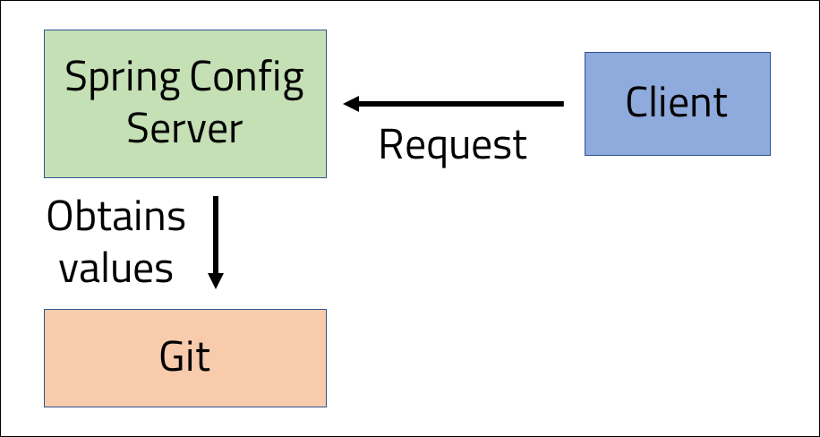

<br>
<strong>Key Takeaways</strong><br>
&#8226; Use Spring Cloud Config to create an externalised configuration server in a distributed system.<br>
&#8226; Understand how the Config server reads in properties across a filesystem.<br>
&#8226; Implement a client server to consume the Config server.<br>

<br>
<h4>Centralised configuration</h4>
<p>
In a distributed system, the configuration of the services are often defined at a local level where they are individually updated and maintained by the responsible team.
The Spring Cloud framework offers the Config server solution to act as a single-stop solution for managing all configurations to the services within a system. The centralised configuration 
server will provide transparency and versioning of configurations that can impact multiple or single services at a time.
</p>
<p>
We use configurations to represent all the changes that might take place between deployments. For example, configurations could include login credentials, connections to databases, hostnames and also logging levels. Configurations for services within a Spring Boot application are often defined within the <code>application.properties</code> file or a similar yml file within the resources directory.
With Spring Cloud Config, the distributed services can inject their configurations by scanning the Config server before they are instantiated.
</p>
<p>
A centralised configuration server offers further benefits such as risk reduction and dependency on local configuration that can otherwise fall out of sync with the other services.
Spring Cloud Config enables environment variables to be tracked centrally, where services can even obtain updated properties at runtime without having to restart.
</p>

<br>
<h4>Creating a Config Server</h4>
<p>
The Config server can use many different medium for storing the configuration files including JDBC, Redis, or AWS S3. The default storage is Git and will be used alongside GitHub in this blog.
</p>
<p>
When a service is subscribed to the config server, they will be able to use the server as a REST service to obtain their configuration values.



</p>

<p>
The Config server uses the Spring Cloud Config Server dependency and Spring Web dependency together. The Web dependency provides the REST functionality of the server once all the 
configuration files are read and stored:

```
<dependency>
  <groupId>org.springframework.cloud</groupId>
  <artifactId>spring-cloud-config-server</artifactId>
</dependency>

<dependency>
  <groupId>org.springframework.boot</groupId>
  <artifactId>spring-boot-starter-web</artifactId>
</dependency>


```
</p>

<p>
The config server must be configured to know where to read the properties files from. The configuration is applied in the <code>application.properties</code> file:

```{numberLines:true}
server.port= 8888
spring.cloud.config.server.git.uri = https://github.com/4neesh/DeveloperBlogDemos
spring.cloud.config.server.git.searchPaths= SpringConfig/Config-files*, SpringConfig/Config-files/prod*, SpringConfig/Config-files/dev*
```

The first line will direct the Config server onto port 8888.<br>
Line 2 will specify where the server will look for the Git configuration files. The value for line 2 will be the home directory of the Git repository (where the .git file is located).<br>
Line 3 defines the search paths to find the appropriate properties files from within the Git repository.
The search path will first enter the SpringConfig folder, followed by scanning all files within the Config-files sub-directory, and finally the sub-directory of 'prod' and 'dev' within Config-files.
The Config server will register all .properties files found within the search path.
</p>

<p>
The server is activated through a single annotation in the main class <code>@EnableConfigServer</code>. The annotation will instruct the server to scan the search paths defined and to 
define the endpoints for reading the configuration files. 

```java{numberLines:true}
@SpringBootApplication
@EnableConfigServer
public class ConfigServerApplication {

	public static void main(String[] args) {
		SpringApplication.run(ConfigServerApplication.class, args);
	}

}
```
</p>


<p>
The following list contains all the .properties files that are obtained by the config server. 
I have manually created these files and placed them within the folders at the Git <a href="https://github.com/4neesh/DeveloperBlogDemos/tree/master/SpringConfig/Config-files" target="_blank">repository</a> to allow the server to build its key-value pairs of properties:

```
- /SpringConfig/Config-files/application-prod.properties
- /SpringConfig/Config-files/application-dev.properties
- /SpringConfig/Config-files/application-default.properties
- /SpringConfig/Config-files/prod/drinks-prod.properties
- /SpringConfig/Config-files/prod/food-prod.properties
- /SpringConfig/Config-files/dev/drinks-dev.properties
- /SpringConfig/Config-files/dev/food-dev.properties
```
The below file directory structure is used:

```
├── SpringConfig
│   └── Config-files
│         ├── application-prod.properties
│         ├── application-dev.properties
│         ├── application-default.properties
│         └── prod
│         │     ├── drinks-prod.properties
│         │     └── food-prod.properties
│         └── dev
│               ├── drinks-dev.properties
│               └── food-dev.properties
```
</p>
<p>
When the config server has started, you will be able to send GET requests to the 8888 port endpoints to obtain the relevant value(s). In the next section, we will look at the exact endpoints that are generated by the config server and how the values returned are determined.
</p>

<br>
<h4>Navigating the Config server</h4>
<p>
When the Config server is launched, it will use the Spring-web starter to expose endpoints that reflect the properties files which it finds from the saerch paths. 
A GET request can be made to endpoints using the following name convention:

```
localhost:8000/{application name}/{active profile}
```
</p>
<p>
Each property file is conveniently named to address both the <code>application name</code> and the <code>active profile</code>. For example, 'drink-prod.properties' will have the application name of 'drink' and the active profile of 'prod'. The same goes for all other files. If there is no application name specified, it will be defaulted to 'application' and if there is no profile specified, it will be read as 'default'. Therefore all services that use the config server will obtain the values from the 'application-default.properties' file (if it exists). We are able to define the application name and profile of each service within the application.properties file. The service will then know which properties file to query in the Config server.  
</p>
<p>
You can see the config files on GitHub <a href="https://github.com/4neesh/DeveloperBlogDemos/tree/master/SpringConfig/Config-files" target="_blank">here</a>. They contain values for a database name, user name and password. The database name will reflect the application name and the profile and the user name and password will either be a service account credential or simple value. They are used for demonstration in this blog, however as we will later visit, they can be made to represent real configuration values. 
</p>
<p>
The following endpoints are exposed from the config server to enable transparency into the values obtained by the services:<br>
/{application}/{profile}<br>
/{application}-{profile}.properties<br>
The first endpoint will return all values that fall under the application and profile together, and also the respective default values as per the application-prod/dev/default.properties files.
</p>

<p>
The below examples demonstrate how the properties returned from the config server follow a hierarchy of matching from the defined application name and profile:

localhost:8888/food/prod returns:

```
{
    "name": "food",
    "profiles": [
        "prod"
    ],
    "label": null,
    "version": "f6d1b8edc6e75c5586e369188e6bf6284120f46c",
    "state": null,
    "propertySources": [
        {
            "name": "https://github.com/4neesh/DeveloperBlogDemos/SpringConfig/Config-files/prod/food-prod.properties",
            "source": {
                "Database": "mysql-food-prod",
                "User": "serviceAccount",
                "Password": "serviceAccount"
            }
        },
        {
            "name": "https://github.com/4neesh/DeveloperBlogDemos/SpringConfig/Config-files/application-prod.properties",
            "source": {
                "Database": "mysql-application-prod",
                "User": "serviceAccount",
                "Password": "serviceAccount",
                "Environment": "PROD"
            }
        }
    ]
}
```

The first tags returns the application name and the profile of the request. 
The properties from the files on the Config server are presented under 'propertySources'. The first set of values come from the food-prod properties file and the second set of values are from the application-prod properties file. The config server has returned the properties files that are appropriate to the application name and the profile of prod first, followed by the default application-prod properties second. 
</p>
<p>
Another example to demonstrate the config server: localhost:8000/drink/dev:

```
 "propertySources": [
        {
            "name": "https://github.com/4neesh/DeveloperBlogDemos/SpringConfig/Config-files/dev/drink-dev.properties",
            "source": {
                "Database": "mysql-drink-dev",
                "User": "user",
                "Password": "password"
            }
        },
        {
            "name": "https://github.com/4neesh/DeveloperBlogDemos/SpringConfig/Config-files/application-dev.properties",
            "source": {
                "Database": "mysql-application-dev",
                "User": "user",
                "Password": "password",
                "Environment": "DEV"
            }
        }
    ]

```
</p>
<p>
If we request an unknown application name with a 'dev' profile, we will receive the application-dev.properties file:

localhost:8080/cook/dev:

```
"propertySources": [
        {
            "name": "https://github.com/4neesh/DeveloperBlogDemos/SpringConfig/Config-files/application-dev.properties",
            "source": {
                "Database": "mysql-application-dev",
                "User": "user",
                "Password": "password",
                "Environment": "DEV"
            }
        }
    ]

```
</p>

<br>
<h4>Consuming the configuration server</h4>

<p>
We have seen how the config server will return properties as a REST service and how the properties files are returned upon reflection of the application name, profile and defaulted properties files. A client can also perform GET requests to the service to obtain the configuration to be injected at instantiation. 
</p>
<p>
The client service will require the Web-starter dependency to make the GET request and Config-client dependency to register the Config server:

```
<dependency>
  <groupId>org.springframework.boot</groupId>
  <artifactId>spring-boot-starter-web</artifactId>
</dependency>

<dependency>
  <groupId>org.springframework.cloud</groupId>
    <artifactId>spring-cloud-starter-config</artifactId>
</dependency>
```
<p>
The client will need to load the Config server properties <u>before</u> the application uses its <u>local</u> properties by defining the Config server in the <strong>bootstrap.properties</strong> file.
The bootstrap properties file is loaded with precedence before the application has started to override any of the local configurations by default. The bootstrap.properties file is therefore used to 
load the configuration files from the server to provide configuration to the service. 
</p>

<p>
The bootstrap.properties file will be defined as below to register the config uri, application name and profile:

```{numberLines:true}
cloud.config.uri=http://localhost:8888
spring.application.name=drink
spring.profiles.active=prod
```

The <code>cloud.config.uri</code> will point to the location of the config server.
The <code>spring.application.name</code> value will determine the application name for which to obtain the properties file for. This property is defaulted to 'application'.
The<code> spring.profiles.active</code> property will tell the application which profile it will assert for the config property search. This property is defaulted to 'default'. 
</p>
<p>
If you check the console for when the application is started, you will see the following line to tell you the config files are being loaded:

```
Fetching config from server at : http://localhost:8888
```

When the Spring client has loaded, the config properties from the localhost:8888/drink/prod will be loaded into the application.
The following values are pre-loaded into the application:

```
Database=mysql-drink-prod
User=serviceAccount
Password=serviceAccount
Environment=PROD
```
The <code>Environment</code> property has been taken from the application-prod.properties file which is read second to the drink-prod.properties file. As the drink-prod file did not contain a value for the 
key of 'Environment', the value is populated from the application-prod file. 

</p>

<br>
<h4>Using the config values within the client</h4>
<p>
The client can use a RestController to obtain the values from the config server:

```java{numberLines:true}
@RestController
public class ClientController{

  @Value("${Database}")
  public String database;

  @GetMapping("/database")
  public String getHome(){
    return database;
  }

}

```
</p>
<p>
The <code>@Value</code> annotation will obtain the value for the property of 'Database' from the configuration file. 
The endpoint of '/database' will return the value as a String to the user. 
Going to the endpoint of '/database' will return 'mysql-drink-prod'.
</p>

<br>
<h4>Obtaining client properties from the Config Server</h4>
<p>
You may remember that we are importing the config files from the server within the bootstrap.properties file which is initialised before the service iteself.
As a result, the config server will theoretically populate items into the application.properties file. 
To test this, we can update the drink-prod.properties file from the config server to include a further property that is then pushed to the GitHub repository:

```
server.port=7777
```
The new property for <code>server.port</code> will instruct the client to be hosted on the 7777 port. The property would only ever work for a single client as only one client can be registered to port 7777.
Further requests to the port from different services will return an error that the port is unavailable. 
If we were to restart the client, we can see it will start on port 7777 from the Spring console output:
```
Tomcat initialized with port(s): 7777 (http)
```
By defining the server port through the config server, we have illustrated how the bootstrap.properties file is loaded before the application starts, and how the 
application name and profile read from the config server is applied.
The config server can be taken much further by configuring many other static properties across services such as discovery server locations, JDBC drivers, database locations and non-production credentials. 
</p>

<br>
<h4>Obtaining updated properties from the Config server</h4>
<p>
The current client and Config server work in unison where the client pulls in the config server properties upon instantiation. The properties are read in statically and used for the life of the service. 
But what happens if we change a property within the config server? The client will not be able to reflect the update as it's properties are static. Instead, we will need to restart the client to obtain the latest information from the config server. 
</p>
<p>
Thankfully, there is an easier way to obtain the latest updates, by using the <code>@RefreshScope</code> annotation from the Spring Cloud Context package. 
In the RestController, I will add the @RefreshScope annotation to instruct the controller to refresh its beans upon a client refresh. 
We are able to refresh the client by invoking the 'refresh' endpoint from the Spring actuator with the below dependency:

```
<dependency>
  <groupId>org.springframework.boot</groupId>
  <artifactId>spring-boot-starter-actuator</artifactId>
</dependency>
```
By default, not all actuator endpoints are accessible. Therefore in the application.properties file for the client, we are to add the following line to enable the '/refresh' endpoint.
Alternatively, you can add the below line to the appropriate file in the Config server.

```
management.endpoints.web.exposure.include=refresh
```
</p>
<p>
The RefreshScope will be tested by updating the property of 'user' in the drink-prod.properties file:

```
Database=mysql-drink-prod
User=serviceAccount2.0
Password=serviceAccount
server.port=7777
```

The property update is pushed to the Git repository and the client RefreshScope is activated by sending an empty POST request to the refresh endpoint: localhost:7777/actuator/refresh using Postman.
Once the actuator endpoint is called, the RefreshScope will renew its beans to show the updated configuration file reflected in the '/username' endpoint.
</p>
<p>
So what does RefreshScope actually do?<br>
The RefreshScope annotation will mark the Controller class as 'lazy' where they are initialised when they are <i>used</i> rather than at the application initialisation. 
The scope of the class will act a cache for storing the initialised values. As a result, the bean can be re-initialised as and when required. 
It is important to consider which other beans are within the scope of the class as they will also be re-initialised when the actuator refresh endpoint is called. 
This consideration can have an impact on the efficiency of the refresh and the side-effect upon beans that are refreshed. 
</p>

</p>
<br>
<h4>Summary</h4>
<p>
The Spring Cloud Config server is used to act as a REST service for obtaining service configuration at runtime. 
The centralised configuration offers a transparent and controlled service to all clients within the microservice system. 
The Config server is configured to scan a file path to obtain the properties files and uses a hierarchy of application name and active profile values to define configurations to be passed in.
Each client within the system registers its configuration to the server with the bootstrap.properties file and is able to obtain live updates of the configuration through the RefreshScope annotation.
</p>
<p>
You can get started with centralised configuration from with the source code from this blog on GitHub <a href="https://github.com/4neesh/DeveloperBlogDemos/tree/master/SpringConfig" target="_blank">here</a>.
</p>