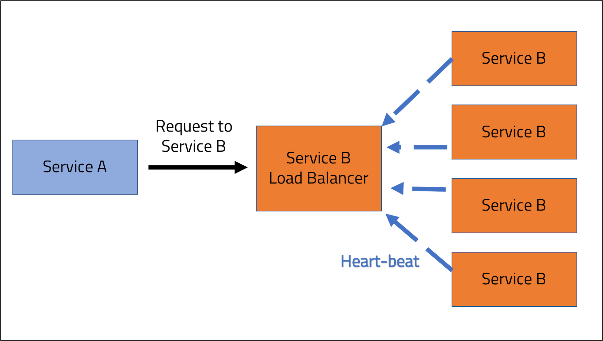
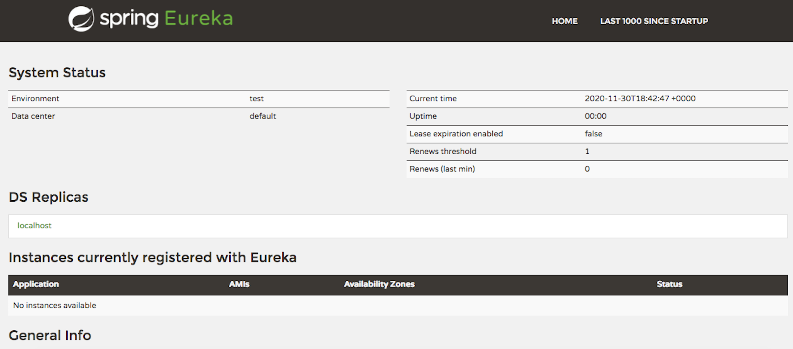

<br>
<strong>Key Takeaways</strong><br>
&#8226; Understand the use of Spring Cloud Netflix Eureka for registering, consuming and load-balancing services.<br>
&#8226; Create a Eureka discovery service to register services within a distributed system.<br>
&#8226; Register and consumed microservices through the Eureka service.<br>


<br>
<h4>Netflix Eureka Registration service</h4>
<p>
Netflix Eureka is a microservice registration tool developed and open sourced by Netflix. 
Within a microservices environment, microservices will be communicating with each other across different IP addresses and ports thus requiring each service to manage many connection locations that may change with time. 
Service discovery constitutes the process of registering other services within a distributed architecture.
Service discovery supports the horizontal scaling  of services; development teams are able to see the instances/CPU that are available for each service from a single point and are able to scale instances of the service to enhance the capability to consume and process requests. 
Scaling within a monolithic system would have required a vertical scaling across the system to enhance throughput.
</p>
<p>
The Eureka server is itself a microservice that is used to register and store the location of other microservices within the same system. The services register themselves to the server where they can be identified and located by other microservices when required.
</p>
<p>
This blog will demonstrate the use of Eureka as a service registry service. The load-balancing feature of the service will be explored as well as the many 
other benefits of Eureka to report upon health information for services and the system.
</p>

<br>
<h4>What is load-balancing?</h4>
<p>
Load balancing refers to the efficient distribution of network traffic amongst the available servers, known as a server farm. Within a distributed architecture, individual services are able to communicate with each other, thus constituting network traffic of requests along with external requests made through the system interfaces.
</p>
<p>
A load-balancer sits in-front of the service instances to monitor the health of the instances and to direct traffic accordingly. If a service instance goes down, the load-balancer will automatically redirect traffic to healthy instances. 


</p>
<p>
Spring Cloud Eureka acts as a load-balancer as well as a discovery service to services within a distributed system.
</p>
<br>
<h4>Creating the registration server</h4>
<p>
The Eureka server is first created to maintain the pool of services that consistently send a heartbeat of their existence.
The discovery service acts as a domain name service or a load balancer as instance health is assessed and requests are routed as appropriate by the registration service for the consumers of the service.
</p>
<p>
To create the registration service, you must include the <code>spring-cloud-starter-eureka-server</code> dependency to add support for the Eureka server along with <a href="https://spring.io/guides/gs/client-side-load-balancing/" target="_blank">Netflix Ribbon</a>, a client-side load balancer. 

```
<dependency>
	<groupId>org.springframework.cloud</groupId>
	<artifactId>spring-cloud-starter-netflix-eureka-server</artifactId>
</dependency>

```
</p>
<p>
The main class of the new Spring project will be annotated with <code>@EnableEurekaServer</code>. The annotation instructs the service to act as a Eureka server:

```java{numberLines:true}
@SpringBootApplication
@EnableEurekaServer
public class DiscoveryServerApplication {

	public static void main(String[] args) {
		SpringApplication.run(DiscoveryServerApplication.class, args);
	}

}
```
</p>

<p>
In the application properties file, the server is configured to a port, and boolean values for registration instructions:

```{numberLines:true}
server.port=9001
eureka.client.fetch-registry=false
eureka.client.register-with-eureka=false
```
The <code>server.port</code> specifies the port the Eureka service is located. By default, it is port 8761.<br>
The <code>fetch-registry</code> will instruct the server not to store the services within its cache. We will look into this with a bit more detail further in the blog.<br>
The <code>register-with-eureka</code> property will instruct the server to not register itself with itself. By default, you will find the server as the only service registered as it will otherwise register itself as a service.
</p>
<p>
If we navigate to localhost:9001, we can find the server without any instances registered to it:


</p>
<p>
The 'Environment' at the top of the page is defaulted to 'Test', however can be overridden within the application properties file with <code>eureka.environment</code> key. The section at the top right will show the uptime of the server and the renews threshold and renews. The threshold defines the number of expected heart beats it expects per minute. 
</p>
<p>


In the second half, information including the available memory and CPUs are also shown with the memory usage and percentage for the registered services. 
As we add instances to the Eureka server, we can review how the general information updates. 
</p>

<br>
<h4>Configuring a Discovery client</h4>
<p>
I will use two services to demonstrate how the Eureka server can be used between microservices to consume each other.
The demonstration will include a HR-Service which represents a HR department, and a Phone-book service, which includes a service that returns user names and 
their phone number. 
The HR-Service will consume the phone numbers from the Phone-book service to retrieve contact information. 
</p>
<p>
Both clients to the Eureka server will register themselves with the help of the <code>spring-cloud-starter-eureka</code> dependency. The dependency also comes with further properties that can be configured for custom behaviours. The Spring-web dependency is also required for the REST service provided by the client. 

```
<dependency>
	<groupId>org.springframework.cloud</groupId>
	<artifactId>spring-cloud-starter-netflix-eureka-client</artifactId>
</dependency>
<dependency>
	<groupId>org.springframework.boot</groupId>
	<artifactId>spring-boot-starter-web</artifactId>
</dependency>
```
</p>
<p>
Adding <code>@EnableDiscoveryClient</code> can be used to activate the discovery client to the server.
This is a marker annotation for others to know it is a Eureka client. We do not necessarily have to use it. 
Alternatively, you can use @EnableEurekaClient for a direct implementation of discovery server. <code>@EnableDiscoveryClient</code> will instead select the implementation (Consul, ZooKeeper, Eureka) from the classpath and assign it.
</p>
<p>
The properties file of the Phone-book service will be configured accordingly with the Eureka server:

```
server.port=9002
spring.application.name=phone-book
eureka.client.serviceUrl.defaultZone= http://localhost:9001/eureka/
```

The <code>application.name</code> defines the name of the service to be used as a key within the Eureka server.
The <code>serviceUrl.defaultZone</code> will instruct where the Phone-book service will try to register itself with a Eureka Server.
</p>
<p>
Both services will include a model class called 'Contact' to store a basic Contact Object with name and number. The Phone-book will later create a list of the Contact Objects and the HR-Service will consume them over a HTTP call.

```java{numberLines:true}
public class Contact {
	
	private int number;
	private String name;
	
	public Contact(int number, String name) {
		super();
		this.number = number;
		this.name = name;
	}
	public int getNumber() {
		return number;
	}
	public void setNumber(int number) {
		this.number = number;
	}
	public String getName() {
		return name;
	}
	public void setName(String name) {
		this.name = name;
	}
	
}
```
</p>
<p>
Within the Phone-book service, the controller class will be used to create and return a list of Contacts:

```java{numberLines:true}
@RestController
public class PhoneController {
	
    @GetMapping("/contacts")
    public ResponseEntity<?> getContacts() {
    	
	 List<Contact> contactList = new ArrayList<>();
		contactList.add(new Contact(123, "Alice"));
		contactList.add(new Contact(456, "Bob"));
		contactList.add(new Contact(789, "Charlie"));
        	
        return ResponseEntity.ok(contactList);
    }	
}
```

The above <code>getContacts()</code> method simulates a call to a data store.
The <code>ResponseEntity</code> return type of the controller defines a HTTP response that can be consumed and transformed by another service.
</p>
<p>
If we navigate to the '/contacts' endpoint from the Phone-book service, we can retrieve the list of Contact instances:


</p>
<p>
We can also check the Eureka service to confirm the Phone-book service is registered.
The Eureka service will typically take 30 seconds to show the new service registered as it requires 3 consistent heartbeats from a service for it to be registered.


The number inside the brackets will tell you how many instances of a service with the same name that are running. 
If we add more services, the number will increase and the status will show the address of each of the services:


Now we can consume and test load-balancing to the instances!
</p>

<br>
<h4>Consuming the Phone-book service</h4>
<p>
The HR-Service is going to be built out to consume the Phone-book service and to obtain the appropriate Contact instances.
The HR-Service will use the <code>RestTemplate</code> class to consume the HTTP body of the Phone-book 'contacts' endpoint. The RestTemplate is a high-level API to the Spring framework that is used for executing synchronous HTTP requests. The RestTemplate will be defined as a Bean within the main class to be later injected:

```java{numberLines:true}
@Bean
RestTemplate getRestTemplate(){
	return new RestTemplate();
}

```
</p>
<p>
The properties file will look similar to the Phone-book service, with the addition of <code>eureka.client.fetch-registry</code>:

```numberLines:true
server.port=9003
eureka.client.fetchRegistry=true
spring.application.name=hr-service
eureka.client.serviceUrl.defaultZone= http://localhost:9001/eureka/
```

The fetch-registry property will instruct the service to obtain a list of all services registered to the Eureka server. 
The services will be stored within the client cache and is updated every 30 seconds.
</p>
<p>
The HR-Service controller will use the RestTemplate to make a HTTP call to one of the instances of the Phone-book service with the 'contacts' endpoint:

```java{numberLines:true}
@RestController
public class HrController {

	@Autowired
	RestTemplate restTemplate;
	
	@GetMapping("/request-contacts")
	public Contact[] contacts() {
	        Contact[] result = restTemplate.getForObject("http://localhost:9002/contacts", Contact[].class);
	        return result;
	    }
	
}
```
</p>
<p>
So far, this request from the controller doesn't actually need the Eureka server. What happens if port 9002 goes down or is changed? How can we better utilise the available instances of the Phone-book service? 
In the next section, the Eureka service is used to perform load-balancing and dynamic access to the services.
</p>

<br>
<h4>Enabling microservices to communicate through Eureka</h4>
<p>
The Eureka server allows our services to communicate without explicitly knowing their location (including port). With the use of the service name as a key, Eureka is able to consolidate all running instances of a server for load-balancing, and also empowers the clients of the server to refer each other upon their name, rather than address. 
As a result, clients are able to reference each other dynamically, and requests for service consumption can be load-balanced altogether.
</p>
<p>
The Spring application name, defined the properties of each service, is used as a key within the Eureka server. Before we can allow the RestTemplate to take 
advantage of the load-balancing provided by Eureka, we must annotate it with <code>@LoadBalanced</code>:

```java{numberLines:true}
@Bean
@LoadBalanced
RestTemplate getRestTemplate(){
	return new RestTemplate();
}
```
We use the <code>@LoadBalanced</code> annotation to tell Spring to create a Ribbon-backed RestTemplate. The Ribbon slightly changes the way we interact with the service as Spring no longer expects the physical location of the service to be provided, instead it expects the Eureka service ID (Application name) to be called.
Eureka Ribbon will periodically refresh its cache of IP addresses from the Eureka service of service names in an eventually consistent manner every 30 seconds.
The Ribbon-enabled RestTemplate parses the URL as the server name key to query Ribbon for a service instance.
</p>
<p>
If we were to call the existing HR-Service request from the Controller, it will now search for a service within its cache under the name of 'localhost:9002'. The service will throw an error when we try to access the service name. The advantage is that the service will no longer request the exact port of the request, and can now have the request load-balanced to one of the various service instances.
</p>

<p>
The HR-Service controller is now updated to call the Phone-book service name as the key to the Eureka server:

```java{numberLines:true}
	@GetMapping("/request-contacts")
	public Contact[] contacts() {
	        Contact[] result = restTemplate.getForObject("http://phone-book/contacts", Contact[].class);
	        return result;
	}
```
</p>
<p>
If we make a call, the Eureka server will provide load-balancing for us and return the contacts in JSON as expected from one of the available instances.
</p>
<br>
<h4>Summary</h4>
<p>
When I first started using Spring Cloud Eureka, I had thought of it as a convenient naming resource that allowed me to reference different services by name, rather than by location.
This blog has allowed me to realise the potential of the discovery server for more than just service registration.
<p>
<p>
The Eureka server can provide useful insight to the health of the many instances running for each service within a distributed system. From the server page, we can see the life of services via the expected and received heartbeats, the capacity of RAM in the system, and also the live update of services as they come up and are brought down.
</p>
<p>
Spring Cloud Eureka provides load-balancing as a service to the system to support the horizontal scaling of the services as they are required.
The Eureka package has also made it intuitive and simple with bootstrapped annotations to implement the discovery server and to also use the discovery server with auto-configured service discovery implementations and configured properties.<br>
You can find the source code from this blog on GitHub <a href="https://github.com/4neesh/DeveloperBlogDemos/tree/master/Eureka">here</a> where you launch your own Eureka server to open and consume services through a load-balanced server.
</p>

<br>
<small style="float: right;" >Picture: Siquijor, Philippines by <a target="_blank" href="https://unsplash.com/photos/2rH2w01umhY">Louie Martinez</small></a><br>
