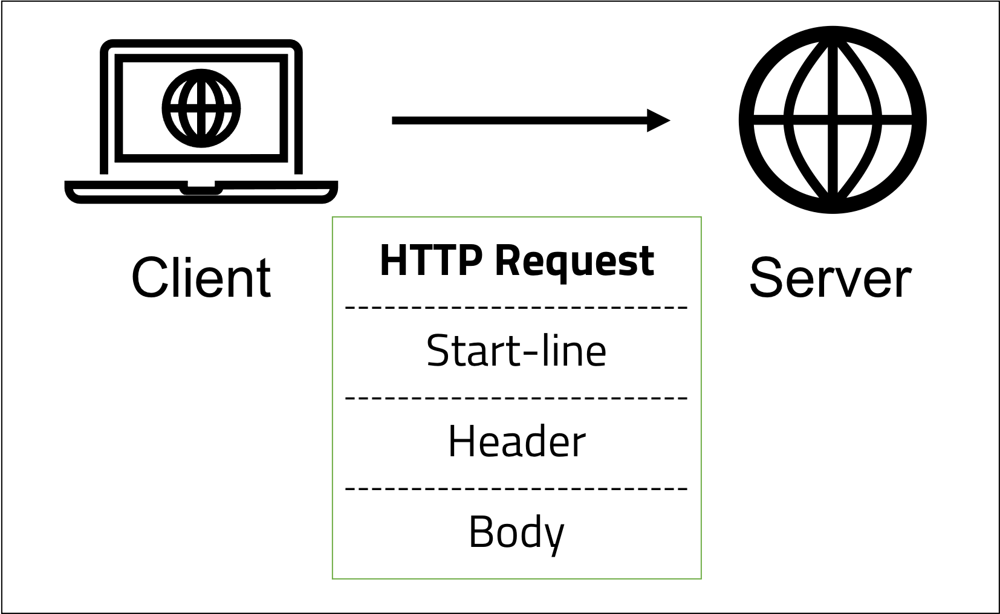
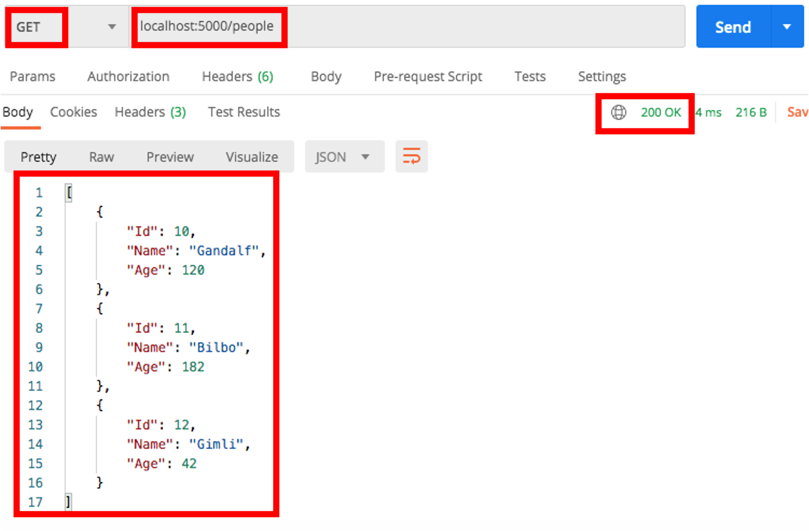
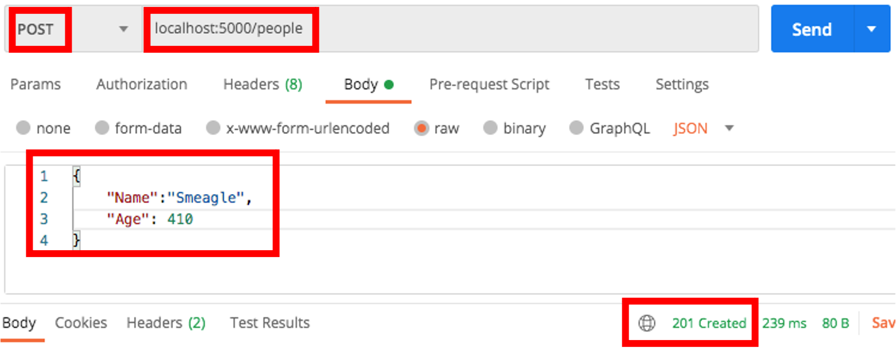

<br>
<strong>Key Takeaways</strong><br>
&#8226; Use Go to create a RESTful web service step-by-step.<br>
&#8226; Explore some of the key classes and methods from the Go standard library for web services.<br>
&#8226; Handle client HTTP requests to perform CRUD operations.<br>
&#8226; Persist data with a MySQL database.<br>

<br>
<h4>Introduction to Go web service</h4>
<p>
In my previous <a href="https://aneesh.co.uk/an-introduction-to-go" target="_blank">blog</a>, I reviewed the drivers and key properties of the programming language 'Go'. Go's most defining properties made it a lightweight programming language that is specifically well supported to creating applications with efficient compile time, efficient runtime and with ease of programming.
</p>
<p>
One of the most valuable use-cases for Go extend to its built-in capacity to create powerful and efficient web services with its 'http' standalone package.
This blog will review the process for creating a web service with Go and persisting the data in a MySQL database. I will also pay close attention to the packages, keywords and design patterns used in the source code.
</p>

<br>
<h4>The HTTP communication protocol</h4>
<p>
Hypertext Transfer Protocol (HTTP) is a client-server protocol during data transfer across the web. When a client requests information from a server, a HTTP Request is made by the client and in return the server will issue a HTTP Response. The Request and Response consist of structured data to inform the server of the request details and the client of the processed outcome. 
When we design and build Go web services, we are required to specify the request and response details that are encapsulated by HTTP within the source code. Before we create the web services, I will briefly run over the HTTP protocol in a little more detail.
</p>
<p>
The Go web services use representational state transfer (REST) as the protocol to exchange messages. HTTP in this context is the protocol for transporting the messages.
REST is used to respond to incoming HTTP requests where the sender of the request (client) uses an API uniform resource identifier (URI) to obtain and modify the state of the resource. In our case, the resource will be data that would be typically persisted by the application datastore.
</p>
<p>
HTTP requests are made in a stateless manner within the system meaning they are executed independently from all other requests. 
This means HTTP transactions are sent, completed, and closed in isolation to support huge scaling as sessions are unrelated to each other.
The HTTP message will include a packet of information between the client and server that includes a start-line, header and body. 



</p>
<p>
During a HTTP request, the start line will indicate the HTTP method performed (such as GET, POST, PUT, DELETE) along with information about the target server. 
The header in the request may include supporting information for the server to process the request such as authentication tokens. 
The body of a request may include JSON data that is required for processing. The body is used during PUT and POST requests where data is updated or added to the datastore.
</p> 
<p>
A HTTP response will use the start line to define a status code explain the result. Status codes exist from 100 to 599. Codes in the 200s represent successful responses, codes in 300s represent redirected requests, codes in the 400s represent client-side error (such as 404), and codes in the 500s represent server-side errors.<br>
The response header may provide information to support client-side processing such as a cache or cookies. 
The response body would consist of the requested data (such as for a GET request). 
</p>
<p>
In the following section, we will begin to build a Go web service using HTTP to customise messages from the server.
</p>
<br>
<h4>Creating a Go web service</h4>
<p>
From a high-level view, creating a web service will include the following steps:<br>
1. Create an entity class for storing the instances of the records. <br>
2. Initialise the data store.<br>
3. Define the web service endpoints.<br>
4. Handle GET requests to the server.<br>
5. Handle POST requests to the server.<br>
6. Handle PUT requests to the server.<br>
7. Run the application.<br>

Before we begin writing the bulk of the source code, we must first create the 'main' file to launch the web service. 
The file will be named 'main.go', it will define the package as 'main' and will include a method named as 'main':

```go
package main

func main(){

}
```
</p>

<br>
<h4>1. Creating the entity class</h4>
<p>
Go defines a 'struct' (short for structure) as a collection of fields for custom user-defined types to be used in the application. The struct is used to hold records that are to be included in the application with certain properties.
Similar to a Spring web service by marking a class with @Entity and defining its fields, a struct can be defined with the same purpose as below:

```go
type person struct{
    Id int,
    Name string,
    Age int
}
```
</p>
<p>
A struct can be considered as a template that is used for creating data records. 
The use of a struct is made by using the keyword 'type' followed by the struct name and lastly by 'struct'.
In this struct, the fields are accessible outside of their package due to the capitalisation of their first letter (Id, Name, Age). 
</p>
<p>
A struct instance can be created in many ways:

Using direct assignments:
```go
var p Person
p.Id = 1
p.Name = "Alice"
p.Age = 25
```

Using a code block:
```go
p:= Person {
    Id : 1,
    Name : "Alice",
    Age : 25,	
}
```

Or in a single line:
```go
p:= Person {1, "Alice",25}
```

</p>


<br>
<h4>2. Initialise a data store</h4>
<p>
To initialise a storage of multiple Person instances, we will define a variable as an array of {Person}:

```go
var personList []Person
```
The in-code data storage will be populated by using a special function within Go called '<a href="https://golang.org/doc/effective_go.html#init">init</a>'. 
Init functions are used for initialising variables, checking states and running other one-time computations. Despite how many times the package is referenced,
the 'init' function will only ever be called once:

```go{numberLines:true}
func init(){

    personJson := `[
        {
            "Id" : 1,
            "Name":"Alice",
            "Age": 25,
        },
        {
            "Id" : 2,
            "Name":"Bob",
            "Age": 22,
        },
        {
            "Id" : 3,
            "Name":"Charlie",
            "Age": 23,
        }
    ]`
    err := json.Unmarshal([]byte(personJson), &personList)
    if err != nil{
        log.Fatal(err)
    }
}
```
</p>
<p>
So what have we achieved?<br>
Firstly, the personJson declaration defines a JSON within back ticks. 
</p>
<p>
From lines 3 to 19, the JSON data is used to initialise 3 people into the list with their Id, Name, and Age.
</p>
<p>
From line 20, a second method call is made that returns an error code 'err'. The method call to <code>json.Unmarshal</code> will transform the JSON into the array of Person instances: personList.
</p>
<p>
The <code>Unmarshal</code> method parses JSON-encoded data and stores the result within the value pointed to by the second argument. The <a href="https://golang.org/pkg/encoding/json/#Unmarshal" target="_blank">documentation</a> defines the use of two parameters and to return an error code:

```go
func Unmarshal(data []byte, v interface{}) error
```
The Unmarshal method performs the reverse of the Marshal method (later visited) by transforming the byte array 'data' into the interface 'v'. 
From line 20 in the above code snippet, we perform a check upon the error response of the Unmarshal method to verify that it is not equal to Nil. The following code block is frequently used with Go for checking errors:

```go
 if err != nil{
        log.Fatal(err)
    }
```
</p>

<br>
<h4>3. Handle requests</h4>
<p>
So far, we have created a data record type (struct) and populated an array of records using the <code>Unmarshal</code> method for parsing JSON. 
Before we access the data, we must define the endpoints of our web services which are later accessed by the client.
The Go web service endpoints are defined in one of two ways:

```go
http.Handle("/home",&Person{Name: "Steve"})
http.HandleFunc("/about", aboutHandler)
```
The <code>Handle</code> function allows us to register a handler that will service the request for the pattern that matches "/home".<br>
The <code>HandleFunc</code> allows us to assign a function to directly handle in the incoming request when the pattern matches "/about".<br>

The Handle interface from the documentation appears as following:

```go
func Handle(pattern string, handler Handler)
```
The Handler interface contains a single method: ServeHTTP(ResponseWriter, *Request) which uses a ResponseWriter and a pointer to a Request object to return a response.
To define our own implementation of Handler, we will hang the ServeHTTP method on the Person struct by providing an implementation of the method.

```go{numberLines:true}
func (p *Person) ServeHTTP(w http.ResponseWriter, r *http.Request){

    w.Write([]byte(p.name))
}
```
On line 1, we first specify a new function with 'func', second, the '(p *Person)' section will specify the Person struct has the method hung from it. 
By convention, w is used to denote the http.ResponseWriter. The ResponseWriter is used to construct the HTTP response from the server to the client. The HTTP start line, headers, and body can all be defined here. The http.Request instance is conventionally denoted with 'r' and is used to assess the incoming request properties.
</p>
<p>
The HandleFunc method allows us to handle HTTP methods, however instead of taking a handler as a second argument, it takes a function that has the same signature as <code>ServeHTTP</code>.
The ServeHTTP function uses parameters of a ResponseWriter and a pointer to a Request object, therefore our function 'aboutHandler' must do the same:

```go{numberLines:true}
func main(){
    http.HandleFunc("/about", aboutHandler)
}

func aboutHandler(w http.ResponseWriter, r *http.Request){
    w.Write([]byte("About page"))
}

```
</p>

<br>
<h4>4. Handle a GET request to the server</h4>
<p>
The <code>personList</code> can be obtained through the web service by defining a handler to a GET request made on a URL pattern '/people' and returning the personJson array variable to the HTTP body.<br>
First, we will register the request to be handled with HandleFunc:

```go{numberLines:true}
http.HandleFunc("/people", peopleHandler)
```
</p>
<p>
Second, the peopleHandler method is designed to return the peopleJson in the body. 

```go{numberLines:true}
func peopleHandler(w http.ResponseWriter, r *http.Request){

    personJson, err := json.Marshal(personJson)
    if err != nil{
        w.WriteHeader(http.StatusInternalServerError)
        return
    }
    w.Header().Set("Content-Type", "application/json")
    w.Write(personJson)
}
```
On line 1, the peopleHandler function is defined with the same signature as the <code>ServeHTTP</code> implementation from the Handler interface.
</p>
<p>
On line 3, the personJson response is defined by calling the json.Marshal method on the initialised personJson array.
The json.Marshal interface is defined in its documentations with the below signature:

```go
func Marshal(v interface{}) ([]byte, error)
```
The Marshal method will do the opposite of the Unmarshal method. The response from Marshal is the JSON data in a byte array and an error code.
On lines 4 to 7, the error is handled with a HTTP start line of StatusInternalServerError.
</p>
<p>
On line 8, a good response is deemed to have been received so we set the header to return content type of JSON and on line 9 we write the HTTP response body to be the JSON returned from the Marshal method.
</p>
<p>
The GET method will now return the JSON data or an empty body and an internal server error (HTTP code 500).



</p>

<br>
<h4>5. Handle POST requests to the server</h4>
<p>
For the POST request, we are aiming to add the JSON data into the array of Person instances. 
We are able to map multiple types of HTTP requests to the same URI to be managed by the handler.
In the peopleHandler function, we can decide how to process the request by assessing the request header. For this, a switch statement can address the different types of methods:

```go{numberLines:true}
func peopleHandler(w http.ResponseWriter, r *http.Request){

    switch r.method{

    case http.MethodGet:
        personJson, err := json.Marshal(personJson)
        if err != nil{
            w.WriteHeader(http.StatusInternalServerError)
            return
        }
        w.Header().Set("Content-Type", "application/json")
        w.Write(personJson)
    case http:MethodPost:
        var newPerson Person
        personDetails, err := ioutil.ReadAll(r.body)
        if err != nil{
            w.WriteHeader(http.StatusBadRequest)
            return
        }
        err = json.Marshal(personDetails, &newPerson)
        if err != nil{
            w.WriteHeader(http.StatusBadRequest)
            return
        }
        if newPerson.Id != 0{
            w.WriteHeader(http.StatusBadRequest)
            return
        }
        newPerson.Id = nextId()
        personList = append(personList, newPerson)
        w.WriteHeader(http.StatusCreated)
        return
    }
}
```
</p>
<p>
From line 3, the switch statement begins where the method from the request, r, is cycled upon. 
</p>
<p>
From lines 5 to 12, the GET request from step 4 is captured in its own block for the <code>http:MethodGet</code> case.
</p>
<p>
From lines 13 to 34, the POST request handler is defined. This method appears fairly long due to the multiple error checks performed at each stage.
</p>
<p>
On line 13 a new Person instance is defined.
</p>
<p>
On line 14, the <code>ioutil.ReadAll()</code> method is used to read in the request body and to pass it into a new variable defined as <code>personDetails</code>.
</p>
<p>
From lines 15 to 18, the error from the ReadAll method call is reviewed before the personDetails JSON from the request body is passed into the newPerson instance using the <code>Marshal</code> method on line 19.
</p>
<p>
The error returned from the Marshal method is evaluated on lines 20 to 23 before evaluating the Person Id is defaulted to 0. The Id is later assigned using a custom function <code>nextId()</code> to find the highest Id from the list and to increment upon it.
</p>
<p>
Lastly, the personList is updated to append the newPerson to the list and a response is returned consisting of a 201 code for Status created. 


</p>

<br>
<h4>6. Handle PUT requests to the server</h4>
<p>
Before we can send a PUT request, we need to create a new handler and pattern. When we need to update a user, we must specify exactly which one by a unique identifier (Id). The ID is to be passed into the URL for the PUT request and extracted by the source code.
In the <code>main()</code> method, I will create a new HandleFunc with a pattern using a trailing forward-slash:

```go{numberLines:true}
http.HandleFunc("/people/", singlePersonHandler)

```
The forward-slash tells Go to use the handler for all requests that define further information in the 'people' endpoint if a more specific pattern is not matched.
</p>
<p>
The <code>singlePersonHandler</code> method can be split into two parts, firstly to obtain the Id from the URL, and secondly to perform the update to the peopleList accordingly. Part 1 is below:

```go{numberLines:true}
func singlePersonHandler(w http.ResponseWriter, r *http.Request){

    urlPathSegments := strings.Split(r.URL.path, "people/")
    personId, err := strconv.Atoi(urlPathSegments[len(urlPathSegments) -1])
    if err != nil{
        w.WriteHeader(http.StatusNotFound)
        return
    }
    person, listItemIndex := findPersonById(personId)
    if(person == nil){
        w.WriteHeader(http.StatusNotFound)
        return
    }

}

func findPersonById(personId int) (*Person, int){

    for i, person := range personList{
        if person.Id == personId{
            return &person, i
        }
    }
    return nil, 0

}

```
</p>
<p>
On line 3, <code>urlPathSegments</code> is is obtained by splitting the url path from 'people/'.
</p>
<p>
The <code>personId</code> is then extracted on line 4 by using the <code>strconv.Atoi</code> method to obtain the final parameter from the url. The error is handled accordingly on lines 5 to 8. 
</p>
<p>
On line 9, the person and their index position in the list are obtained through a method call to the function <code>findPersonById</code>. findPersonById will loop through the personList
to obtain the person instance and their index position 'i'. 
The first section concludes by handling a nil person that would be returned by findPersonId if no such Id is found for a person in the personList.
</p>
<p>
The second section of the function will perform the PUT update:

```go{numberLines:true}

    var updatedPerson Person
    body, err := ioutil.ReadAll(r.body)
    if err != nil{
        w.WriteHeader(http.StatusBadRequest)
        return
    }
    err = json.Unmarshal(body, &updatedPerson)
    if err != nil{
        w.WriteHeader(http.StatusBadRequest)
        return
    }
    person = &updatedPerson
    personList[listItemIndex] = *person
    w.WriteHeader(http.StatusOK)
    return

```

</p>
<p>
The second section will create a new person instance <code>updatedPerson</code> and update the list of people with the new request.
</p>
<p>
On line 3, the <code>ioutil.ReadAll</code> method is used to read the content of the body from the PUT request. The body of the put request will contain the JSON of the person update. 
The variable <code>body</code> is therefore populated with the JSON for the updated user. 
</p>
<p>
The error code from <code>ReadAll</code> is handled on lines 4 to 7.
</p>
<p>
On line 8 the JSON body is extracted into the updatedPerson variables by using the <code>json.Unmarshal</code> method. The error that is returned is then handled on lines 9 to 12.
</p>
<p> 
The second section concludes where the person instance is overwritten with the <code>updatedPerson</code> and the index position in the personList is updated to the new person.
A response header of StatusOK is returned. 
</p>
<p>
Section 2 can be converted into a switch statement to satisfy further HTTP methods requests to the url of 'person/' where a GET request would return a single person and a DELETE request would
remove the person from the personList:

```go{numberLines:true}
switch r.Method{

    case http.MethodGet:
        body, err := json.Marshal(person)
        if err != nil{
            w.WriteHeader(http.StatusInternalServerError)
            return
        }
        w.Header().set("Content-type", "application/json")
        return
    case http.MethodPut:
        var updatedPerson Person
        body, err := ioutil.ReadAll(r.body)
        if err != nil{
            w.WriteHeader(http.StatusBadRequest)
            return
        }
        err = json.Unmarshal(body, &updatedPerson)
        if err != nil{
            w.WriteHeader(http.StatusBadRequest)
            return
        }
        person = &updatedPerson
        personList[listItemIndex] = *person
        w.WriteHeader(http.StatusOK)
        return

    case http.MethodDelete:
        personList := remove(personList, listItemIndex)
        w.WriteHeader()

    default:
        w.WriteHeader(http.StatusMethodNotAllowed)
}

func remove(list []Person , index int) []Person{
    list[index] = list[len(list)-1]
    return list[:len(list)-1]
}
```
</p>
<br>
<h4>7. Run the application</h4>
<p>
Before the application can be executed, we need to specify a port for which the web service will be run. 
To do this, the <code>ListenAndServe</code> method from the http package is used to direct the application. 
ListenAndServe takes two arguments, first a string literal as the address and second a handler.
The Handler is often placed as 'Nil' which will cause the handler to use its default 'DefaultServeMux'. 
</p>
<p>
DefaultServeMux is a HTTP multiplexer. The multiplexer is responsible for matching the url of the incoming request to the registered list of patterns that are served. 
</p>
<p>
The web service can be started using the following command from the terminal:

```go
go run .\main.go
```

If you see an error, use the 'ls' or 'dir' command to ensure you are navigated to the correct directory where the main.go file exists. You can test the web service through the browser or by using an API client such as Postman. 
</p>

<br>
<h4>Data persistence</h4>
<p>
The current web service uses an in-built array that is initialised through the <code>init</code> function to replicate a datastore. When we restart the web service, array is reinitialised and updates are therefore lost. In the following section, we will utilise the database connectivity packages from Go to persist our information in a MySQL database. We will also update the <code>handler</code> functions to interact appropriately with the database.
</p>

<br>
<h4>Creating a MySQL Database</h4>
<p>
To begin, we will use the MySQL workbench to create a new database and table with the default records of data required using the SQL statement below:

```sql
CREATE DATABASE `go_store`
CREATE TABLE `go_store`.`people`(
    `Id` INT NOT NULL AUTO_INCREMENT,
    `Name` VARCHAR(45) NOT NULL,
    `Age` INT NOT NULL,
    PRIMARY KEY (`Id`)
);
INSERT INTO `go_store`.`people` (`Id`, `Name`, `Age`) VALUES (1, "Alice", 25);
INSERT INTO `go_store`.`people` (`Id`, `Name`, `Age`) VALUES (2, "Bob", 22);
INSERT INTO `go_store`.`people` (`Id`, `Name`, `Age`) VALUES (3, "Charlie", 23);
```
</p>

<br>
<h4>Using MySQL within Go</h4>
<p>
Go does not include the database driver for mysql in the standard library so we must download it with the following command:

```
go get -u github.com/go-sql-driver/mysql
```

The main.go file will import the driver to imply the use of the mysql driver. As the import is not explicitly used within the file, it is marked with an underscore on the import line:

```go
_ "github.com/go-sql-driver/mysql"
```
</p>
<p>
We will establish our database connection in a separate package and class: 'database'. The database.go file will use the <code>sql.Open</code> method from the sql package to create a connection.
A pool of database connections are defined within the <a href="https://golang.org/pkg/database/sql/#DB" target="_blank">DB</a> type from the sql Go package while the <a href="https://golang.org/pkg/database/sql/#Open" target="_blank">Open</a> method from the sql package is used to open a pool of database connections. 
</p>
<p>
The database.go file will appear as below where a <code>SetupDatabase</code> function is defined:

```go
package database

import (
	"database/sql"
	"log"
)

var DbConn *sql.DB

func SetupDatabase() {
	var err error

	DbConn, err = sql.Open("mysql",
		"root:java@tcp(127.0.0.1:3306)/go_db")

	if err != nil {
		log.Fatal(err)
	}

}
```
The var <code>DbConn</code> is defined within the package and assigned by the <code>sql.Open</code> method call on line 13. 
The first argument to the <code>sql.Open</code> defines the driver name. As we are using mysql, it is "mysql", however other driver names can be found <a href="https://github.com/golang/go/wiki/SQLDrivers" target="_blank">here</a>.
</p>
<p>
The second argument to <code>sql.Open</code> is the data source name. The name is defined using the following pattern:
{database username}:{database password}@tcp(127.0.0.1:{port})/{database name}.
'tcp' stands for transmission control protocol which is the protocol used for sending data. The database is hosted locally, thus the 127.0.0.1 IP address. 
</p>
<p>
From the main method, we will call the database <code>SetupDatabase</code> method and run the application to confirm no error has been produced during the connection.
Once the connection is established, we can begin to process user requests using SQL queries. 
</p>

<br>
<h4>Making GET requests to the database</h4>
<p>
The first GET request we will need to make will pull in all Person instances from the database:

```go
func getPeople() ([]Person, error) {

	results, err := database.DbConn.Query(`SELECT Id, Name, Age FROM people`)
	if err != nil {
		log.Fatal(err)
	}
	defer results.Close()
	personList := make([]Person, 0)
	for results.Next() {
		var person Person
		results.Scan(&person.Id, &person.Name, &person.Age)
		personList = append(personList, person)

	}
	return personList, nil

}
```
The <code>getPeople()</code> function will return an array of Person and an error when called.
</p>
<p>
The <a href="https://golang.org/pkg/database/sql/#DB.Query" target="_blank">Query</a> method from the sql package will return an array of rows from the database and an error following the execution of the query in the argument.
The Query statement is a used to return the defined fields in the order as specified by the struct <code>Person</code>. The error is evaluated if the request is not served on lines 4 to 6.
</p>
<p>
When we reach line 7, we know valid results have been returned (following an error code of Nil on lines 4-6). We then use the <a href="https://golang.org/pkg/database/sql/#Rows.Close" target="_blank">Close</a> method from the Rows package to prevent further access to the result set after the getPeople function is executed.
</p>
<p>
The <code>make([]Person, 0)</code> method is used to create a dynamically-sized array known as a 'Slice'. The <code>personList</code> will be used to store each record as a person instance when it is scanned from the database.
</p>
<p>
The personList is populated by a for-loop on lines 9 to 13 upon where the database records are iterated upon until there are no further rows. 
</p>
The <a href="https://golang.org/pkg/database/sql/#Rows.Scan" target="_blank">Scan</a>method from the Rows package will convert the values from each column into the values as specified in the arguments. 
Therefore the first column will be assigned to the &person.Id, second to &person.Name and third to &person.Age.
The getPeople function completes by returning the personList which will consist of an array populated by each record in the database. 
</p>

<p>
After the GET request for ALL people in the database is implemented, we can begin to write a GET request to obtain a single person from the database:


```go
func getPerson(personId int) (*Person, error) {

	row := database.DbConn.QueryRow(`SELECT Id, Name, Age FROM people where Id = ?`, personId)
	person := &Person{}

	err := row.Scan(&person.Id, &person.Name, &person.Age)
	if err == sql.ErrNoRows {
		return nil, nil
	} else if err != nil {
		return nil, err
	}

	return person, nil
}
```

The <code>getPerson(personId int)</code> function will take in an int value to represent the personId and will perform a search for the user. The method will return a Person instance with an error code.
</p>
<p>
On line 3, the <code>row</code> item is defined as a single row by using the <a href="https://golang.org/pkg/database/sql/#DB.QueryRow" target="_blank">QueryRow</a> method. The QueryRow method differs from the Query method as it will only return the first result from the database. 
</p>
<p>
On line 4, a new Person is instantiated. The person instance is populated on line 6 with the <a href="https://golang.org/pkg/database/sql/#Row.Scan" target="_blank">row.Scan</a> method. The <code>row.Scan</code> method will return the values of the fields as specified by the query. As a result, we pass the values from column 1 into person.Id, column 2 into person.Name and column 3 into person.Age. 
</p>
<p>
The error returned from <code>row.Scan</code> is evaluated against there being 0 records and also against any other errors which are otherwise returned. 
Lastly, the complete Person instance is returned with an empty error code.
</p>

<br>
<h4>Making POST requests to the database</h4>
<p>
The <code>insertPerson</code> function is used for making POST requests to the database. 

```go
func insertPerson(person Person) (int, error) {
	result, err := database.DbConn.Exec(`INSERT INTO people (Name, Age) 
	VALUES (?, ?);`, person.Name, person.Age)

	if err != nil {
		return 0, err
	}
	insertId, err := result.LastInsertId()
	if err != nil {
		return 0, nil
	}
	return int(insertId), nil
}
```
The function uses a single Person parameter and returns an int (the personId) along with an error code.
</p>
<p>
On line 2, the INSERT statement is made using the <a href="https://golang.org/pkg/database/sql/#DB.Exec" target="_blank">Exec</a> method without returning any rows.
The method will use the person parameter to populate the query to add values to the Name and Age. The database will auto-increment the Id of the person to provide an Id value.
</p>
<p>
The result from the <code>Exec</code> method will return information such as the number of rows affected. On line 5 to 7, the error code is handled.
</p>
<p>
On line 8, the <code>lastInsertId</code> method is called to identify the latest Id from the database which will correspond to the new person.  
</p>

<br>
<h4>Making DELETE requests to the database</h4>
<p>
The DELETE function is similar to the <code>insertPerson</code> function where the <code>Exec</code> method is used to call a custom SQL query:

```go
func deletePerson(personId int) error {
	_, err := database.DbConn.Exec(`DELETE FROM people where Id = ?`,
		personId)
	if err != nil {
		return err
	}
	return nil
}
```
</p>
<p>
The personId is passed into the method as a parameter and is used to perform the DELETE operation. 
</p>

<br>
<h4>Making PUT requests to the database</h4>
<p>
The PUT request is also similar to the POST and DELETE functions as it also uses the <code>Exec</code> method to perform an UPDATE query upon a user:

```go
func updatePerson(person Person) error {
	_, err := database.DbConn.Exec(`UPDATE people SET Name = ?, Age = ? where Id = ?`,
		person.Name, person.Age, person.Id)
	if err != nil {
		return err
	}
	return nil
}
```
</p>
<p>
The query will update the Name and Age of the Person instance where the Id is identified within the database. 
The handler will define the new Person instance and pass it into the method. An error is returned as per the SQL result. 
</p>

<br>
<h4>Updating the handlers for the CRUD requests</h4>
<p>
The handlers that were previously defined must now be updated to reference the CRUD methods that are defined above. 
To reflect, there are two handlers to update, one for the "/people" pattern which accesses all records, and one for the "/people/" pattern which accesses an individual person. 
</p>
<p>
The <code>SinglePersonHandler</code> method will be responsible for extracting the final parameter from the URL to make an update to a single row.
As the query uses the personId, just 2 HTTP headers are supported: GET and DELETE. 
The updated method will obtain the Person instance through the new <code>getPerson</code> method:

```go
person, err := getPerson(personId)
	if err != nil {
		w.WriteHeader(http.StatusNotFound)
		return
	}
```

The switch statement responsible for the GET and DELETE methods are updated as follows:

```go
switch r.Method {
	case http.MethodGet:
		personJson, err := json.Marshal(person)
		if err != nil {
			w.WriteHeader(http.StatusInternalServerError)
			return
		}
		w.Header().Set("Content-Type", "application/json")
		w.Write(personJson)
	case http.MethodDelete:
		err := deletePerson(personId)
		if err != nil {
			w.WriteHeader(http.StatusInternalServerError)
			return
		}
		w.WriteHeader(http.StatusOK)
		return
	default:
		w.WriteHeader(http.StatusMethodNotAllowed)
	}
```
The GET method will return the JSON of the Person instance as returned from the <code>getPerson</code> method by using <code>json.Marshal</code>. 
The Delete method will use the personId from the URL to perform the update to the database with the <code>deletePerson</code> method. 
A default <i>Status Method Not Allowed</i> error will be returned if the HTTP request is not GET or DELETE.
</p>
<p>
The PersonHandler will be responsible for handling GET, PUT and POST requests under the "/people" pattern from the URL. 
The GET method is updated to return a list of people using the <code>getPeople()</code> method:

```go
case http.MethodGet:
		personList, err := getPeople()
		if err != nil {
			log.Fatal(err)
		}
		personJson, err := json.Marshal(personList)
		if err != nil {
			w.WriteHeader(http.StatusInternalServerError)
			return
		}

		w.Header().Set("Content-Type", "application/json")
		w.Write(personJson)
```
</p>
<p>
The PUT request will use the <code>updatePerson</code> method to perform the update once the request body has been processed and extracted. 
The person.Id from the request is extracted and performed. 

```go
var updatedPerson Person
		bodyBytes, err := ioutil.ReadAll(r.Body)
		if err != nil {
			w.WriteHeader(http.StatusBadRequest)
			return
		}
		err = json.Unmarshal(bodyBytes, &updatedPerson)
		if err != nil {
			w.WriteHeader(http.StatusBadRequest)
			return
		}

		err = updatePerson(updatedPerson)

		if err != nil {
			w.WriteHeader(http.StatusBadRequest)
			return
		}

		w.WriteHeader(http.StatusOK)
		return
```
</p>
<p>
The POST request uses the uses the <code>insertPerson</code> method to make the POST request:

```go
var newPerson Person

		personDetails, err := ioutil.ReadAll(r.Body)
		if err != nil {
			w.WriteHeader(http.StatusBadRequest)
			return
		}
		err = json.Unmarshal(personDetails, &newPerson)
		if newPerson.Id != 0 {
			w.WriteHeader((http.StatusBadRequest))
			return
		}

		result, err := insertPerson(newPerson)
		if err != nil {
			log.Fatal(err)
		}
		if result == 0 {
			log.Fatal(err)
		}

		w.WriteHeader(http.StatusCreated)
		return
```

</p>

<p>
Once the handler methods are updated, we are able to restart our web service and the send requests to the server to add, update, delete and obtain records from the database.
When the web service is shut down, the results are persisted in the database and accessible upon restarting the web service. Use the MySQL workbench or CLI to verify the updates on the database after each client call to see the result of the HTTP requests. 
</p>

<br>
<h4>Summary</h4>
<p>
This blog has taken us through the process of creating a web service using the functions and support from the Go http package and mysql driver package. 
The blog has also reviewed several keywords of Go to create the CRUD operations using the HTTP protocol. By reviewing the code, line by line, we are able to see patterns for creating endpoints, handling the different types of method requests, and processing the errors and responses into a HTTP response.
</p>
<p>
If we exclude the SQL driver, we have only used features exclusive to the Go standard library. This out-of-the-box support for web services is what makes Go lightweight to compile and execute. 
Go also provides comprehensive documentation for the available methods and responses that are possible from the documentation. I would encourage you to review the <a href="https://golang.org/doc/" target="_blank">documentation</a> to understand how Go can be enhanced further with the use of its standard library. 
</p>
<p>
You can find the source code from this blog on GitHub. The non persisted code: <a href="https://github.com/4neesh/DeveloperBlogDemos/tree/master/Simple%20go%20web%20service" target="_blank">here</a> and the source code with MySQL persistance: <a href="https://github.com/4neesh/DeveloperBlogDemos/tree/master/Persisted%20Go%20web%20service" target="_blank">here</a>. 
</p>