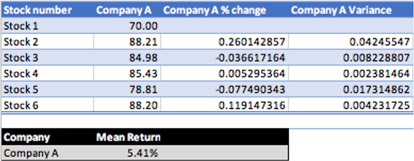
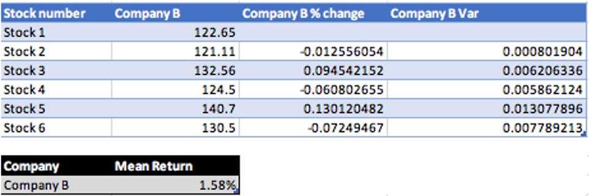
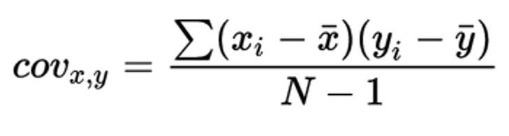
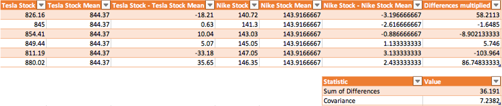
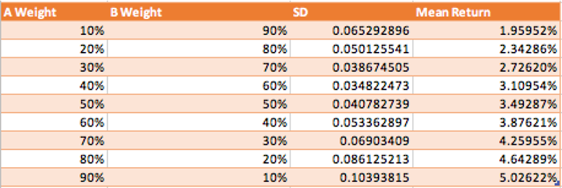
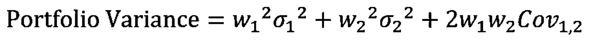
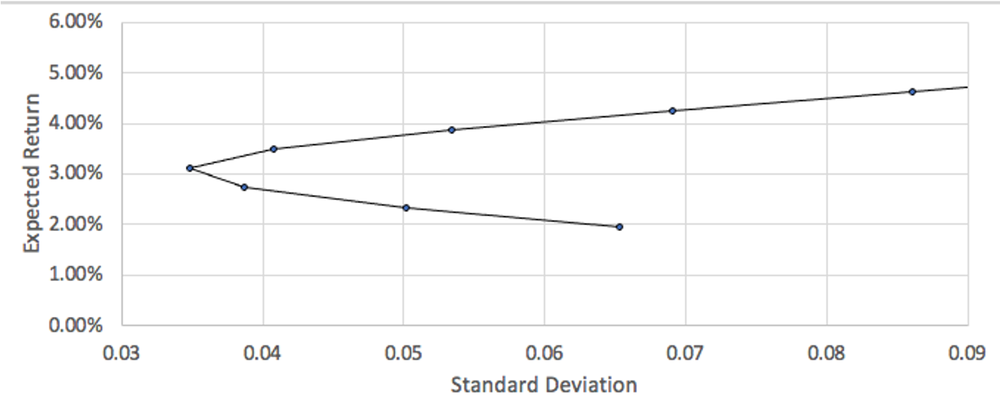
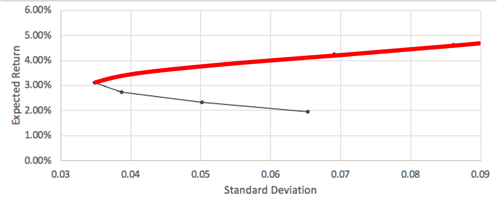
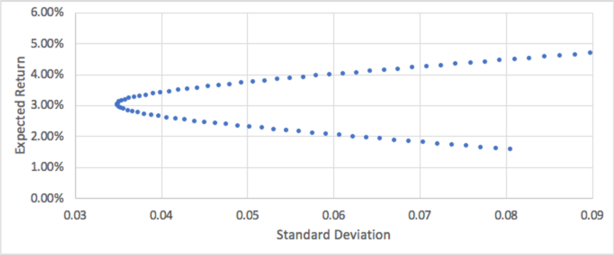

 
<strong>Key Takeaways</strong> 
&#8226; Understand modern portfolio theory and its application to portfolio construction. 
&#8226; Use statistical measures such as variance, covariance and standard deviation to simulate portfolio risk and return profiles. 
&#8226; Understand the properties and differences between the asset classes that can be combined to diversify a portfolio. 

 
<h4>Modern portfolio theory</h4>

Modern portfolio theory (MPT) was first introduced in 1952 by Harry Markowitz to describe how risk-averse investors can achieve optimal returns from their investments at a given level of risk.
Harry later received a Nobel prize for MPT, which is still valued to the present day.

MPT involves a process of identifying how the assets within a portfolio of investments contribute to the funds overall profile for risk and return. Through MPT, we are able to understand how the assets can be combined to create different risk and return values, and where an optimal mix of the assets can achieve the highest level of expected return for the fund at a given level of risk. 

It is often accepted that a larger appetite for risk may yield larger returns for the investor. Despite this, a portfolio of assets may not always yield the same increments of returns for the additional risk taken, thus the relationship between risk and return is not linear. 

In this blog, I will look at the some of the key statistical measures involved with MPT to understand what they tell us about a portfolio of assets, and what their criticisms are. You can find the formulae for all calculations from my Excel sheet available on <a href="https://github.com/4neesh/DeveloperBlogDemos/tree/master/Modern%20Portfolio%20Theory" target="_blank">GitHub</a>.
I will also review how the optimal mix of assets can be found for a portfolio. 
I will conclude the blog by reviewing the different types of assets that can be included within a portfolio and how MPT has since been adapted and applied within industry.

 
<h4>Asset and portfolio risk</h4>

We can divide risk into two types: systematic and unsystematic risk. Systematic risk, also known as undiversifiable risk, is implicit with the market; it includes risk from market observables (such as interest rate or inflation). Unsystematic risk, also known as diversifiable risk, is present with the nature of the asset and <strong>can</strong> be mitigated. 
One example of an unsystematic risk may be the change in regulations to the airline industry which subsequently caused the likes of Ryanair and EasyJet stock prices to tumble during Covid-19 lockdowns.

MPT calculates the risk of an asset from its <u>variance</u> which is later transformed into the <u>standard deviation</u>. The variance of an asset is used to understand how 'spread out' the values are within the data set. With MPT, variance is used to understand how the average change in stock price differs from the mean change of all the stock prices.
In this blog I will use the stock prices of 2 different assets (Company A and Company B) to demonstrate MPT. I will construct the values based upon the past 6 days of their stock price, however in reality a much larger time frame will be used for more meaningful statistical measures of the two assets.

The past 6 stock prices for Company A are: 70.22, 88.21, 84.98, 85.43, 78.81, 88.20. 
The past 6 stock prices for Company B are: 122.65, 121.11, 132.56, 124.5, 140.7, 130.5. 
For the two assets, the mean values derived represent the average percentage change in the stock price from the previous stock price. For Company A, this is 5.41%, and for Company B, this is 1.58%. 

To calculate the variance, I will subtract the percentage change in stock price for each price away from the asset's mean and square the value.
I will then take the average of the individual variance values to obtain the variance for the asset.

I have used Excel to calculate the variance values, you will also see the field 'SD' which stands for standard deviation. 
The variance of Company A and Company B is 0.0149 and 0.0067 respectively; these values, however, can become distorted as the difference between each stock price deviation and the mean is squared. 

The standard deviation provides a <u>normalised</u> version of the variance to reduce the impact of an outlier on the final value.
The standard deviation is the square root of the variance and provides a contextual value. For Company A and Company B, the standard deviation is 0.122 and 0.082 respectively.
The standard deviation tells us that the Company A stock deviates from the mean percentage movement on average by 0.122%, whereas the Company B stock deviates from the mean percentage movement by 0.082%.

 
<h4>Constructing risk measures in a portfolio of assets</h4>

The risk profile of a portfolio is derived from the <u>combined</u> risk of the assets along with the respective weight they contribute to portfolio. 
Before we begin constructing a portfolio of assets, we must first understand how the risk profile of two assets move with respect to each other. 

<u>Covariance</u> is a statistical measure used to determine the <u>directional</u> relationship between two assets. Covariance does not capture the strength of a relationship between the assets, but just the direction of the movement. If two asset prices on average move up together, they will have a positive covariance value. Alternatively, if the assets tend to move in different directions to each other, they will have a negative covariance.

The formula for covariance is below:

We describe cov(x,y) as the covariance between x and y. This is the sum of each point of x less its mean, multiplied by each data point of y less its mean, all divided by the sample size less 1. 

The covariance of Company A and Company B is calculated below:

The covariance value of -0.007509 tells us that there is a slight negative relationship between Company A and Company B. As a result, the average movement of one of the stocks would create a slight opposite movement in the other stock (if one goes up, the other goes down).

The covariance tells us the portfolio would expect a lower risk profile when the assets are combined than when they are separate. 
A negative covariance would mean the portfolio value does not exclusively fall to the same amount that an individual asset value would fall; the negative covariance in the other asset would offer a protection to some degree against the fall of one asset as it will theoretically rise in value. The relationships are implied from the historical data, however future behaviour between the assets may not always be so true.

The combination of differing assets within the same portfolio creates <u>diversification</u>. 
The portfolio becomes more diversified as it adds assets which have contradicting risk exposures, thus reducing the combined risk of the portfolio.

 
<h4>Using MPT to find the optimal mix of assets</h4>

In this section, we will look at how the key statistical measures can be combined to create a portfolio with a single risk and return value. 
The portfolio can be created in many different ways by combining the assets with different weights. For example, creating a portfolio with 10% of Company A stock and 90% Company B stock. 

We can simulate many different portfolio combinations in Excel by changing the weights of the assets in the portfolio. 
The portfolio expected return percentage will be a sum of each asset mean percentage multiplied by the asset weight in the portfolio.

The formula for finding the portfolio variance is slightly more complex: 

In the formula, <i>w</i> represents the weight of the asset in the portfolio, and the <i>&sigma;</i> represents the standard deviation of the asset. 

 
<h4>Constructing and using the efficient frontier</h4>

The 'efficient frontier' is a curve that is drawn upon a graph of the different risk and return portfolios that can be achieved with two assets. In the real world, this may be used with two portfolios rather than assets to capture more complex relationships. 
From the table which we have created of the weights, expected return and expected standard deviation of the portfolio, we can create a scatter graph to visualise the information:

We can break the graph into different sections to illustrate how a portfolio can be constructed:

The red line represents the efficient frontier, where the optimal mix of assets can be achieved for a given level of risk. 
It is not possible to construct a portfolio with the two assets to achieve a risk and return profile above the red line, however it is possible to construct one that falls below.
If the portfolio risk and return profile is below the line, it is not regarded as optimal with respect to the risk that is taken. 
The image below illustrates the construction of the portfolio for 100 different weight combinations, rather than the 9 shown before:

We can now see how many more portfolios can be built, and how many more sub-optimal portfolios that are possible below the efficient frontier.
By understanding how the two assets move on average against (or with) each other, we can begin to understand how a portfolio of the assets can be created to maximise returns for a certain risk level.

A typical portfolio of assets may not just consist of two assets. Once a portfolio has been constructed, it will have its own risk and return profile that is living with the assets it contains.
Further assets may be evaluated before being added to the portfolio by using an understanding of how the risk and return of the asset complements or hinders the expected performance.

When reducing the unsystematic risk from a portfolio, a manager may take an approach of looking at different types of securities, or to look at various asset classes to seek portfolio diversification.
An asset allocation fund is a type of fund that creates diversification by balancing a mix of assets. 
Each asset classes will provide the fund with unique properties from its exposure and return that can be combined to create a well diversified portfolio.

 
<h4>Diversification with asset classes</h4>

Depending on where you look, you will find that assets are divided into a varied number classes, typically from 3 to 8.
The advent of new derivatives and exotic investment products have introduced new types of asset classes including commodities, real estate, financial derivatives and most recently, cryptocurrencies. The three largest asset classes are equities, fixed income and cash/cash equivalents. In this section, I will reflect upon 5 asset classes to understand their unique properties: 
&#8226; Equities 
&#8226; Bonds/fixed income 
&#8226; Cash and cash equivalents 
&#8226; Real estate and tangible assets 
&#8226; Financial Derivatives

<strong>Equity</strong> 
Equity, also known as stocks or shares represent a percentage ownership in a publicly listed company. 
Equities are often classed by their market capitalisation into small-cap, mid-cap and large-cap. 
Investors of equities benefit from a potential dividend and the value of the resale of the equity in the market.
While equity provides benefits such as company ownership and a right to vote on certain decisions, they are viewed as risky investments due to their large dependence upon company performance.

The payments to an equity holder are less certain than other securities such as those of bonds. Common-stock holders receive payment once all other cash flows to the company have been paid, such as workers, taxes and bondholders. The dividend payments are also not a guaranteed payment as they are reflective of company performance. 
The value of the equity can also deteriorate under the company performance as the supply and demand of the stock changes within the market. 

<strong>Bonds and Fixed Income</strong> 
Bonds represent an issued loan from a company that is repaid over the life of the bond. 
The bond will include a maturity date - when the principal of the bond is repaid to the investor and a coupon rate - the interest repayment to the investor at set intervals until maturity.
Bonds are not always sold at the value of the principal. Bonds can come in many different forms such as zero-coupon bonds, corporate bonds and municipal bonds - all of which offer different levels of return and coupons.

Bonds are often considered less risky than equity for several reasons: 
&#8226; Bond investments come with a promise to be repaid at maturity. 
&#8226; The fixed interest repayment on the bond is guaranteed (unlike a dividend payment on equity). 
&#8226; Bond owners have higher priority during liquidation than equity holders.

<strong>Cash and cash equivalents</strong> 
Cash and cash equivalents are financial securities that have two key properties: high credit quality and high liquidity.
Cash equivalents are also known as money market instruments that consist of low risk and short-term securities such as T-bills, certificates of deposit and commercial paper. 

The cash and cash equivalents are often shown as a company health indicator as per the balance sheet as it reflects the ability of the company to pay their short-term debts.
Cash and cash equivalents may also be used to finance an acquisition, however this is not of relevance for a portfolio of assets.

With respect to a portfolio of assets, cash and cash equivalents will have a low risk and return profile with high liquidity. The T Bills and other securities will carry a low duration 
due to their short maturity dates thus providing an opportunity to mitigate portfolio exposure to interest rate risk.

<strong>Real estate and tangible assets</strong> 
Real estate and tangible assets reflect securities that derive value from real-life assets that contain an intrinsic value. 
The link between the security value and the asset means real estate and tangible assets offer a hedge against inflation in the currency for a portfolio.
Tangible assets will also typically have very little in common with financial securities to offer a new element of diversification to the portfolio. 
Real estate and tangible assets offer a stability of payments to the portfolio, however a reduced liquidity due to the time it can take to sell the assets.  

A commodity is also considered a tangible asset: an economic good that has a fungibility. 
Commodities are divided into two types: hard commodities that are mined such as oil and gold, and soft commodities such as harvest (rice, wheat) or livestock (meat, cattle).

<strong>FX and other derivatives</strong> 
The foreign exchange (FX) market is a relatively new asset class since a free-floating exchange had been enabled following the collapse of the Bretton Woods system in the 1970s.
FX rates offer a portfolio a hedge against currency risk as the value of other securities can vary with the FX market. 
FX also offers portfolio growth as speculation in a currency against other currencies can create greater values in securities over others.
The FX market is often captured through the derivatives market where they are swapped or secured through contracts.

Derivatives represent a contractual agreement between parties where the value is 'derived' from an underlying security or asset. 
Common derivatives include a future or forward contract, which is an agreement to pay a certain price for a certain quantity of an asset at a date in the future.
Other derivatives include options, which provide a right to buy or sell a security at a point in the future, and swaps, which are exchanges of assets over a period of time.

Derivatives are traded both on an exchange and over-the-counter (OTC) which provide various ways for them to be customised to suit the preference of a portfolio.
Derivatives can be used to both hedge a risk (such as with a swap) or to speculate upon a price (such as a call option).
Portfolios can therefore benefit from derivatives to achieve bespoke risk and return benefits. 

 
<h4>Modern Portfolio Theory today</h4>

An understanding of the different asset classes can provide a small amount of colour to the vastly complex world of portfolio construction and assets. 
MPT has provided a well-respected, yet simplified model at understanding how assets can be combined to create a variety of expected returns at a level of risk. 
Since its inception, limitations have been identified with MPT in-line with other theoretical models of finance: investors are not always rational, buy and hold strategies are not always optimal, past performance is not indicative of future performance, securities are not always available within the market. Amongst the limitations, there are four common criticisms of MPT that may influence the use and perception of the model.

<strong>Assumption: Investments upon the efficient frontier are optimal.</strong> The curve created by the efficient frontier does not leave the manager with a complete array of portfolio combinations that are optimal with regards to the level of risk taken for the return achieved. The efficient frontier is to be better utilised by drawing a capital market line that accounts for the risk free rate of return for an investment (typically the return of a government bond) and finding a tangent to the point on the frontier. I will review the capital market line in a separate blog. The key point to note is that the efficient frontier isn't equally efficient in risk/return tradeoff at each point along the curve. 

<strong>Assumption: Returns on assets are normally distributed.</strong> 
The assumption of a normal distribution of returns is reflected in our expectation that the price of an asset may rise and fall with equal probability. The reality of 
price movement however is often skewed to reflect the general movement of the asset price, be it upwards or downwards as per the asset classes market expectation
at the point in time. You may consider technology-based companies over the past 10 years; we wouldn't expect the prices of their shares to equally move up and down through the years, let alone when considering inflation.

<strong>Limitation: Risk is defined as both the upside and downside of price movement.</strong> MPT obtains the standard deviation of an asset from both its movement up as well as its movement down.
The standard deviation through this calculation has been criticised as it is used for understanding the risk of the asset, which would otherwise be reflected in just the 
downwards movement of the price, and not the upward movement. <a href="https://www.investopedia.com/terms/p/pmpt.asp" target="_blank">Post-modern portfolio theory</a> is a 
methodology that was introduced in 1991 where the standard deviation of the risk of an asset is defined from its downward movement, rather than all of its movement.

<strong>Limitation: Covariance to establish relationships between asset movements.</strong>. A limitation of covariance is that is can only be used to measure the 
directional relationship of two assets. The strength of the relationship is not shown, therefore an understanding to the degree at which two assets move with or against 
each other cannot be gathered or applied to the efficient frontier. A greater measure of the relationship can be obtained using a correlation coefficient. The 
correlation will normalise the covariance to provide a signal on the strength of the relationship of a scale of -1 to 1. 

 
<h4>Summary</h4>

In this blog, we have looked at modern portfolio theory to understand how the risk and return of a portfolio of assets might not always be optimised when grouped together. 
Amongst MPT, we have also looked at how assets will have their own variance and covariance with other securities. The realisation of a negative covariance can enable us to reduce the variance of returns when combining assets. 

The understanding of an asset or portfolio standard deviation will provide an investor an insight into the volatility of the assets together. 
Diversification can come from many different sources including securities with a variety of companies, sectors and geographical regions, 
however an extended range of diversification opportunity can be realised across
different asset classes, all of which have their own unique properties and underlying characteristics within the market. 

MPT has remained resilient with time as a tool to understanding portfolio construction and expectations.
The criticisms of MPT have lead to further developments and extensions of the theory. In a future blog, 
I will write about the capital market line that builds on-top of MPT to develop an understanding of the relationship a portfolio may have with the risk-free
rate of return that could be otherwise be obtained with other securities in the market. to reiterate, you can find the exel sheet from this blog on  <a href="https://github.com/4neesh/DeveloperBlogDemos/tree/master/Modern%20Portfolio%20Theory" target="_blank">GitHub</a>.

 
<small style="float: right;" >Picture: Paris, France by <a target="_blank" href="https://unsplash.com/@alexandrelallemand">Alexandre Lallemand</small></a> 