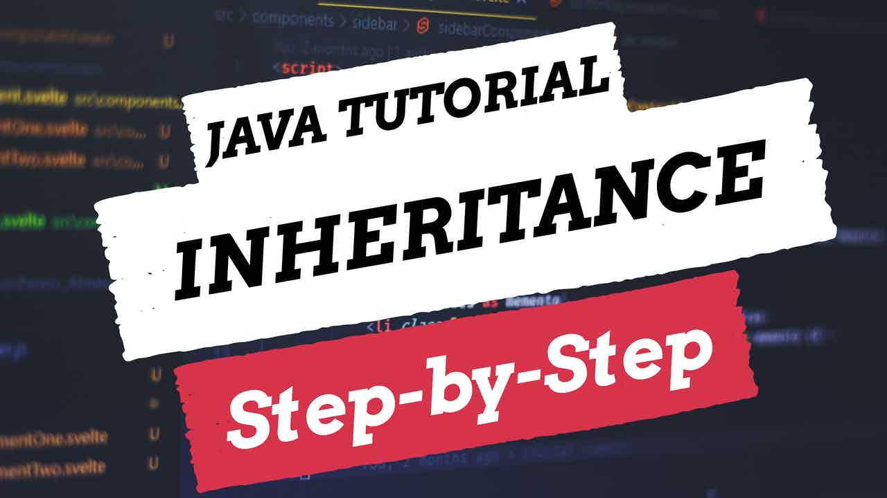

 
<h4>Inheritance</h4>

Inheritance is one of the four concepts of object-orientated programming. 
This video is a step-by-step tutorial on how you can develop software using inheritance with Java.
I use a demonstration within IntelliJ by creating a football team where inheritance is used to make it easier to create and update classes with similar properties and behaviours. 

