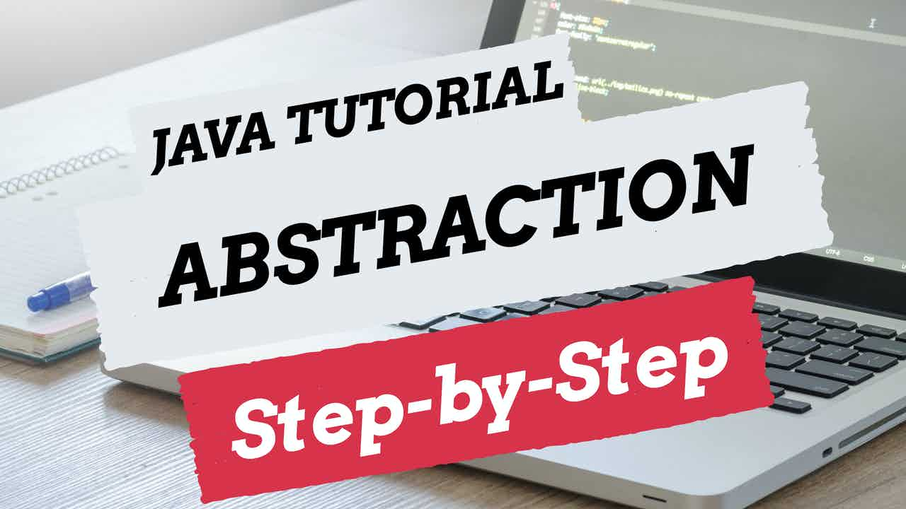

 
<h4>Abstraction</h4>

Abstraction is one of the four concepts of object-orientated programming. 
This video is a step-by-step guide on how you can use abstraction within a Java application. There will be an overview of why abstraction is appropriate to use and how you can enhance the simplicity of your code with an example within IntelliJ. 

Abstraction is used in our design of how we group behaviours of classes together. The details of how the behaviours are used by the class is delegated to the class itself, however abstraction defines a contract that enforces such behaviours to be handled by the class. 

