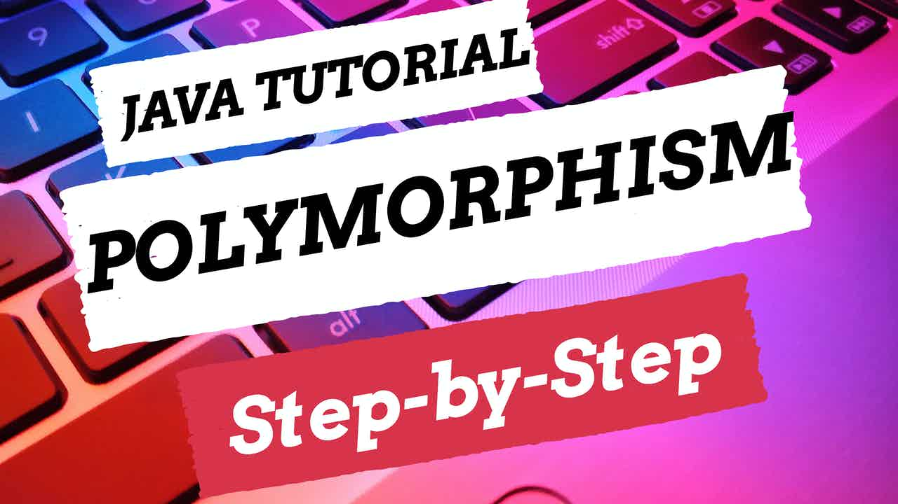

 
<h4>Polymorphism</h4>

Polymorphism is one of the four concepts of object-orientated programming. 
This video is a step-by-step guide on how you can use polymorphism within a Java application. There will be an overview of why polymorphism is appropriate to use and how you can use static and dynamic polymorphism to encourage code reuse with an example within IntelliJ. 

Polymorphism is used in our design of how we reuse method names within the same class and with inheritance to create different implementations of the method. The details of how the methods are defined with parameters, and how the class that is calling it is created will ultimately determine which implementation of the method is used at runtime.

