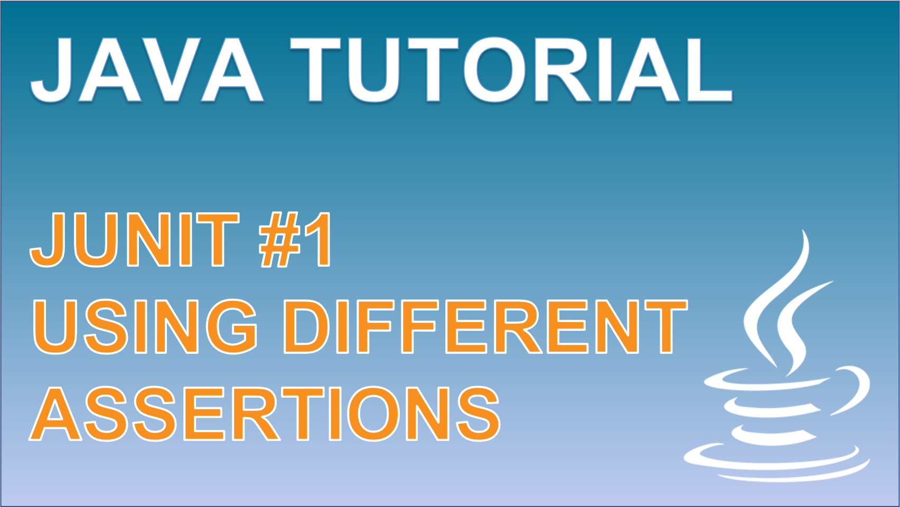

 
<h4>JUnit Assertions</h4>

Learn about the different assertions that can be used with the unit testing framework: JUnit. 
Understand when and how you can apply different assertions to optimise and improve the readability of your test cases.

