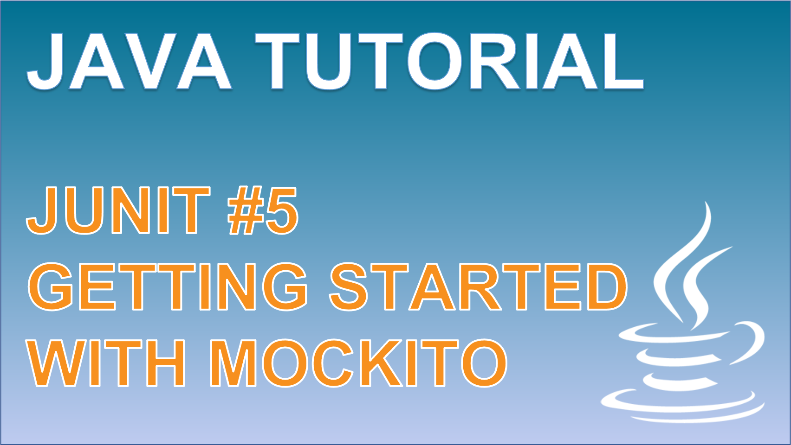

 
<h4>Getting started with Mockito</h4>

Learn about what a mocking framework is used for with unit testing, when we it would want to use it, and how we can use the Mockito framework within our tests. 
This tutorial involves testing a class method in isolation despite its dependency upon a database call. We will understand why mocking is useful and how we can approach it in 3 steps.

