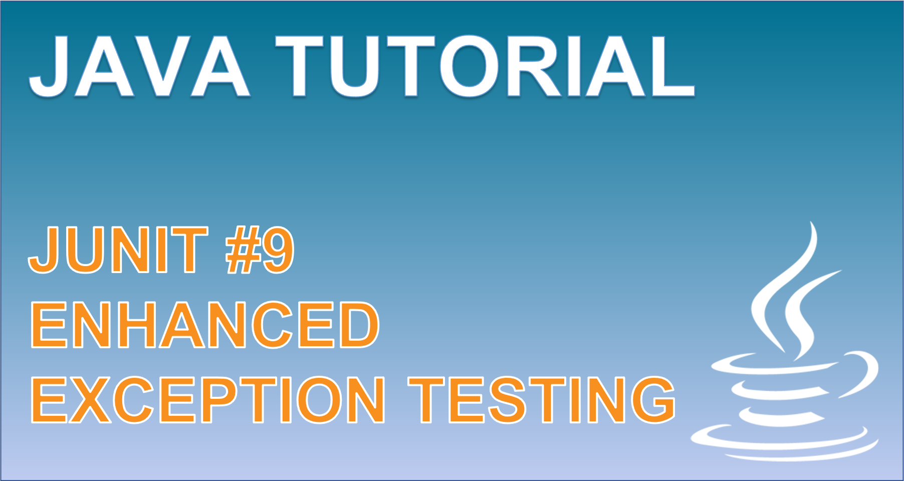

 
<h4>The catch-exception library</h4>

Learn about the limitations to conventional exception testing from JUnit and resolve them using the catch-exception library from googlecodes. 

The catch-exception library allows us to control a test method to capture an exception that can then be asserted upon with more detail and upon the runtime behaviour of our test. 

