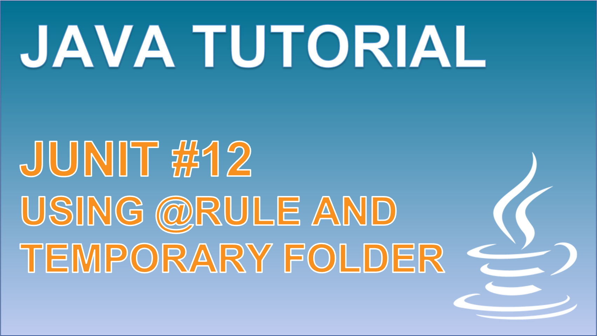

 
<h4>The Rule Annotation</h4>

Leverage the Rule annotation to neatly surround your unit tests with bespoke logic for setting up and tearing down components that can be used within each test. Explore the different implementations that come out of the box with JUnit, and dive a little deeper to understand how the TemporaryFolder may be valuable to use when testing with files.

 

