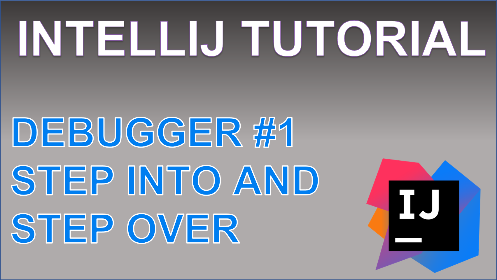

 
<h4>IntelliJ Debugger</h4>

Take a look at 3 of the most commonly used tools of the debugger that allow you to navigate your application run with control.
A break point will enable you to pause your application each time a specific line of code is executed, from there, we can use the step over tool to execute each line, one by one, 
and the step into tool to dive into any other method calls made on that line.

