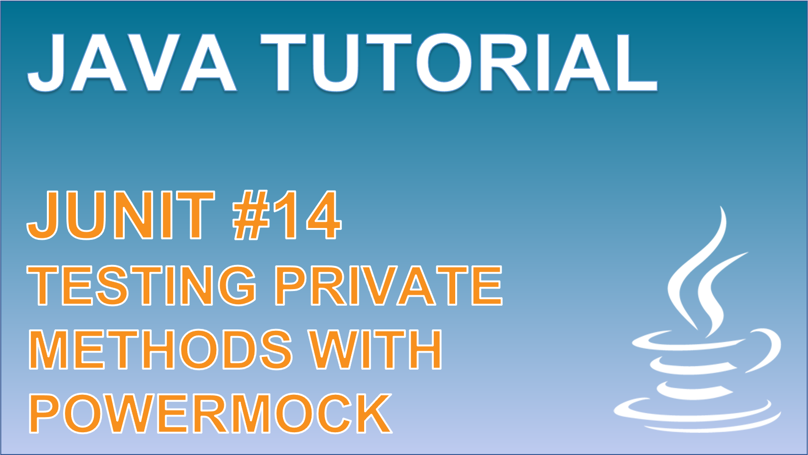

 
<h4>Testing private methods</h4>

Learn how you can test private methods within your application using JUnit. First we explore how the reflection utils from the Java library can be used to control and invoke a private method. Second, we use the Powermock library to condense a large portion of the test to just a single line.

