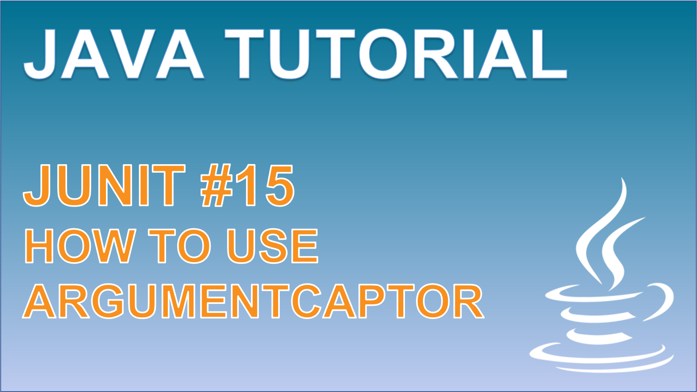

 
<h4>Using the ArgumentCaptor</h4>

This video will explore the conditions that would make us interested in testing the arguments passed around our application methods, and howe we can extract the Objects that are passed using the ArgumentCaptor. 
With the ArgumentCaptor, we are able to isolate Object arguments away from the stack that calls it, to then test them on their own back in the test class. 

