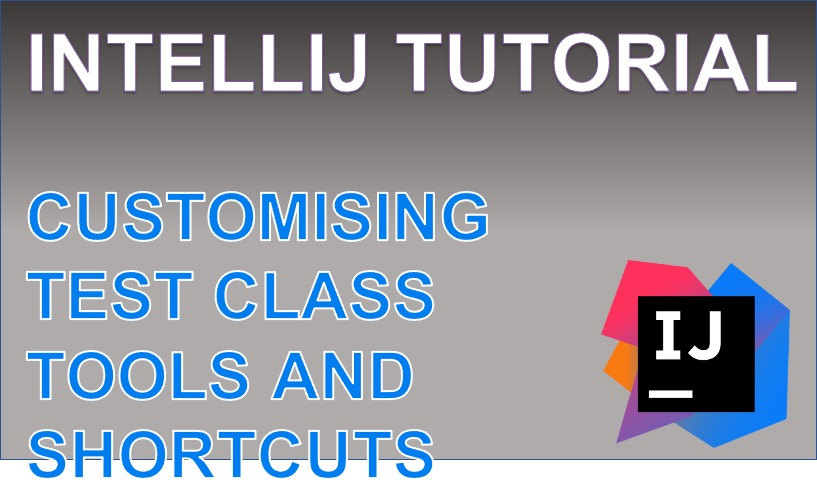

 
<h4>Custom test views</h4>

Explore some of the on-demand settings that are offered with IntelliJ that enable you to customise 
your test class outputs that can improve how you navigate, review and debug your test methods. 

By the end of the video you will be able to sort and filter the test methods that are returned when running a test class.
You will be able to navigate across test methods with a single click, and to the failing assertion with two clicks. And lastly, you will be able to create customised html reports, straight from the IDE for an easy-to-read interface of the test outcomes. 

