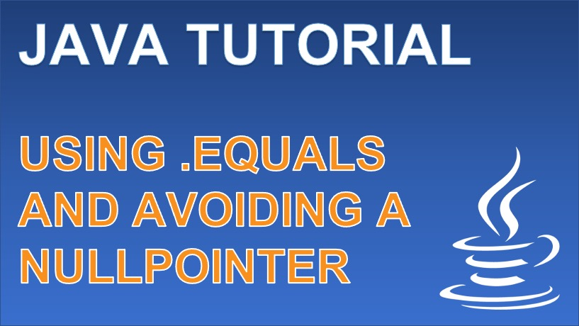

 
<h4>Avoiding the NullPointerException when comparing Objects</h4>

The .equals method is often used within if-statements and to return boolean expressions within an application.
By understanding how the structure of the boolean to call the .equals method is made, we are able to design our 
booleans to avoid any null exceptions when comparing two Objects.

