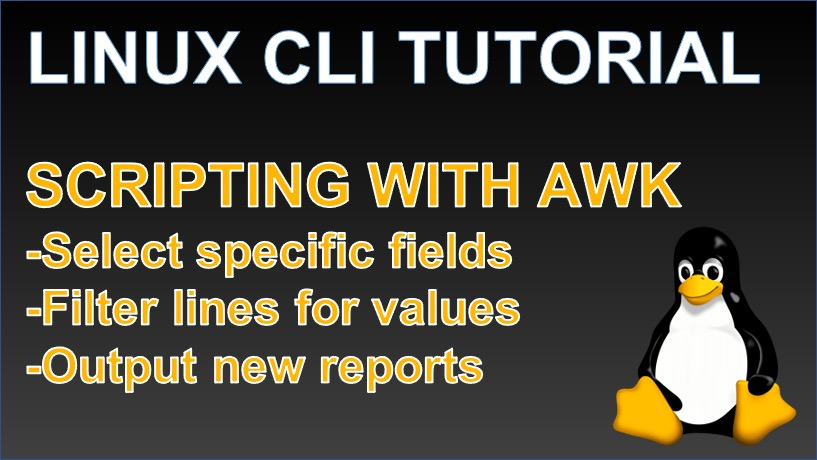

 
<h4>An introduction to awk scripting</h4>

Learn about the convenient awk scripting language that you can use from the Linux CLI to manipulate, filter and reorder structured files into new reports with a single line command. 

