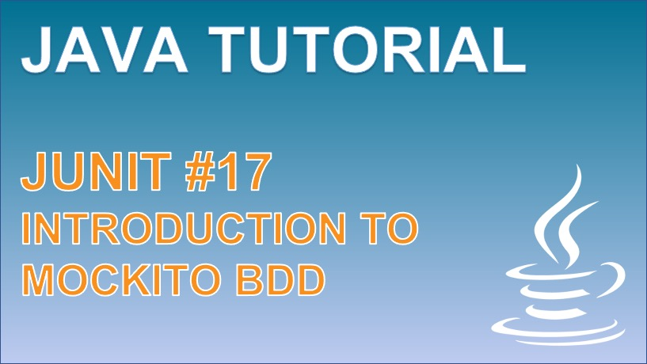

 
<h4>Using MocktioBDD</h4>

MockitoBDD provides us with special methods that support the communication of a behaviour-driven-development approach to software development and testing.

In this video, you can integrate MocktioBDD with a given-when-then style of test writing to clearly outline how Objects are mocked and instructed to behave, while asserting against outcomes from the test in a clear manner.

Link to source code: <a href="https://github.com/4neesh/YouTube-Channel/tree/main/MockitoBDD" target="_blank">Here</a>. 

Comment, like and subscribe for more content on Java and software engineering. 

Visit my website to also see my blogs: https://aneesh.co.uk

