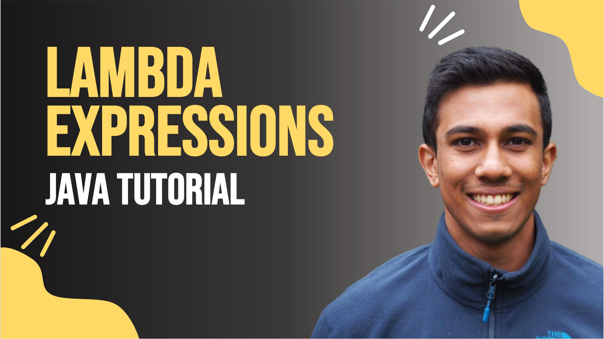

 
<h4>Lambda Expressions</h4>

Lambda expressions are a new feature from Java 8 that allow you to efficiently create instances of a functional interface with a new syntax: () -> {}.
This video will take a look at functional interfaces and how we can instantiate them. We will finally look at the lambda expression syntax and how it relates back to the functional interface. 

