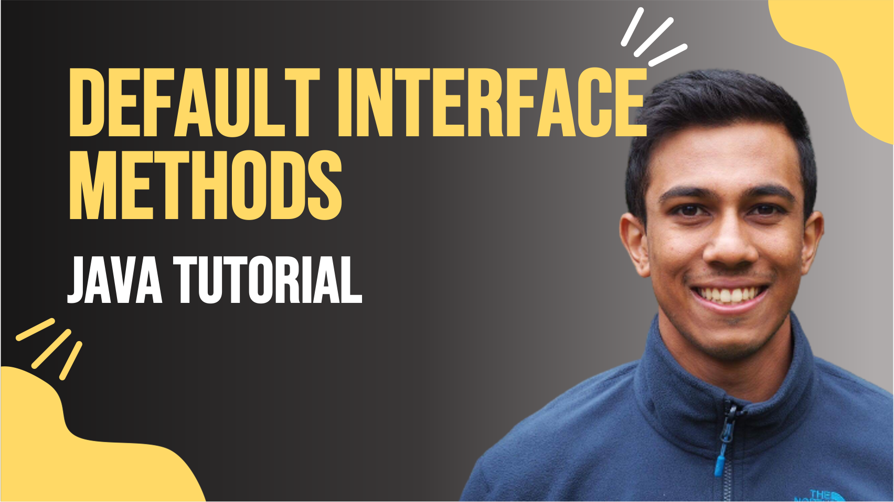

 
<h4>Interface Default methods</h4>

Explore the benefits of the default keyword that has been introduced with interfaces within Java 8. 
We will look at when and how you can use the default keyword, how interfaces will now compare with the abstract class, and examine the 
corner case condition where a class may implement two interfaces with the identical default method signatures. 

