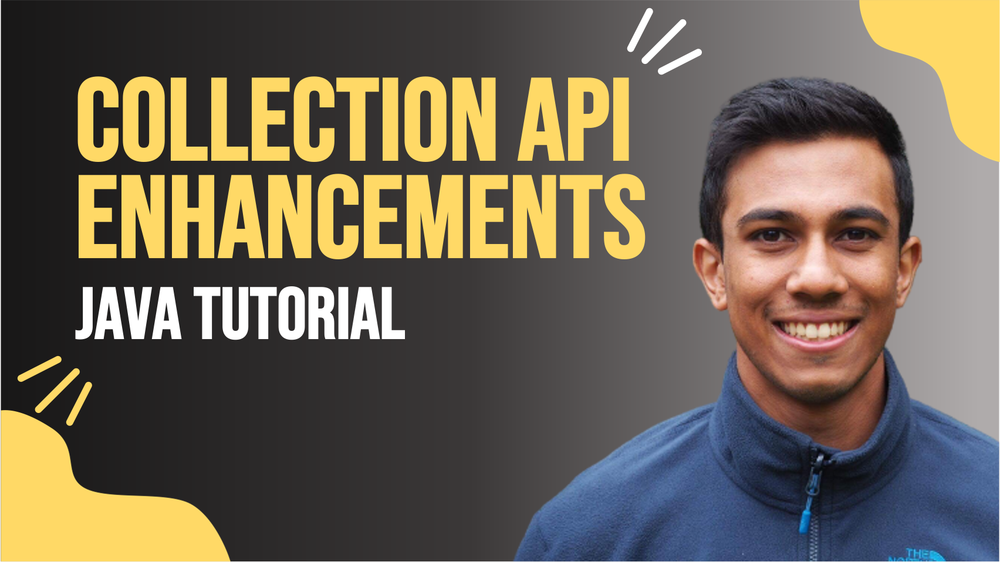

 
<h4>Java Collection API Enhancements</h4>

Learn how and when to use the Collection API enhancements from Java 8 to reduce repetitive and error-prone code when handling and transforming collections. 
This video will include alternative ways to iterate a list, to navigate and sort a map, and to replace or merge values of a map with new API methods. 

