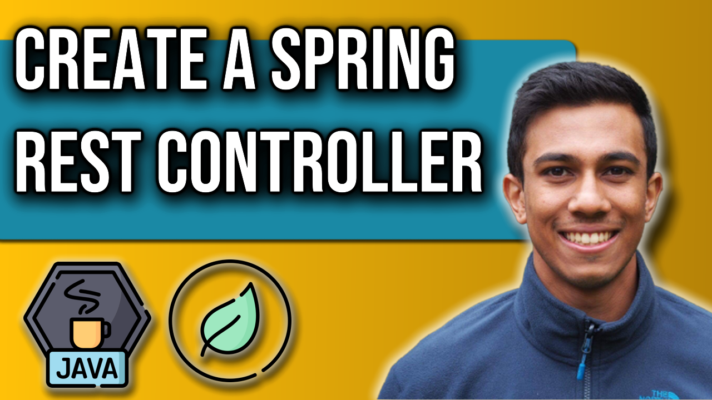

 
<h4>Create a REST Controller with Spring Boot</h4>

Get started with the Spring initializer to build a Spring Boot Web Server. 
The web server will contain 
a Controller layer that will store endpoints that we interact with through the browser.

We will register some GET endpoints that will return data to the user, and we will explore how
JSON data appears within the browser.

