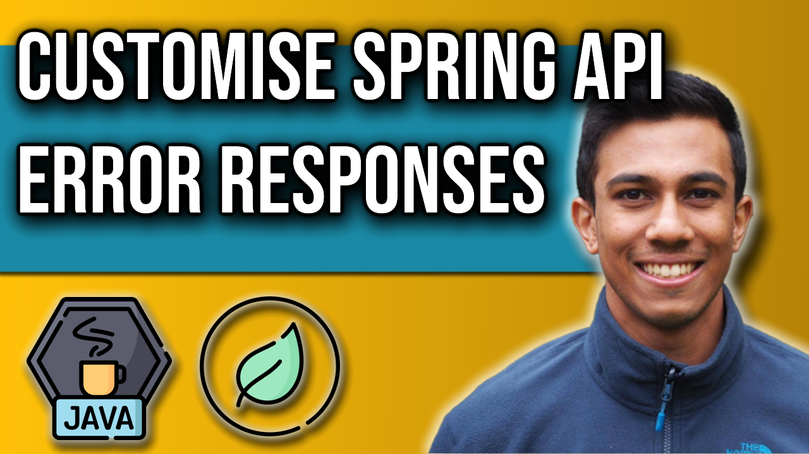

 
<h4>Customise Error Responses from a Spring REST API</h4>

Learn how you can customise the default error response that a Spring REST service can provide to invalid or incomplete API Requests. This video will visit the ResponseEntityExceptionHandler to understand how the error response is created, and will use annotations such as @ControllerAdvice and @ExceptionHandler to build custom responses to specific thrown Exceptions from the REST controller.

Link to source code: https://github.com/4neesh/YouTube-Channel/tree/main/REST%20API%20With%20Error%20Formatting/Store

