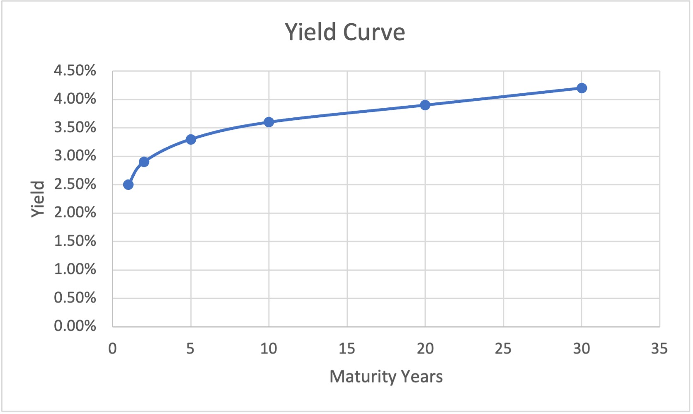
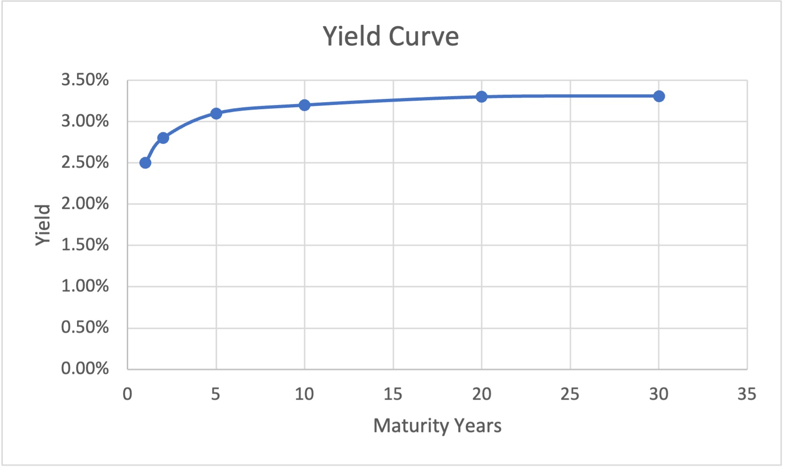
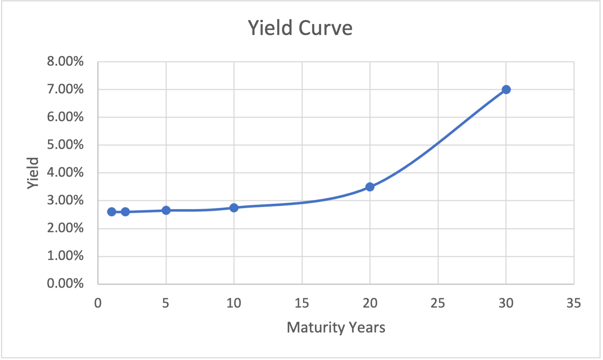
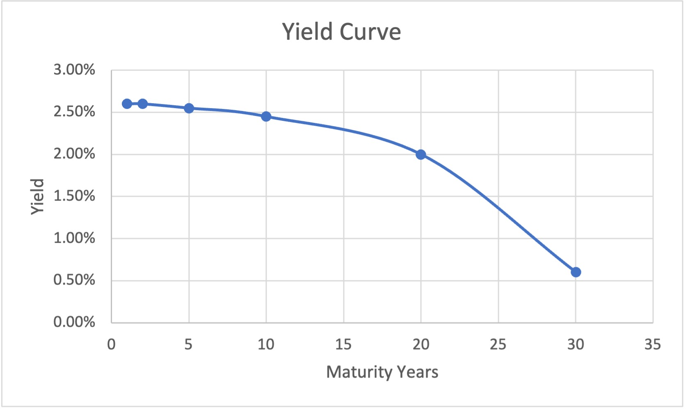

 
<strong>Key Takeaways</strong> 
&#8226; How yield curves are used. 
&#8226; Review the properties of a bond. 
&#8226; Understand how and why the yield curve can change shape. 

 
<h4>Yield Curves - An introduction</h4>

This blog is split into multiple sections that will eventually lead to (hopefully) a better understanding of yield curves.
First we will look at bonds, what they are and why businesses and investors use them. Then we will look at bonds and interest rates, and why we might consider interest rates when investing in a bond.
Then finally we will look at the yield curve, to understand what it looks like, how it can change, and most importantly, what it means.

Yield curves are used within finance to measure the risk appetite of bond investors.  
A typical yield curve may look like this:

The yield curve has two axis, one for yield (return percentage) and one for time to maturity. 
We can see that as maturity years change for a bond, the expected yield changes, rising quickly at the start, and then slightly flattening towards the end. But wait, what is a bond?

 
<h4>Bonds</h4>

A bond is a <strong>fixed income instrument</strong> that represents a loan that an investor makes to a borrower (typically a corporation or government entity). The bond will have a few key properties: 
&#8226; Principal: the amount of money the corporation is borrowing. 
&#8226; Coupon: a percentage amount of the principal the corporation will pay the investor at fixed intervals (which is typically every 6 months). 
&#8226; Maturity: when the bond will expire and the principal amount is repaid to the investor by the corporation. 

We can describe how a bond works using its properties. The corporation or government entity need to raise short-term capital. They can do this using bonds. An investor can purchase a bond, this involves lending the corporation the principal amount, with the promise of being repaid at the maturity date. The maturity date ranges from weeks to decades. As an incentive to the investor to purchase the bond, the corporation that issues the bond will pay a bi-annual fee to the bond holder, which is a percentage of the principal, known as the coupon rate. 

So if I buy a bond with a principal of £100, and a coupon rate of 2% that matures in 3 years, I will receive payments of £2 every 6 months for 3 years before receiving my £100 back from the corporation. 

Bonds fall under the type of investment called 'fixed income' as they provide the investor with a fixed stream of income from the investment. This fixed stream is realised in the form of the coupon repayments the investor receives. 

Bonds are considered to be a fairly safe investment when compared with equities. This is because bonds are bought with a promise of the issuer to return the face value of the bond at maturity. Equity does not carry such a guarantee. As a bond-holder, you also sit higher in the liquidation hierarchy than a shareholder for a corporation if they were to default.

 
<h4>Bonds and Interest rates</h4>

As a bond-holder, you will be also be conscious to the current interest rate and forecasted interest rate for the maturity of the bond. But why? 

Bonds act as an alternative low-risk investment option for your money when compared to a savings account. Leaving your money in a savings account will guarantee a return of the interest rate, whereas investing the money in a bond will return the coupon rate for that bond. Buying a bond means your capital is tied up with the corporation until maturity, but in return you receive the bi-annual coupon return for the investment.

Using the example from above, if interest rates were 1%, I would probably prefer to invest my £100 by buying a bond, as the coupon rate is 2% and earn more money over 3 years, than just the 1% interest I receive each year from my bank. This is provided I would not like to access my £100 during that time. The benefit of leaving my money in a savings account means I can withdraw it when required, such a benefit does not exist with a bond, unless I sell it within the market.

When we later look at yield curves, we will be able to reflect upon interest rates as their expected long-term behaviour can influence the expected returns an investor has for a bond.

 
<h4>Different Yield Curves</h4>

Not all bonds return the same amount to the investor, nor do they last for the same amount of time, or even pay coupons at the same time. Bonds can differ by the corporation they are bought from, and the credit quality deemed for that corporation. Corporations with a lower credit quality may pay a higher coupon rate that reflect the higher risk faced by the investor. Similarly, maturities for bonds can also be different. If a bond has a longer maturity, it means the principal will be repaid to the investor at a different period of time in the future (and the coupon repayments are received for a longer period of time). We are able to visualise the risk of holding a bond using a yield curve. A yield curve illustrates the expected returns investors have for bonds of a similar credit quality, but at different maturities. This allows us to understand exactly what level of return is expected for a bond where the maturity of the bond is the only variable. 

Given any individual yield curve can be reflective of a bond's credit quality, you will find many different yields curves, such as the Treasury Yield curve that reflects the rates of US treasuries, AAA Municipal yield curve that refelct AAA municipal bonds, or even those for a single issuer such as the IBM Yield curve. When you hear about yield curve in the news and in economics, it is likely they are talking about the Treasury Yield Curve.

 
<h4>The standard Yield curve</h4>

We have seen what a normal yield curve looks like earlier in this blog:

Let's break it down slightly to understand why it is the shape it is. When an investor commits funds to an bond, they are leaving their capital at risk. If you were to invest £10 for 1 month, and were offered £1 back as profit (so £11 return in 1 month), you probably wouldn't be as happy with an offer of receiving £11 back in 2 months time. Investing money for longer periods of time means your invested capital is at risk (in the event that the principal cannot be repaid) for a longer period, and is therefore at more risk.
As a result, investors therefore expect higher returns when the time to repayment (maturity) is longer. Equally, if the money were left in a savings account, it may accrue more interest in a longer period of time.

The yield curve for a bond is not linear, afterall we may not expect the exact same yield for 2 months as we do receive for 1 month. We can see in the graph that the yield for 20 year maturity is only slightly less (3.9%) than the maturity for 30 years (4%).

The yield curve typically increases at a steeper rate during the early period, and then flattens towards the longer maturities from 20 years to 30 years. 

 
<h4>Interpreting a yield curve</h4>

So what does this all mean, and why do yield curves differ?
Yield curves are often used to understand how the investors expect long term interest rates to behave. Why? Because if an investor is able to establish an opinion on how they expect interest rates to move, they will therefore have an expectation on what yield to demand for a similar maturity of a bond. 

Let's head back to our example from earlier. Let's say we expect interest rates to rise to 5% in 1 years time, and 10% in two years time. All of sudden, the current interest rate of 1% doesn't seem so bad to begin investing with. And all of a sudden, our bond, which pays a 2% coupon every 6 months is not looking so good. If we have good reason to believe interest rates are going to skyrocket in the coming periods, then we can rightfully expect bonds to beat those interest rates for an investment of the same period. Why? Because bonds naturally carry more (be it very little amounts) of risk than a regular savings account. Investors will not be so keen to buy the 2% bond if they expect the interest rates to rise so quickly over the same period of time.

 
<h4>Changing the yield curve</h4>

We may see a yield curve begin to flatten when investors expect long term interest rates to fall in comparison with short term interest rates. When this happens, the required rate of return on a bond with long maturity is reduced as the investor does not expect interest rates to be as high in the future. Therefore the right-hand-side of the yield curve may fall, and the curve flattens.

We may also yield curves steepen:

A steepening yield curve will see yields on bonds that mature at dates further into the future return significantly higher yields than those in the short term. A steepening curve reflects a steepening long maturity or a shallowing short maturity. It is indicitive of expectations for higher interest rates in the future, so corporations are willing to provide greater returns on their long-term bonds. 

Lastly, we can also see an inverted yield curve:

This is a rare case where short term bonds return a greater yield than long term bonds. This means investors expect the interest rates to fall in the future, and are therefore willing to accept smaller returns for the longer maturity bonds. 

 
<h4>The yield spread</h4>

The term 'yield spread' is used to briefly, and effectively compare two bonds. These bonds can have different maturities, different credit ratings, and different risk levels. It allows analysts to understand how yield is currently represented for a bond, and if, compared to its historical points of reference, is a good investment.

A yield spread is quoted by comparing the yield of one bond against another. If you are comparing a bond yield against the US treasury bond, it is known as a <strong>credit spread</strong>. The US treasury bond is considered a de-facto standard for bonds. If bond 'A' has a 5-year yield of 3% and the US Treasury bond has a yield of 2%, then the yield spread is 1%, also expressed as 100 basis points. If bond 'A' usually has a yield spread of 0.2% when compared with the US Treasury Bond, then that means it is currently offering a high (or 'wider') spread than usual and is therefore offering a greater return than it historically did.

The yield for corporations that are typically smaller, with poor financial data and backing may be greater than that of a larger organisation or government entity. This is because the bond with the smaller corporation may be perceived as being riskier, thus warranting a larger yield for the bond. 

 
<h4>Yield curves today</h4>

It can also be interesting to take a look at yield curves today, to understand how investors expect interest rates to change in the future. You can visit <a target="_blank" href="http://www.worldgovernmentbonds.com/country/united-kingdom/">worldgovernmentbonds.com</a> to get a picture of different bond yields. 

 
<h4>Summary</h4>

The yield curve is used to understand the expected returns of an investor for a given bond at a given maturity. The yield curve helps us to understand future expecations of interest rates as investments with bonds are often compared with risk-free savings. Analyst will create historical yield spreads to compare different bonds, and to understand when some bonds are trading at a premium than they previously have against others. 

