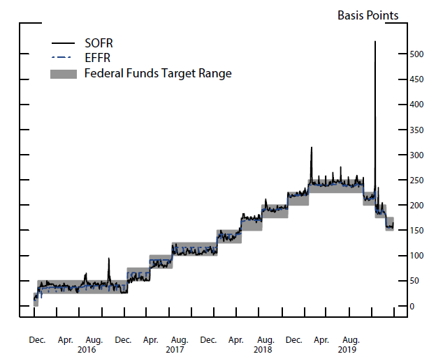

 
<strong>Key Takeaways</strong> 
&#8226; What a repo is and how it works. 
&#8226; The benefit of a repo and its importance to financial markets. 
&#8226; How central banks are able to control bank reserves through policy and the repo market. 

 
<h4>About this blog</h4>

I originally expected this blog to be fairly short; while the Repo market is worth trillions of dollars in a global market, it consists of a fairly simple exchange (as we will later see). The elevated importance of Repos as the 'pipelines of the global financial system' will take this blog through a more interesting turn to understanding monetary policy and as a means for governments can influence the behaviour of the repo market participants.

 
<h4>What is a Repo?</h4>

The term 'Repo' is short for repurchase agreement. A repurchase agreement is commonly referred to as a 'pawn shop' for banks, let's look at why..

A repurchase agreement is used by banks to trade debt for cash. With this in mind, this means banks <u>need</u> cash and are happy to trade the high-grade securities they own for it. In a single line, a Repo is a 'short term collateralised loan', where emphasis on 'collateralised' should be taken. The debt traded in a Repo tends to be of high credit quality, such as a government bond. Repurchase agreements are typically traded on an exchange; let's look at an example:  
Bank A holds a government bond, Bond A, but needs to raise some short term capital for it's own requirements. One way Bank A can do this is by selling Bond A on the market, but what if Bank A would also like to keep Bond A in it's portfolio for the longer term? Well, Bank A can sell Bond A and then repurchase it from the buyer after an agreed period.

On the other hand, Bank B has excess capital sitting in its reserves, and would like to make a return on that capital rather than have it sit in its books earning nothing. Let's take a look at how Bank A and Bank B can create a mutually beneficial agreement: 
Bank A sells Bond A to Bank B. Bank B transfers £100 cash to Bank A and receives Bond A. Bank A only needs the £100 cash overnight, so they agree for Bank B to sell Bond A back to Bank A the next day. Bank B will sell this bond for a pre-agreed price of £101 to realise a £1 profit. Bank A is satisfied that they have ultimately obtained their £100 capital for a cost of £1. 

What we have is a repurchase agreement; a short term <i>collateralised</i> loan between two banks. The loan is collateralised because Bank B is effectively lending Bank A the money they require, and in-turn receive Bond A as collateral. If Bank A is unable to repurchase Bond A (and thus default on the repo), Bank B won't face a loss as they can simply sell Bond A in the market. 

The percentage difference between the price Bond A is sold for and the price Bond A is repurchased for is known as the <strong>repo rate</strong>. In our case, Bond A is sold for £100 and bought back for £101, creating a repo rate of 1%. As a repo is effectively a return on a low-risk, short term collateralised loan, a repo rate can be considered a proxy for an overnight risk-free loan.

 
<h4>The Reverse Repo</h4>

The reverse repo is used with the intention of purchasing a security and reselling it at a higher price. A government may use reverse repos to inject capital into the market. They offer reverse repo's to eligible counterparties that can purchase bonds from them with an agreement to be repurchased at a higher price.
The transfer of bonds from the government with cash from the banks will allow the government to increase their capital stores while draining the capital reserves of the banks. We will later see how reverse repos are useful for the central banks.

 
<h4>Repo Haircuts</h4>

The securities traded within a Repo tend to be of high credit quality and low volatility. Why? 
The reliability of a repo trade is that the underlying security does not change value (to any significant degree) for the life of the trade. If the security holds it's value, then the participant purchasing the bond can be confident that in the event of default from the counterparty, they will be able to sell the security to not realise any losses. 

The party purchasing the debt in the repo will want to protect themselves from any volatility of the underlying security price, and therefore may request a higher value security is transferred during the trade. As a result, rather than having a £100 bond transferred from Bank A to Bank B, we may have a £108 Bond transferred. This way, if the bond falls in value to £101, Bank B will still be able to realise the same expected profit of £1 from the repo. 
The additional value of the security in the trade is known as the <strong>haircut</strong>. 

<strong>An interesting story on repo haircuts..</strong> 
<i>In the 2008, Lehman Brothers had found a unique accounting loophole regarding repos that allowed them to hide liabilities. During the life of a repo, the debt is not actually exchanged, but is only used as collateral. Where a haircut on a repo was large enough, Lehman Brothers were able to project the incoming cash <u>as a sale</u> of an asset that can be used to hide liabilities. As we know, all Repos are meant to be repurchased, therefore the 1st leg of the repo transaction (the 1st exchange) should not be treated as a sale, as the security is going to be repurchased during the 2nd leg. This is known as the 105 rule, read about it <a href="https://blogs.harvard.edu/michaellaw/2014/01/29/lehman-brothers-repo-105-recap/" target="_blank">here</a>.

 
<h4>Repos and monetary policy</h4>

So far we understand that repos are used by banks to control their cash balances, and that they typically hold high-grade securities as collateral to a short term loan. The instruments traded are typically government debt as the debt will hold it's value in turbulent markets and therefore requires less of a haircut on the trade.

The role government debt plays in the financial market enables governments to influence the behaviours of banks. For example, a government can issue new debt into the market to enable banks to directly achieve a given return on their excess cash holdings. Issuing new debt can therefore drain cash reserves from the financial markets as it flows from the banks towards the central banks.

Similarly, governments are able to inject capital into the financial market by buying back their debt from banks.

 
<h4>Reference Rates with Repos</h4>

While reading about the Repo market, I came across a recent market event that illustrated how the monetary policy of a central bank can shape the repo market. In September 2019, the secured overnight financing rate, also known as SOFR, had a huge spike creating headline news... 

SOFR measures the cost of overnight borrowing of dollar-denominated repo transactions. SOFR is one of many overnight reference rates, others include SONIA for Sterling interbank money market trades, and EONIA for the Euro. These reference rates are calculated using real trade data for derivatives and aim to replace reference rates from LIBOR, which is based upon estimates. You can read more about LIBOR in my blog <a href="https://aneesh.co.uk/the-liborois-spread" target="_blank">here</a>.

 
<h4>The Repo Rate Hike of 2019</h4>

In September 2019 the SOFR rate spiked from 2.2% to 5.25%; the graph below illustrates the significance of the spike to historical trends:

<small>Source: Data available on FRBNY public website.</small> 

 
<h5>Why the rate hiked</h5>

As we understand, the repo market is used to help banks obtain cash for their high-graded securities, typically overnight. 
The rate hike occurred due to a sudden rise in the demand for cash, and this is largely considered to be due to the timely occurrence of two events...

The first event were the Q3 taxes that were due for banks in mid September 2019. 
The tax deadline meant cash from the banks had been planned to flow to the US central bank, the Federal Reserve.
As banks needed more cash on hand to pay the taxes, the demand rose. 

The second event were the issuance of new investment grade securities by the treasury that also coincided around mid-September to the value of roughly $115 billion. 
The trading volumes of the new securities meant broker-dealers relied upon the repo market for the cash to fund the volumes. 
These two events meant cash within the financial markets were in large demand. 

 
<h5>Bank reserve frameworks</h5>

Bank reserves refer to the amount of cash banks hold that is readily available for use.
Governments use a minimum level of reserves target that they would like the banks to hold to reflect the market conditions and prospects.
Prior to 2008, the Federal Reserve used a 'scarce reserves' framework where banks held only enough reserves needed for day-to-day activities. 
Banks were able to borrow from the repo market when cash was required and lend when they had too much. Following the financial crisis, the cash reserves required by banks had grown to a high degree.

From 2008 to 2014, Quantitative Easing had been used as a strategy to introduce a new cash supply within the system to support higher cash reserves.
The Federal Reserve implemented Quantitative Easing by purchasing treasury securities from the banks to provide capital in the system.

Since 2014, the banks have applied an 'ample reserves' framework on their balance sheet. 
The Federal Reserve introduced a new interest rate 'interest on excess reserves' (IOER) where banks were paid an additional interest rate for holding excess amount of reserves in their books. The IOER encouraged banks to hold further reserves, but also placed a new rate for the Federal Reserve to control that would influence the amounts of cash reserves the banks held. Increasing IOER would encourage more excess reserves, while the opposite would have the opposite effect.

A further instrument of the ample reserves framework were the overnight reverse repos (ON RRP). 
A reverse repo will see the Treasury sell a security to an eligible counterparty and repurchase the security at a higher price, implying an interest rate. 
These transactions were performed overnight for a short-term interest rate gain for the counterparty. The benefit to the counterparty were to protect
them from the lower-bounds of the interest on reserves balances rate (IORB). IORB is paid to banks for the reserves they hold, and if that rate fell very low, 
the ON RRP can be used as a floor to ensure at least the ON RRP % return was possible for the cash reserves. As the ON RRP rate fell, the amount of capital banks
were willing to hold increased as they could earn a higher rate than through an ON RRP. 

As the reserves in banks fell with the ample reserves framework, the confidence banks had as to what 'ample reserves' would be required became less and less obvious. As a result, banks would hold more cash than they felt required to further drive the demand for cash.

 
<h5>How the Hike impacted banks</h5>

The immediate impact of the SOFR rates hike first meant banks were not as able to obtain cash from the repo market as required. A larger repo rate meant
a larger cost to the bank for obtaining short-term cash. There would also be banks that benefited from the hike to realise greater profits in their cash reserves if held.

A secondary impact of the SOFR rates hike were the much larger number of parties that used SOFR as a reference rate, specifically to borrow at. This meant
their fees for borrowing may have increased in a short term to reflect the sudden SOFR hike. 

 
<h5>How the Federal Reserved intervened</h5>

The Federal Reserve were able to intervene to the SOFR hike to provide means for reducing the demand for cash. 
This was achieved by growing their balance sheet (increasing the assets they held) and then 
offering $75 billion in cash to borrowers on the repo market. The array of collateral that was accepted by the New York Fed increased to include Treasury Securities, agency debt securities and agency mortgage-backed securities. This made it easier for participants to access the cash injection.
 
Further intervention involved lowering the IEOER rate to 20 basis points below the top of its target range to also discourage discourage excess reserves held by banks.
From October 11th 2019, the Fed also injected reserves into the financial system by purchasing Treasury Bills to the value of roughly $60 billion per month
through the second quarter of 2020. 

 
<h4>Summary</h4>

The Repo Market is used to help banks obtain short term cash using highly rated securities as collateral. The Repo Market supports banks to operate
with minimal cash reserves they think they require as cash is so easily available and at a low price.

The Repo market uses many reference rates to determine what rate will be returned for exchanging cash overnight, however repos can also be reversed where
the party purchasing the security benefit from the resale at a higher price. 

The Repo market is one of global magnitude, where reference rates impact both day-to-day operations of a bank and the many parties that use the rate for borrowing and lending. The 2019 SOFR rate hike is one example that illustrates the degree of control the central bank may have in controlling the cash reserves 
banks hold, and to influence their motivations and behaviour to use the repo market. 

