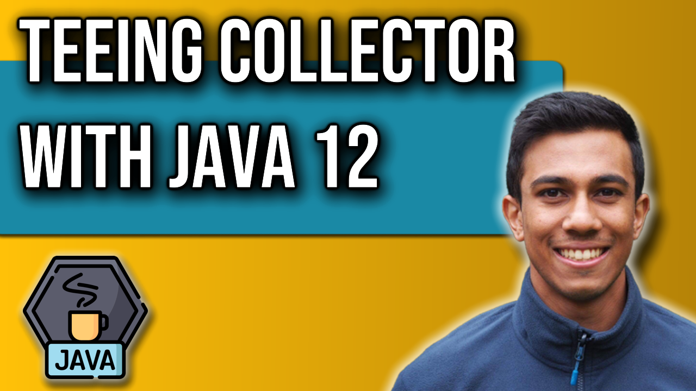

 
<h4>Duplicate, collect and merge: How to use Teeing</h4>

Take a look at the new method 'Teeing' introduced to the Collectors class with Java 12. 
Teeing allows us to duplicate a stream, to collect the streams separately, and to merge them anyway we choose to in a single function. 
We will walk through a demonstration where we use teeing to extract the maximum and minimum values of a collection and to merge them into a map. 
Teeing is a useful method for specific use cases where we find ourselves streaming a collection multiple times and combining the resultant collection with each other. 

