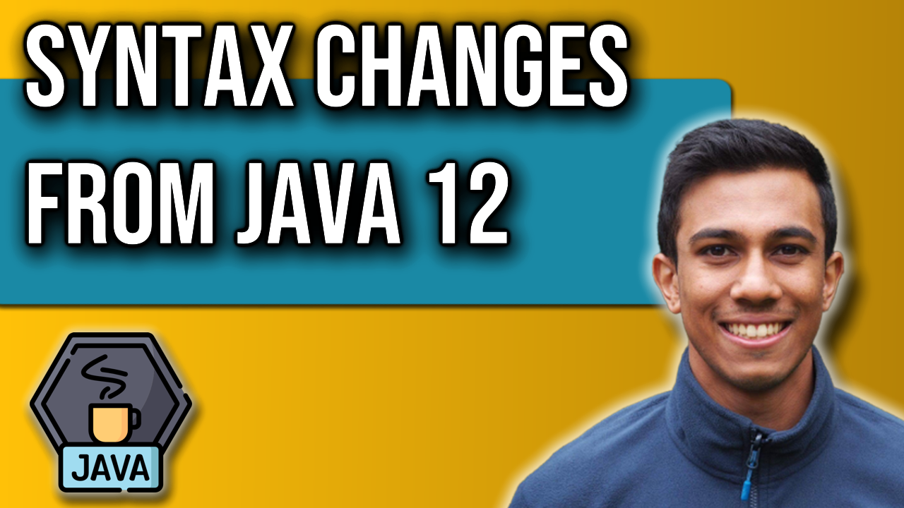

 
<h4>Java 12 Syntax Changes</h4>

This video covers the main syntax changes that are introduced to Java 12. 
We will look at how the String class, Files class and Collectors class have all changed
to offer new functionality and easier ways to approach unique problems. 

