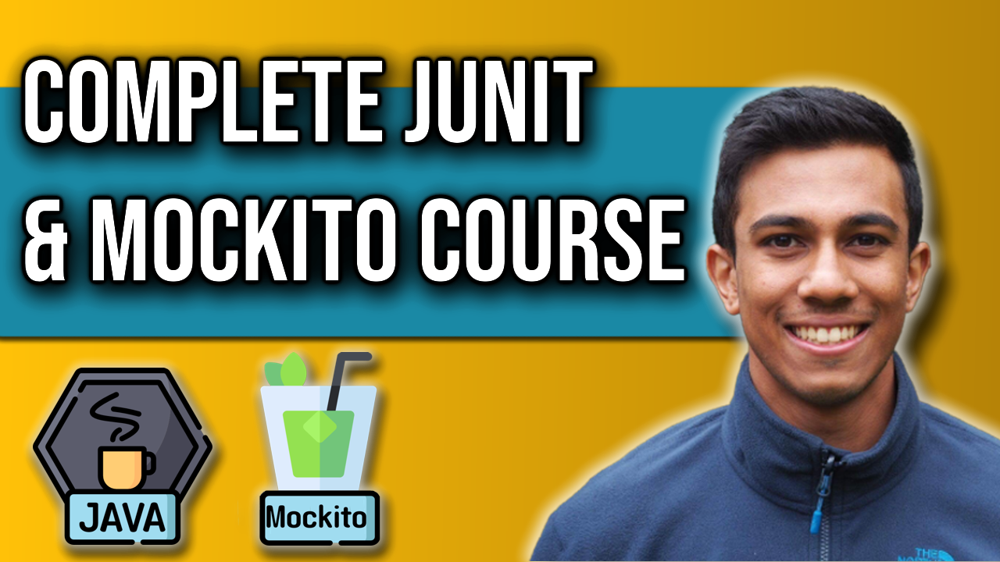

 
<h4>Learn </h4>

🕒 Timestamps 🕒

00:00 - Introduction
00:25 - Why we use Mocks
11:09 - Parameterised Testing
23:36 - @Before
29:11 - Different assertions
38:06 - Mocks, Stubs, Spies
53:06 - Testing the Entity Manager
01:01:06 - Testing Exceptions
01:05:31 - Modify default mock behaviour
01:15:31 - Stub void methods
01:25:28 - ThenReturn vs DoReturn
01:34:34 - Mockito Answer
01:44:09 - Various Argument Matchers
01:52:35 - Stub Multiple calls
01:58:41 - Mockito BDD
02:05:53 - Customise IntelliJ for Testing
02:16:22 - Test Private Methods
02:23:55 - Argument Captor
02:30:58 - AssertJ 
02:40:13 - @InjectMocks
02:47:52 - @Rule
02:56:43 - Matchers in JUnit
03:01:56 - Custom Matchers 
03:12:46 - Catch Exception Library
03:24:11 - Testing Method Parameters
03:35:56 - Mockito Verify

