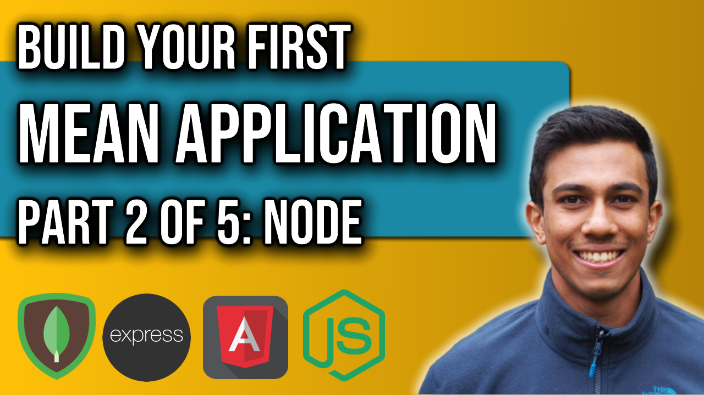

 
<h4>MEAN Application: Part 2</h4>

This part of the MEAN series will create the backend server using Node.js.
We will start by testing node and then creating a server that will respond to all requests
using the methods that come out of the box with the http modules from node. 

Link to source code: 
https://github.com/4neesh/MyDiary

🕒 Timestamps 🕒

00:00 - Introduction
00:15 - Application overview
03:13 - Creating a node server

