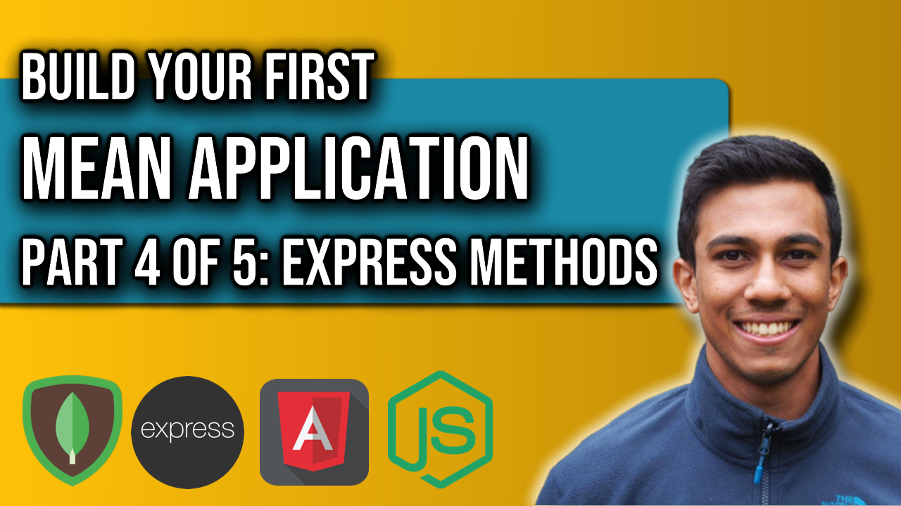

 
<h4>MEAN Application: Part 4</h4>

Part 4 of this MEAN Application series will build-out our Express middleware to provide complete backend functionality to our application. We currently use the backend service to obtain the diary entries for our app. This video will expand the functionality so we can perform PUT, POST and DELETE requests to our backend server so we can update, edit and remove entries. We will enhance the data service in the Angular single-page application to make HTTP requests to the Node backend service where data is stored.

Link to source code: 
https://github.com/4neesh/MyDiary

🕒 Timestamps 🕒

00:00 - Introduction
00:14 - Making POST requests
04:26 - Making DELETE requests
08:24 - Making PUT requests

