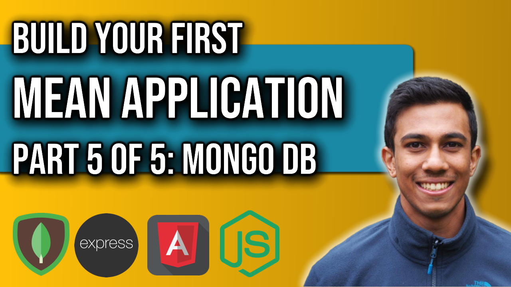

 
<h4>MEAN Application: Part 5</h4>

Part 5 of this MEAN Application series will complete our application with a MongoDB database. We are going to create an account with MongoDB and a cluster to store our data within. We will also use the mongoose package to define a schema for our data, before connecting to MongoDB and persisting the data. We will complete the full-stack functionality by enabling POST, PUT and DELETE functionality with the database and application together.

Link to source code: 
https://github.com/4neesh/MyDiary

🕒 Timestamps 🕒

00:00 - Introduction
00:26 - Setting up MongoDB
02:54 - Using Mongoose
06:36 - Connection our app to MongoDB
08:38 - Saving to MongoDB
09:22 - MongoDB Shell
10:58 - Fetching data with MongoDB
13:58 - Deleting from MongoDB
16:10 - Editing data with MongoDB

