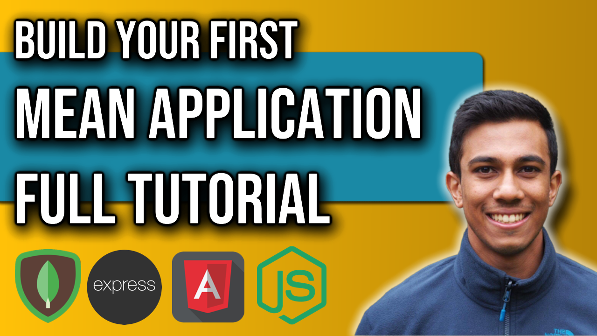

 
<h4>Create a MEAN Application</h4>

Build a full-stack mean application from scratch, step-by-step with this video!
We will create a web application that can be used for storing, updating and deleting diary entries.
This application will use Angular (and bootstrap) for the front-end, node and express JS for the backend server, and mongo db for data persistence!

Link to source code: 
https://github.com/4neesh/MyDiary

🕒 Timestamps 🕒

00:41 - Setting up Angular
03:22 - Adding Bootstrap 3
04:27 - Creating a HTML Table
05:50 - Angular Shared Services
07:55 - Populating data from an array
09:02 - Adding action buttons to each entry
09:47 - Deleting diary entries
11:14 - Angular Subjects
13:39 - Angular Reactive Forms for adding entries
20:07 - Editing a Diary Entry
26:12 - Splitting the Application
29:11 - Creating a node server
33:12 - Getting started with Express
37:03 - Using next()
37:56 - Registering URI's
38:44 - Migrating Data from Angular to Express
40:41 - Angular HTTP requests
48:15 - Making POST requests
52:22 - Making DELETE requests
56:22 - Making PUT requests
01:00:00 - Setting up MongoDB
01:02:30 - Using Mongoose
01:06:10 - Connection our app to MongoDB
01:08:11 - Saving to MongoDB
01:08:56 - MongoDB Shell
01:10:32 - Fetching data with MongoDB
01:13:33 - Deleting from MongoDB
01:15:43 - Editing data with MongoDB

