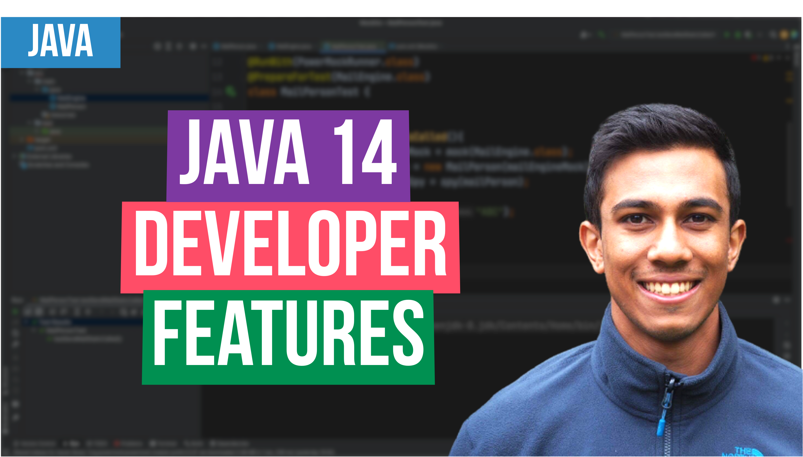

 
<h4>Java 14 Enhancements</h4>

This video will look at the two key features introduced with Java 14 for the developer. These include
the improved syntax for switch statements, and the detailed feedback provided with a null pointer exception. 

