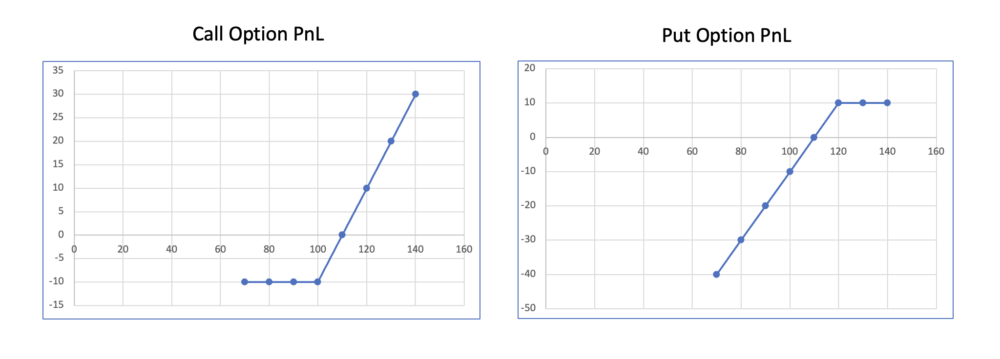

 
<strong>Key Takeaways</strong> 
&#8226; Understand what an options contract is and how it can be used. 
&#8226; Explore exotic options and the various benefits they offer. 

 
<h4>Introduction</h4>

My previous blog took at a look at forwards and swap derivatives in general with an application to commodity derivatives. This blog will build upon the last blog to look at the different types of option derivatives available within the context of commodities. 

 
<h4>An option contract</h4>

If we take a look back at the forward contract, upon agreement, the buyer will have an obligation to purchase the exact amount of the commodity upon maturity at the agreed strike price from the seller. While the contract is not often seen to maturity, there remains an outstanding obligation for the contract to be exercised. An options derivative differs as there is no such obligation. A common definition you will see for an option is: 
<i>An option provides the right, but not the obligation, to buy or sell a asset at an agreed upon price and quantity at maturity.</i>

Let's take a look at what this means for both sides of the deal.

 
<h4>How option contracts work</h4>

An option contract works as such:  
1. The contract is purchased by the buyer from the seller for a fee.  
2. The contract will specify which asset can be bought/sold, the strike price and volume.  
3. The contract will have a maturity date, and depending on the type of contract it is, the buyer can then exercise the contract.

The options contract has a few variables to the buyer, so let's take a look at these: 
1. If the contract is to purchase a security, it is known as a 'call' option. If it is to sell a security, it is known as a 'put' option. 
2. A 'European' option will only allow the buyer of the option to exercise it at maturity, whereas an 'American' option will allow the buyer to exercise at anytime until maturity. Lastly, a 'Bermudan' option will allow the holder to exercise at a set of pre-agreed dates (such as the 28th of each month).  

An option's value will continuously dip and rise in intrinsic value to the holder as the market price of the underlying security changes. For example with a call option, if the price of the security increases beyond the strike price, the option holder can exercise it (if it is American) to make a profit. Exercising the option to buy at a the lower market price will create a profit as they can (in-theory) sell at the higher value in the market. For a put option, the option holder will be able to make money if the value of the security drops, as they are able to then sell the security for a price that is higher than the market price. For both of these scenarios, the option holder are considered 'in the money', where they can profit from exercising their right on the option.

One small point to remember is the fee (aka premium) paid by the buyer to the seller of the option to have the right to buy or sell the asset. As a result of the fee, the option buyer will only be in the money once the strike price has surpassed (for calls) or fallen below (for puts) the market price combined with the option premium. The two graphs below illustrate how a bought call and put option can move in and out of the money as the market price changes. 
For the call option, the premium is £10, and the strike is £100, therefore break even is at £110 for the market price. 

 
<h4>Why Options are useful</h4>

The optionality of option contracts make them useful in multiple ways for hedging risk and taking speculative positions on the market. 

The first way an option can be used is to take exposure in an underlying security. If you expect the price of a commodity to rise, you can purchase it in the market with the expectation to sell at a higher value in the future. This exposes you to the complete price movement of the commodity, both upwards <u>and</u> downwards. A future can also be used to obtain exposure. On the other hand, purchasing a call option will provide similar exposure to the commodities price movement, but with a limited downside equal to the premium paid for the option. Therefore, the investor can take a more precautionary position on the commodity while obtaining exposure to it's expected rise in price.

An option can also be used as an asset itself. The premium paid for the option can be reflective of the current market position, expiry and volatility of the commodity. A trader can then sell their right to exercise the option in the market for a greater premium.

Options can be used to hedge the risk of a portfolio should there be adverse movements in the underlying securities price. For example, if a portfolio consisted of copper, they would be completely exposed to a price rise (and fall) of copper. By buying a put option, they will be paying a premium, but guaranteeing a price that they can sell copper should it fall in price. 

 
<h4>Exotic Options</h4>

Exotic options capture a slightly different, and more complex, way an option can be altered to see a different purpose for the investor and seller.

 
<h5>Binary Option</h5>

A binary option, also known as a digital option works where the buyer of the option pays a premium to the seller and receives a fixed pay out if the price of the underlying security reaches a specific value, known as a barrier. 

The buyer receives a fixed return if the option is exercised, regardless of the market price of the underlying, but provided it has reached the barrier price. 

 
<h5>Barrier Option</h5>

<i>Takes deep breathe...</i>

A barrier option itself is pretty complicated, made more confusing as we have just mentioned a 'barrier price' in the binary option. This naming is purely coincidental. Now let's take a look at the barrier option.

Unlike an ordinary option, a barrier option will have a condition attached to it where the option contract is either granted or cancelled when the underlying security reaches a specific price point, known as a trigger.

This means we start with the investor either already owning an option, with the possibility that it will be cancelled when the trigger is reached, or the investor not already owning the option, and the option being granted upon the trigger. 
When an option is cancelled, it is known as a 'knock out', and when it is granted, it is known as a 'knock in'.

The placement of the trigger price can be in one of two places: either in the money or out of the money, depending on the option type. A trigger that is out of the money is known as a standard barrier, and one that is in the money is known as a reverse barrier.

So we have 4 different types of barrier options: a standard knock in, a reverse knock in, a standard knock out and a reverse knock out.

 
<h5>A call barrier example</h5>

Let's take a <u>call</u> option with the below values: 
Strike: £120 
Market Price: £100

This means the owner of the call can buy the asset at a price of £120, presumably exercised when the market price is above that.

A standard knock in barrier would place a trigger out of the money, and the option would be granted. Therefore the trigger could be £90. This is known as a 'down and in' barrier, as the price goes down and the option is granted. 

Similarly, a reverse knock in would have a trigger in the money, so £125 for example. This is an up and in. 

We can also have a standard knock out where the trigger is out of the money, and the option is cancelled, so the trigger would be £95 and this would be down and out. A reverse knock out would see the option cancelled with a trigger of £125 for example.

 
<h5>A put barrier example</h5>

The strike values will differ slightly for a put option, which grants the right to sell the option. Let's use the below values: 
Strike: £90 
Market Price: £100

This contract will mean the owner of the put can sell the underlying security for £90, presumably when the underlying value of the security has fallen below that.

A standard knock in will see the trigger placed out of the money for the option to be granted. So this value would be £105 thus creating an 'up and in' trigger. This is unlike the call option's standard knock in which is down and in.

A reverse knock in would have an in the money trigger (£85) and would therefore be down and in. A standard knock out would have the value at £105 which is an up and out, with a reverse knock out with a trigger of £85 would be down and out.

The additional condition that comes with a barrier option means they are less likely to be exercised as more events (barrier price being reached for knock-in and not being reached for knock out) are required to occur before the option can be exercised. As a result, the barrier option tend to be cheaper than a vanilla option. The customisability of barrier options also mean they are traded over-the-counter and not through an exchange.

 
<h5>Spread Option</h5>

A spread option will use two underlying assets and pay off the difference between the two to an agreed strike price. A call option will pay off if the spread is greater than the strike, and a put will pay off if the spread is less than the strike. 
Therefore we can use the below formulas to calculate the return on a spread call and put: 
Spread call return = max (p1 - p2 - strike, 0). 
Spread put return = max (strike - p1 + p2, 0). 
Where p1 and p2 are the prices of the 2 assets in the option.

Spread options are popular derivatives within commodities. They provide protection against 2 underlying prices such as the cost of an input (crude oil), and the price of it's output (jet fuel). This can be particularly useful for a refiner who would like to protect the spread they earn from converting the crude oil to jet fuel.  
Spread options can offer more variety in their application, where underlying securities can differ by location (thus protecting geographic price ranges) or futures (for protecting against delivery date spreads).

 
<h5>Average rate option</h5>

The last exotic option we will look at are average rate options.
Also known as an 'avro', the average rate option is the most popular exotic option for commodities.
Unlike a vanilla option, an average rate option will use the underlying <u>average</u> price of a security over a time period to determine the market price.

Avros are specifically popular with commodities due to the nature of the contracts that are constructed for physical commodities. Commercial contracts for physical commodities will use average rates. The average rate serves both the buyer and seller from avoiding the highly volatile prices of the commodity, be it the high for the buyer, or the low for the seller.

The relationship that exists between physical and financial commodities derivates is extended towards the payoff on the derivatives that are also used in commercial contracts. Therefore the average rate option is helpful in avoiding a mismatch between the cashflows of the derivative and the physical contract.

The lower price volatility of an average rate option will also reduce the premium required to buy it. Less volatility of price will reduce the opportunity for the contract to be exercised. This is known as a reduced 'implied volatility' of the contract.

<h4>Summary</h4>

The option contract differentiates itself from other financial derivatives through the optionality of it to be exercised. Further flexibility is provided in it's ability to be used for buying or selling a security, and for the variations of exotic options that exist. This can result in controlled payouts, average price monitoring and using the spread between two securities.

A major opportunity with option contracts lie in the limited downside they require upfront from the investor in the premium, but the potentially unlimited upside they can provide in exposure to the security. This factor makes option contracts popular across asset classes and has thus lead to the creation of exotic types and strategies to incorporate them to a portfolio.

