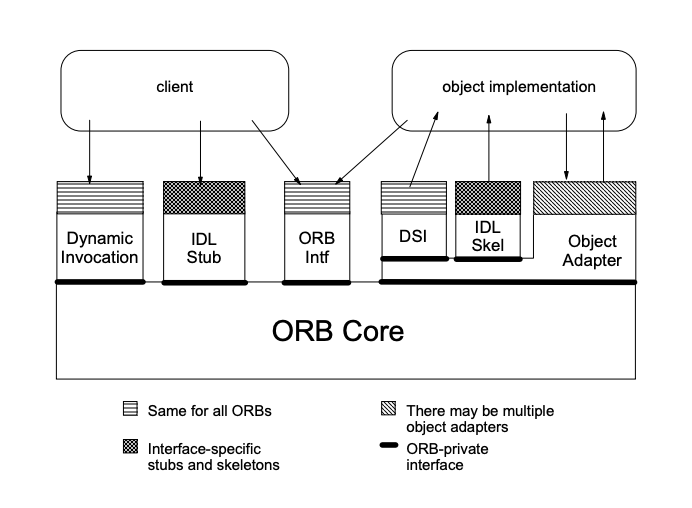

 
<h4>Distributed system communication</h4>

CORBA - the common object request broker architecture (yes, a mouthful), is a mechanism used within computer networks to allow different machines to identify, manage and invoke operations upon each others Objects remotely.
What makes CORBA so useful, is that it has an almost complete language-agnostic design, meaning
systems within the network don't need to be written in the same language to interoperate. This is what makes CORBA unique and relevant to engineers, even 30 years after it's inception.

With it's interoperable design, CORBA is a concept I routinely face in my job. What I had thought would be a simple 5-minute google session turned into a multi-day activity, as the CORBA architecture and workflow isn't as straight-forward as it's value proposition. 

In this blog, we are going to look into the components that make CORBA work while demystifying the many terms used around CORBA networks. At the end, you should be better positioned to navigate a conversation on CORBA (as I have  struggled to do), and to understand why designing interactions within a CORBA network is extremely important. 

 
<h4>What CORBA is and what it isn't</h4>

Before we dive into CORBA, I will offer a few comparisons of CORBA to help us understand why it still has relevance in engineering, and how it differs from other protocols.

<strong>CORBA vs Remote Method Invocation (RMI)</strong> 
RMI provides a mechanism for which a server and client can communicate with each other, they pass information back and forth and where remote Objects can be created, referenced and invoked upon by the client.  
RMI differs from CORBA as it is only used for Java applications, whereas CORBA is language agnostic. RMI uses Java interfaces to define contracts for the type of Objects that can be invoked upon, whereas CORBA uses the interface definition language (IDL), which I will discuss later. 
RMI passes Object by value and reference, whereas CORBA uses reference only, via the naming service (also, more on this later).  
And lastly, RMI uses the JVM to identify and locate Objects, whereas CORBA uses a Local Object Adaptor (LOA) to do the same.

One way CORBA differs from other translation layers, such as RPC, is that it supports remote Object references. This means you can pass Object references as parameters within your service call. For example, if you had an Object that represented a file, you could pass that Object as a reference to another remote call to then add the file to a database, thus allowing Objects to be passed as parameters. 

<strong>CORBA vs SOAP</strong> 
SOAP, the simple Object access protocol, is an xml-based protocol used for distributed members of an application to communicate with each other. SOAP is powerful as it enables language agnostic communication and supports a variety of protocols including HTTP, SMTP and TCP. 
The main difference between CORBA and SOAP is that CORBA is stateful, whereas SOAP is stateless. With CORBA, you can capture the state of an application from within the instance of the Object. The state of the Object is modified by calling functions upon the Object. SOAP, however, uses a stateless protocol.

SOAP also differs from it's bespoke procedures. Instead of translating requests and responses on both the client and server, the client and server would instead agree to a common interface codified in a language called extended markup language, or XML. This makes SOAP a little more accessible to use and maintain over CORBA. We will later see how translations of requests work in CORBA. 

<strong>CORBA vs REST</strong> 
REST is similar to SOAP in how it resolved a communication challenge amongst different systems built with different programming languages. REST provides greater scalability and flexibility in it's design through a dynamic exchange. As a result, REST differs from CORBA in a similar way that SOAP does, through it's stateless design and protocols for communication. Nevertheless, I would say that both REST and SOAP serve different purposes to CORBA in the active management and control of remote Objects. 

 
<h4>The CORBA Architecture</h4>

Thank you for reading this far, we've opened up quite a few ends from that introduction, but now we can start to look at the real detail of CORBA..

To explain how CORBA works, I will introduce the individual components one by one, and describe how each one interlinks through an interaction between a client and server. 
Below is an image of the CORBA architecture to capture the individual elements for a request.
(Image by Vinoski via: https://www.dre.vanderbilt.edu/~schmidt/PDF/vinoski.pdf)

<strong>Client</strong> 
A client is responsible for initiating the workflow with CORBA as they invoke operations upon an Object and process their response. The client is made aware of the structure of the Object through it's interface, and is able to experience the behaviour of the Object through invoking it's methods. 

<strong>Interface Definition Language (IDL)</strong> 
The IDL is independent of any programming language; it enables systems of all programming languages to access Objects via the advertised interface. The logical processing of the CORBA Object is hidden from the client, however it's structure and methods are made clear through the IDL.

The IDL provides the ability for CORBA clients to invoke actions upon an Object. The IDL is defined for each CORBA Object and is provided to the client for invocation. Any client that wants to invoke upon the Object will use the interface and transmit (by marshalling) the parameters for that request.

<strong>Object</strong> 
An Object represents an implementation of an IDL. Each Object can be identified by a reference which uniquely names the instance across servers (known as an Object reference).

<strong>Naming Service</strong> 
The naming service enables CORBA clients to obtain an Object through it's associated name. 
The naming service will both create bindings between Objects and their reference names to make them available to a client.

<strong>The Internet Inter-ORB Protocol (IIOP)</strong> 
The CORBA standard uses the IIOP for client-server communication. The IIOP enables a client and server from almost any vendor, computer, OS, language and network to communicate with each other through an Object Request Broker (ORB).

As a result, the client can communicate with the server through it's address (server and port) known as the Interoperable Object Reference (IOR). 

<strong>Object Request Broker</strong> 
The ORB, also referred to as an item bus, enables clients to make application calls to the server. It acts as an agent to transmit operation invocations in a distributed environment. The ORB handles communication, marshalling and unmarshalling of parameters with each request to enable CORBA servers to correctly receive request details.

The delivery of requests is performed by the ORB Core using IIOP over TCP. 

The ORB also manages the interface repository (IFR), a standardised database of IDL interface definitions. From the client's perspective, the ORB provides interface definitions which enables it to construct invocations against Objects.

The ORB Interface is an abstraction for the client and server to initialise and shutdown the ORB. It can also be used to convert Object references to strings and to create argument lists for requests made through the dynamic invocation interface (DII). 

<strong>Portable Object Adaptor (POA)</strong> 
The POA is responsible for assisting the ORB in delivering client requests to Objects. Firstly, it will carry out the activation and deactivation of Object instances when transmitting a request to the server. This is performed for memory conservation. The POA will deactivate and activate as according to a policy that is set by the developer for flexibility in memory requirements. 

The POA is also responsible for generating Object references as used by the client. This is then interpreted by the POA when received in a client's invocation request. The POA will also work with the skeleton to invoke operations on the server side.

<strong>Stubs and Skeletons</strong>
A stub and skeleton can be thought of as a local proxy for the client and server of the CORBA Object. They provide a mechanism for invoking an Object reference.

The stub and the skeleton are effectively files that are produced by the IDL Compiler. Both files contain code which is used for operating invocations by the methods specified in the IDL. 

On the client's side, the stub will contain code that is generated during the client's build process that is used when sending the request. This compilation of code enables the request to be interpreted once received by the server. 

On the server side, the skeleton acts as a pointer for the client's request to the appropriate code in the Object implementation to satisfy the request. The skeleton is therefore connected to both the ORB and the server. 

Stubs and Skeletons are used by clients and servers respectfully with the ORB. A stub is used to send requests via the ORB which is then interpreted by the skeleton from the server regardless of the client's programming language or vendor. The interface defines the operations and types the object supports and therefore the requests it handles. 
The stub and skeleton facilitates the communication between the client and server through the ORB. The stub will marshal application parameters into a common data-level representation. The Skeleton will demarshal the data back to the application-level parameter. 

The stub will forward the call to the ORB to be transported to the server.  
At the server side, the call is routed with an Object adaptor. The Object adaptor passes the call to the skeleton.

Both the stub and the skeleton have dynamic elements. The dynamic invocation interface (DII) for the stub and dynamic skeleton interface (DSI) allow the ORB to deliver requests to the servant that has no compile time knowledge of the IDl interface it is implementing.

 
<h4>Putting it all together</h4>

Now that we have touched on each of the components, we can begin to appreciate the many steps taken by our client, ORB, and server when we submit a request upon a remote Object with CORBA:

1. The CORBA Server is responsible for registering Object-name bindings in the naming service.  
2. The CORBA Client queries the naming service for an Object reference it can create a request upon.
3. Each Object will contain an IDL that the client can use to understand structure and methods for invocation. The Client submits a request.
3. The IDL Compiler converts the client's request into a stub that is sent via the ORB to the server.
4. The ORB Interface will ensure the ORB is initialised for transport.
5. The ORB Core will deliver the request to the server via IIOP over TCP
6. On the server side, the POA will ensure the Object is activated, and submit the request to the Skeleton to be invoked.
7. The Skeleton demarshals the request for the server to interpret and invoke.
8. On the CORBA server, a response can be returned for the client to receive. 

 
<h4>Summary</h4>

This blog has taken a look at how CORBA distinguishes itself as one of the most popular middleware options to distributed applications. We have then reviewed the many components that enable it to work. This high level view has demonstrated the complexity of the system and how a single request from a client is dependent on multiple transformations, references and transmissions before the server can invoke and respond with a result. 

CORBA's interoperability make it a dynamic solution that can be implemented it a diverse array of systems; however with this comes a heavy technical understanding that is required to extract an optimised solution. I hope you have been able to follow the coverage of this blog well, however I have merely scratched the surface of CORBA where other components such as servants and dynamic invocations can be a good starting point for further research and detail.

