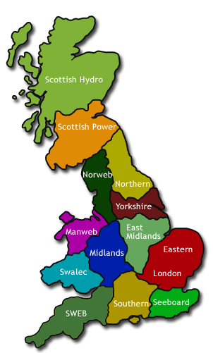
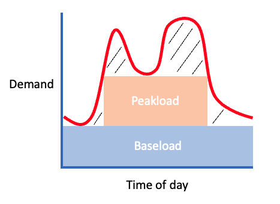
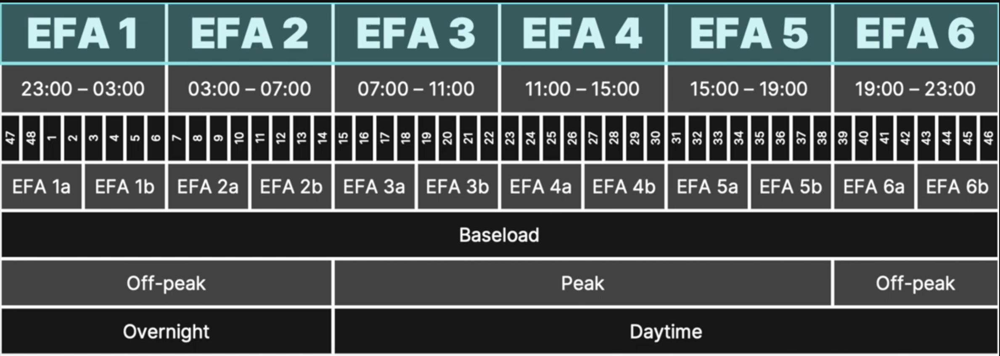

 
<strong>Key Topics</strong> 
&#8226; The lifecycle of electricity, from generation to consumption. 
&#8226; The various markets that enable market participants to trade electricity. 
&#8226; How the National Grid ESO balance the supply and demand of electricity. 

 
<h4>Introduction</h4>

This blog is going to help you develop an understanding of the mechanisms that enable the electricity market of Great Britain to operate. We will first understand the challenges imposed from the properties of electricity that translate to how it is created, distributed and (not) stored. Following this, we will explore the various physical and financial markets that electricity are traded in. Lastly, we will look at the governance and management of the electricity system that sustain a reliable system.

 
<h4>Generating Electricity</h4>

The lifecycle of electricity can be categorised into 3 main steps: generation, transmission, and consumption. 

Generation is achieved by dedicated power generators in one of many ways. The most common generators are turbine-driven, they convert mechanical energy into electrical energy by forcing electrons through a circuit. Steam turbines work by burning fuel or biomass to produce pressurised steam. Nuclear power reactors use nuclear fuel rods to produce pressurised steam. Both of these reactors convert the steam into mechanical energy for electricity generation.

A similar type of generator are combustion gas turbines. These generators instead use the combustion of gaseous or liquid fuels to produce pressurised gasses to spin turbines.

And lastly there are alternative, but less commonly used generators such as hydroelectric turbines that use the force of moving water to spin turbines, wind turbines and also solar photovoltaic systems that convert photons from sunlight into electricity.

But what IS electricity?

You can find many definitions of electricity, but at it's very core, it is the <u>flow</u> of electrical power. Electricity represents a flow of electrons, and is often referred to as an energy carrier as it can be converted into other forms of energy such as mechanical energy or heat. This property of electricity, being a flow of electrons, bring us to the main challenge it poses: it cannot be stored at a wholesale level. There is a potential for it to be converted and stored, such as in a battery, however for the wholesale movement of electricity, this would not be feasible or cost effective. As a result, the supply and demand of electricity must be kept in a constant balance, and we will later see how this is achieved at a granular level.

 
<h4>Transmission Networks in GB</h4>

The electricity created by a generator is subsequently transmitted around the country via transmission networks. Transmission networks come in 2 forms: large transmission towers which you may see line motorways, and smaller distribution networks that transmit electricity at a local level to individual homes and businesses. 

Transmission networks are long distance, high voltage lines transporting electricity from generators to distribution networks. These are considered the 'motorways' of the electricity system. We introduce the term 'voltage' to quantify the pressure which pushes electricity through the wires. Voltage in a transmission network tends to be from 275 to 400 kilovolts. 

Distribution networks transmit electricity at a lower voltage from transmission lines to homes and businesses for consumption. This voltage tends to be around 132 kilovolts. There are 14 'grid supply point groups', each are managed by a distribution network operator (DNO). The distribution network is responsible for reducing the voltage of the electricity so it can be safely distributed for consumption within homes and businesses.

 
<h4>Electricity Consumption</h4>

The consumption of electricity takes place within homes and businesses, where electricity is used for many reasons, such as keeping your lights on, charging your mobile phone, and watching YouTube videos about Java.

 
<h4>The supply and demand of electricity</h4>

We measure the generation of power using watts. Watts capture the rate at which electricity is transferred at a single point of time, and represents the amount of energy required for an item to function. Given the large scale of power generation, we refer to 1000 watts as a kilowatt, 1000 kilowatts as a megawatt, 1000 megawatts as a gigawatt, and 1000 gigawatts as a terawatt.

To put a watt into perspective, an average toaster consumes 1100 watts.

From a supply perspective, consider a wind power generator, which generates on average 3 megawatts of electricity. This fairs in comparison to one rooftop solar system that you find on a residential home, which generates just 4 kilowatts of electricity. 

When we talk about the <strong>consumption</strong> of electricity, however, we use watt hours. Energy is measured in watt hours to capture how much electricity is produced or demanded in a given hour. You can think of this as a car travelling at 30 miles per hour for 1 hour. The speed (watt) would be 30, however the total distance travelled will be 30 miles (watt-hours).
For some more perspective: Great Britain consumed 321 terawatt hours of electricity in 2022.

The supply and demand of electricity in Great Britain is based upon watt hours. The parties who are demanding electricity are energy suppliers. These tend to be the privately-owned corporations that you pay bills to, such as British Gas, EDF, E. ON, and Scottish Power. Energy suppliers enter into contracts with power generators, using a forecast for how much energy their customer base will require as the basis for the contract. We will see later on in this blog how the suppliers are better able to meet the finer granularity of demand they face from their customers on an hour-by-hour basis.

 
<h4>Electricity governance and regulation</h4>

With hundreds of participants in the electricity market entering into contracts for the purchase and delivery of electricity, there exists a single entity responsible for ensuring the balance of all these contracts in unison. That is the National Grid Electricity System Operator (ESO). 

When generators and suppliers of electricity enter into a contract, they will inform the National Grid ESO of their intentions. With a consolidated view of electricity movement across national generators and suppliers, the National Grid can realise where an imbalance lies, whether that is 'long' from too much supply of power, or 'short', due to an inefficient supply.  
The National Grid are then able to operate reserve generators to increase or reduce their contribution to the network to maintain a balance. 

All participants within Great Britain's energy market have obtained a license from OFGEM. 
OFGEM are Great Britain's independent gas and electricity regulator. They exist to protect consumers of electricity by enabling market competition, enforcing market rules and promoting innovation.
OFGEM are responsible for imposing price caps on electricity suppliers, and imposing fines on generators. You can find an interesting read on one of the larger fines imposed by OFGEM in 2020: <a href='https://www.ofgem.gov.uk/publications/ofgem-requires-intergen-pay-ps37m-over-energy-market-abuse' target='_blank'>here</a>.

 
<h4>Determining the domestic cost of electricity</h4>

In this section, we are going to look at how the price you pay for electricity is determined. This price comes down to an understanding of Great Britain's <u>generation stack</u>.

The supply of electricity in Great Britain is made up from a generation stack of different types of generators, all contributing electricity to the National Grid network and at different prices. Electricity from wind turbines will typically be generated at a cheaper rate than nuclear, carbon or gas power stations.

A 'merit order' is defined within the stack to determine which electricity source is consumed first, this will always be the cheapest.

When we consider the total energy that is demanded at a given time, the merit order is used to determine which generators will supply the electricity for that given time. As demand for electricity rises, the number of generators required to meet that demand will increase, and subsequently the more expensive generators down the merit order will be used. The relationship between the merit order and your electricity bill is that the price you pay for electricity at a given time is determined by the most expensive generator used to meet the demand at that time. This is why off-peak electricity, which is generated when demand is low, will be cheaper than when demand is higher and more expensive generators are contributing to the supply of power. This is known as the 'pay-as-you-clear' model. 

The merit order also has a role in determining the development of new power generators. When considering the capital expenditure and return a generator can produce, developers will forecast how often the generator will be contribute to the network and generate income.

 
<h4>The Electricity Markets</h4>

So far, we have touched the surface of electricity generation, transportation and distributed to your homes. We can understand how the price of electricity can be derived at different times, and the high level challenges the National Grid ESO tackle to maintain a balance of supply and demand in Great Britain. We are now going to take a look at who the different players are within the electricity market, and why they are motivated to buy or sell electricity.

We will begin by dividing the electricity ecosystem into four segments: the capacity market, the wholesale market, ancillary services, and the non-physical market.

 
<h4>The Wholesale Market</h4>

The wholesale market is where the majority of electricity is bought and sold. Agreements for electricity occur both bilaterally, known as an over-the-counter deal, and through exchanges. Agreements can vary in time frames from delivery of electricity months in advance, down to delivery in the very same day. 

Within a bilateral agreement, the suppliers negotiate a price in MWh for the delivery of electricity at a specific time period with the generators. When a bilateral contract is agreed, the National Grid ESO must be informed so they can manage the supply and demand balance of electricity. The bilateral agreement tend to be long-standing contracts that enable the energy supplier to guarantee the delivery for months at a time.
The wholesale market also operates through a power exchange. A power exchange is similar to financial exchanges where suppliers and consumers meet to determine a purchase price. Power exchanges can be used for long-dated contracts as well as short-dated contracts as we will soon discuss.

When buying and selling electricity, both parties will reference specific time periods for delivery. One common time frame is for delivery at every hour within a given day, known as 'baseload'. An energy supplier will use a baseload contract to purchase the least amount of electricity they expect to need in a given day. The baseload therefore ensures the supplier are able to meet the minimum electricity demand they forecast from their customer base throughout a given day.

The wholesale contracts can be traded in large periods ahead of time to secure the delivery and price of electricity. As you may expect, the demand for electricity in a normal household will not be equal at all times. The typical 'peak hours' are from 7am until 7pm. As a result of the higher demand during these hours, the energy suppliers must increase their orders of electricity during these periods, which can be achieved through a 'peakload' contract. The process of matching the specific demand of electricity for all hours of the day is known as 'adding shape'.

In the image below, I have used a red line to illustrate how the forecasted demand of electricity can change within a given day. We can then see how a supplied can meet that demand with individual baseload and peakload contracts. The outstanding gap between the red line and the blocks can be met with more granular agreements in the market.

As the time for electricity to be delivered to consumers approaches, energy suppliers can more accurately forecast their expected levels of electricity required. This is shown as the dashed black lines between the peakload and forecasted demand. Electricity suppliers can work to a granularity of hourly and half-hourly contracts to meet this outstanding demand. The finer requests for electricity supply can be obtained through day-ahead and within-day exchanges, for suppliers in Great Britain, these are the EPEX Spot and Nordpool exchanges.

EPEX and Nordpool offer two types of markets for short-term electricity delivery which can help market participants to . These are the day-ahead (DA) and within-day (WD) markets. As described, the day ahead exchange will deliver electricity for the next day, and within-day is for same-day delivery. 
Epex and Nordpool work as an auction exchange, where generators and suppliers publish their acceptable price limits to buy and sell electricity. The market will then meet an equilibrium to arrive at a price for electricity at each given time-interval. 

The wholesale market operates across huge timelines that enable both a guarantee for the delivery of electricity in the future, but also the granularity of electricity delivery at an hour-by-hour basis. The agreement for electricity delivery can take place at any time up to 'gate closure', which is 1 hour before the electricity is set to be delivered. Upon gate closure, generators will inform the National Grid ESO of their intentions to generate electricity.  
Upon gate closure, the National Grid ESO can begin ensuring the supply and demand of electricity is balanced. Balancing is achieved through the use of a balancing mechanism, where generators and industrial users are paid to change their intended demand and supply. This can be a little detailed, so I will write about this in it's own section at the end of this blog.

 
<h4>The Capacity Market</h4>

The capacity market can be thought of as an insurance policy for the delivery of electricity to avoid a potential blackout. The capacity market is a standby market of generators that are ready to produce electricity in periods of high stress on the existing system. High stress can be created where the supply of electricity is low, due to factors such as low wind, and the demand for electricity is high. The capacity market therefore benefits electrical generators that can easily start up and turn off on demand. Contracts within this market can range from 1 to 15 years. With long-term contracts, generators expect to exist with longevity in mind, and play an important role in the long-term generation stack that Great Britain uses.

Generators that contribute to the capacity market are paid for the availability they provide the National Grid ESO to turn on at peak times of electricity consumption. In the event of an unexpected sudden surge in electricity requirement, known as a capacity market event, the National Grid ESO will issue a 4-hour warning to these generators to turn on. This is known as a capacity market notice. 

 
The capacity market was first auctioned in 2014 and works in two auctions: T-4 and T-1. The auctions work on a yearly basis, where the 4 year auction can be for a 15 year contract that begins in 4 years time. The T-1 auction market is used by the National Grid to ensure there is sufficient capacity to support the following years winter.

 
<h4>Ancillary Services</h4>

Ancillary services captures ways that generators can earn money through services that support the stability and efficiency of the power grid. Ancillary services can be split into 6 responsibilities: frequency response, reactive power, voltage management, inertia services, reserve services and restoration.

The frequency response service exists to ensure transmission towers run at a target frequency of 50 hertz. This frequency of electrical transmission is important to maintain as it can otherwise create blackouts or damage the equipment. The frequency response service will manage frequency on a second-by-second basis to actively manage frequency by ramping power up and down. 

Reactive power services exist to ensure voltage levels within the system remain within their target range. Reactive power exist as a by-product of power from AC circuits, you might think of this as the head of a beer when it is poured. It is measured in MVars (megavolt-ampere reactive) and is actively absorbed to reduce voltage or generated to increase voltage on the grid. This balance of reactive power ensures the grid is efficient in delivering power, and not overloaded which can create network volatility. 

Voltage management covers the movement of electricity at a specific voltage through the network. It is closely related to reactive power as both of these relate to the rate which power is moved. Each transmission network is designed to manage a level of voltage, such as 400 kilovolts (for national networks) or 275 kilovolts (for distribution networks). Voltage management is achieved through the use of an electrical transformer to optimise the voltage at which electricity is transported. If the voltage is too low, there may be lost value from the transmission networks in how much electricity is being transported, however on the other end, if voltage is too high, this can result in electrical equipment consuming power in its transmission, and even creating an unstable supply of electricity. There is roughly a 5% buffer for which voltage must be managed at in kilovolts. 

Inertia services exist to support the reliable frequency of power generation to the grid. In traditional turbine-driven power generators, inertia acts as a softener to frequency changes in electricity as turbines continue to spin even when they are not generating power. This means a sudden change in frequency from a generator will not cause a hiccup in the electricity grid. You can think of inertia as similar to the suspension in a car, which absorbs the shock of a change in the road surface.  
The design of wind turbines has reduced the inertia created when the generator stops producing electricity, this means the National Grid must purchase inertia from other generators to maintain the stable level of frequency on the grid.

Reserve services ensure there is sufficient power in reserve in case of a change in generation or denied services.

Lastly, restoration services, formerly known as black start, are responsible for supporting the grid in the event of a complete shutdown. Restoration allows a power station to restart without an external electricity flow to re-energise the grid.

 
<h4>The non-physical market</h4>

So far, we have discussed the physical market for electricity where the counterparts involved are engaging in contracts with the intention to either produce or distribute and consume electricity. Non-physical trade differs as it driven by the means of financial speculation or risk management. The scenarios to be discussed are highly simplified for the purpose of the blog.

The non-physical market use a variety of financial derivatives to trade electricity, however the most commonly used derivative is a forward contract. 
The forward contract represents an agreement between two parties to buy or sell a quantity of electricity in the future at a price agreed today. The forward contract thus reduces the price risk for the buyer of the electricity who can fix it ahead of time, and the supply risk for the generator who can guarantee a buyer. 

Non-physical trading can enable an agent to realise a profit without actually generating or consuming electricity: an agent could enter into a forward contract agreement to purchase a given amount of electricity at a given forward price, K, 1 year from today. As the date for the purchase of electricity approaches, the agent could sell their forward agreement in the market, thus realising a potential profit depending on how the current price of electricity fairs in comparison to the forward price K. 

In our scenario, the agent is 'impersonating' a supplier of electricity as they purchase the forward contract from a generator, but when they resell the forward agreement to a supplier, they are 'impersonating' a generator of electricity by selling the contract to a supplier. I put the word 'impersonating' in quotes as the agent are not really impersonating anyone, but are more fairly just taking a position in the market that the generator or supplier would be taking.
 
An agent can also enter into agreements with suppliers to sell electricity at a given price, thus impersonating a generator. This position would be sold in the market thus granting the contract to generate electricity to an actual generator.

The non-physical market exposes opportunity based on the disparity between a forward price of electricity and the actual price of electricity when the time for delivery approaches. This disparity does not present an arbitrage opportunity. The agents who enter into such deals are speculating upon the price of electricity in the future. If the current price of electricity is £10 MWh, and the forward price for 1 year is £12 MWh, the agent will benefit if the price of electricity rises to £14 MWh as they can receive the power at £12 MWh and sell it in the market at £14 MWh. If the price however falls to £9 MWh, then they are obligated to purchase the electricity at £12 MWh and to sell it at £9 MWh, or effectively sell the forward contract at a loss in the market. 

Within the scope of the non-physical market are also asset-backed traders. These are agents that may enter into financial contracts to hedge or speculate upon the price of electricity, however they have the infrastructural means to generate electricity and deliver against the contract, rather than selling their position in the market as the forward date approaches.

Agents are incentivised to realise greater profits from their generation by engaging in the speculative market on potential price, and makes up 90% of the electricity trades that are made in advance of delivery.

For non-physical trading, I have only mentioned the forward contract, which is utilised in bilateral agreements. The futures market, which is effectively a forward contract that is traded through an exchange contributes heavily to the electricity market. 

Futures derivatives represent similar contracts, however are more standardised and traded through an exchange. The common exchanges used for trading electricity are ICE for long-dated agreements, and EPEX Spot or Nordpool for day-ahead and within-day trading. Within ICE, the two main prices for Great Britain power are the UBL, the UK Base Electricity Future, and UPL, the UK Peak electricity future. The futures agreements can be traded as far as 5 years into the future, and tend to be for delivery at entire months at a time at the very minimum, this is the standardised nature of a future.

The standardisation of contracts for electricity are largely based on time periods within the day. I have already mentioned baseload and peakload within this blog which are used for long-dated futures with ICE. Nordpool and EPEX Spot are exchanges that are used for short-term electricity delivery and therefore use a much finer granularity of time intervals for delivery. To better understand how a day can be broken down for exchange trading, we can take a look at the EFA day. 

 
<h4>The EFA Day</h4>

EFA stands for Electricity Forward Agreement. It is used to capture the time-granularity at which electricity can be traded within a day.

The EFA day consists of 6 4-hour time blocks. The time blocks start at 23:00 from the day before, and run until 23:00 of the current day. There are 48 half-hour blocks, running from midnight to midnight. When making an agreement using the settlement blocks, they will therefore apply from previous day. 
Each EFA block can be split in half, to give us 1a, 1b, 2a, 2b etc. And EFA blocks can be grouped to provide a descriptive product. These products include: 
&#8226; Baseload - Blocks 1 to 6. 
&#8226; Off-Peak - Blocks 1, 2 and 6 during weekdays, and all weekend. 
&#8226; Peak - Blocks 3, 4, and 5 during weekdays. 
&#8226; Overnight - Blocks 1 and 2. 
&#8226; Daytime - Blocks 3, 4, 5, 6. 
These blocks are typically traded at at larger time-scales before delivery, whereas smaller blocks of delivery are traded closer to the time of delivery as forecasts for demand are better known from the purchasers of power. 

<small style="float: right;" >Picture: EFA Blocks from YouTube Video by <a href='https://www.youtube.com/watch?v=ycu24MfufJk&t=63s'>Modo Energy</small></a> 

 
<h4>Day-ahead and Within-Day Power Trading</h4>

The day-ahead and within-day markets provide an opportunity for finer granularity trading at different time periods close to the delivery. These markets use spot markets for price discovery in the here and now. The exchange markets enable energy consumers to finely match their required demand at each hour to the electricity they have incoming from different suppliers as the time for delivery approaches.

As mentioned earlier in this blog, electricity suppliers will often enter into long-dated contracts to fulfil their baseload and peakload requirements using their forecasts. The energy suppliers can then use the Day-ahead (DA) and Within-day (WD) markets to match the outstanding demand at all other times of delivery.

The power exchanges Epex Spot and Nordpool both operate as auction exchanges; they build an order book of the volumes their registered participants need to buy and sell and the prices they are willing to accept for each day. Using the order book, the exchange can calculate the market price at each time interval.

The auctions run everyday, accepting all the bid and offers 1 day prior to the day-ahead auction and calculating the price. The within-day auctions run all the way up to gate closure. Gate closure is 1 hour before the time for delivery of electricity, it is where all participants in the market must submit their intentions for electricity demand and supply to enable the National Grid to ensure the system is balanced and that electricity can be reliably delivered.

 
<h4>The Balancing Mechanism</h4>

The balancing mechanism is used by the National Grid to ensure electricity supply and demand are balanced at the time for delivery. The motions for balancing take place after gate closure when generators and suppliers publish details of their intended generation and consumption for the settlement period. From a high level, there are two functions of the balancing mechanism that ensure supply meets demand. The first function comes from designated Balancing Mechanism Units that increase or decrease their intended demand or supply, and the second function is from Net Imbalancing Units that have excess electricity to sell to the grid when required.

The submission from market participants to the National Grid of their intentions is known as a physical notification. The notifications can be updated up until gate closure, when they then become 'final notifications'. 
The National Grid use final notifications to calculate the imbalance that is present between supply and demand. They then use the balancing mechanism to equate the two.

The Balancing Mechanism operates through registered participants. Participants register themselves with Elexon, the organisation who manage the Balancing and Settlement code.
Participants are known as Balancing Mechanism Units (BM Units) and they contribute to the Balancing Mechanism by submitting bid and offer prices for each half-hourly period up to gate closure for what they are willing to pay to reduce or increase their contribution to supply or demand. A bid price is submitted if a generator want to reduce their generation, or if a supplier want to increase their demand. This is known as a flex up. An offer price is made for the opposite, where a generator increases supply or a supplier decreases demand, known as a flex down. The National Grid ESO will decide which bid and offer to accept for balancing using factors such as cost efficiency and volumes from the bid and offers. 

These bid and offer prices can also be negative, where the participants are paid to reduce/increase against their original plans. Once the National Grid have accepted a price, they issue a Balancing Offer Acceptance (known as a BOA).

There is a further mechanism beyond the BMU's to ensure the balancing mechanism works, and this is through net imbalance volumes. Once the BMU participants are selected, and the National Grid see a balance between supply and demand, there is still a dependency for all participants to contribute as expected. If there is a shortfall, for example a generator not contributing as expected, Elexon are responsible for meeting the shortfall. Participants that fail to deliver are considered 'out of position' and must therefore pay Elexon what is known as a 'system price' or 'cash out' price for failing to meet what is due. The system price is considered a penalty as the price paid will be greater than the market rate for electricity, whether it is for a difference in supply or demand. 

When an imbalance occurs, Elexon will turn to a new participant for the generation of electricity, and these are generators who have excess demand available that they had not assigned to the grid. Generators will receive payment at the system price for the excess electricity that is required, thus possibly realising a greater profit for their electricity than they had at a market price. This unique situation has lead to the term 'NIV Chasing', where generators can deliberately over-generate on the possibility of receiving exposure to the system price. 

With the contribution from BMU's and generators who contribute to net imbalancing, the National Grid are able to manage the supply and demand of electricity across the grid at all times of the day to minimise the potential for unused electricity while ensuring the expected demand of electricity is met.

 
<h4>Summary</h4>

This blog has taken a walk through the electricity markets of Great Britain at a very high level to capture the mechanisms in-place for the electricity lifecycle, physical and financial participation and balancing mechanisms. This simplified view of generators and suppliers enable us to understand where our electricity comes from, the factors that contribute to the price we pay for it and the complexity of the system that enables it to remain stable and efficient.

