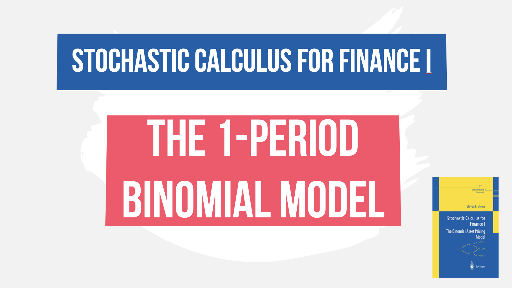

 
<h4>The 1-period binomial model</h4>

Walkthrough the first 4 pages of Steven Shreve's Stochastic calculus for finance I, where we introduce the one-period binomial model and how a replicating portfolio can be created for a European call option in the stock and money market.

