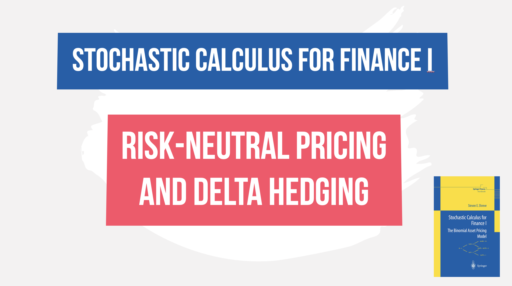

 
<h4>Risk-neutral pricing and the delta-hedging ratio</h4>

In this video, we will walk through pages 4 to 8 of Steven Shreve's Stochastic calculus for finance part 1 where we develop the risk-neutral pricing formula and delta hedging ratio for a one-period binomial model.

