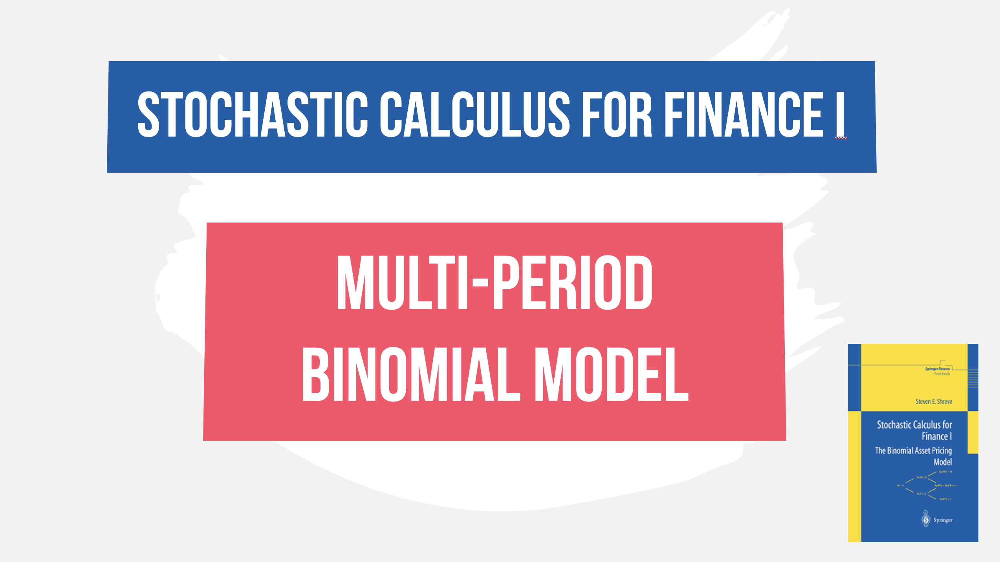

 
<h4>Risk neutral pricing a multi-period binomial model</h4>

In this video, we review pages 8 to 15 from Steven Shreve's Stochastic Calculus for Finance part I where we derive the risk-neutral price and delta hedge required for a multi-period binomial model. We revisit the delta hedging formula and risk-neutral pricing formula within a multi-period model to demonstrate how they can influence the fair price of the option at time 0.

